# 模擬城市 — SimCity 繁體中文重製

**先當上市長，再去投票選市長。**

台北與高雄的市民第一次投票選出自己的市長，是 1994 年 12 月 3 日。在那之前，
這兩個直轄市的首長由中央政府派任（台灣省轄下的縣市長 1950 年代起就是民選，
被派任的是這兩個直轄市）。而更早幾年，軟體世界已經把《模擬城市》擺上台灣的
架子：NT$180、兩片磁片、一本中文說明書。螢幕上那座城市要收多少稅、路往哪裡鋪、
電廠蓋不蓋、錢先給警察還是給消防，全部由坐在鍵盤前的那個人決定。

它給你的不是政績，是一張爛牌和一段年限。達斯維利 1900 年一百年沒什麼變化，
居民開始覺得無聊，市庫只有五千元，你有三十年；舊金山 1906 年開場就是地震，
路網電網全斷，你有五年；底特律 1972 年要在十年內把犯罪壓下來；波士頓 2010 年
開場是核電廠熔毀，輻射清不掉，那塊地只能放棄，城市往別的方向長。
八座「悲情城市」，時間到了看數字，不看說法。

這個專案把 1989 年那套模擬引擎重寫成 Go，接回原版的美術與資料檔，配上繁體中文，
連同當年那本說明書一起保存下來。自備一份合法的原版磁片，那個位子就是你的。

> Maxis／Will Wright，1989。Go / Ebiten 重寫 ＋ 繁體中文化 ＋
> 軟體世界珍藏版 29 中文說明書保存。

**現況：可以玩了。** 開新城市或八個悲情城市、六種城市風格、蓋東西、四個資訊
視窗、存讀檔都接通了，走的是真的按鍵與滑鼠（[實機驗證](#run)）。逐刻對拍還沒
完全收斂，細節與剩下的差距見 [`docs/re/12-tick-parity.md`](docs/re/12-tick-parity.md)。
本檔不寫進度百分比，現況的單一真相在 [`CONTEXT.md`](CONTEXT.md)。

---

## 目錄

- [畫面](#shots)
- [一件當年沒發生的事](#no-chinese)
- [那本說明書留下了什麼](#manual)
- [這款遊戲當年在吵什麼](#reception)
- [華人圈的發行與記憶](#gap)
- [這個專案在做什麼](#project)
- [素材盤點與已知風險](#assets)
- [現況](#status)
- [怎麼跑](#run)
- [文件導覽](#docs)
- [授權與聲明](#license)
- [移植感言](#afterword)
- [致謝](#thanks)

---

<a name="shots"></a>
## 畫面

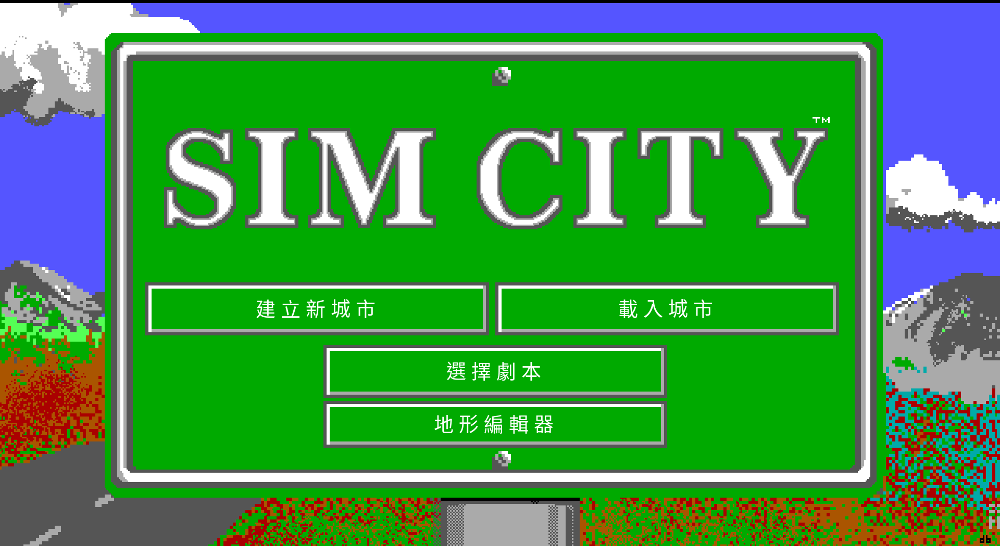

正常啟動先進入 SIM CITY 招牌；四個操作選項依目前語言顯示（前三個是原版的，
第四個「地形編輯器」是 remake 加的），繁體中文為
「建立新城市／載入城市／選擇劇本／地形編輯器」。標誌、原版那三個按鈕的框線與
點擊矩形保留原版版面，只有固定在圖片裡的英文操作文字由 remake 的四語文字層替換；
第四顆按鈕放在量出來**沒有任何原版美術**的那一塊招牌綠上，蓋不掉東西。


底特律 1972，基本外觀（沒裝資料片時的原始樣子）。版面照原版 DOS 重現：
選單列、編輯視窗（標題列的城市名與年月、資金／訊息帶、圖示工具盤、RCI 需求指標、
工具帶）、City Form 視窗與左緣的圖層圖示。字格也照原版排（英數一格、中文兩格），
所以 `$20,000` 這種欄位與原版一樣寬。文字全部繁體中文。

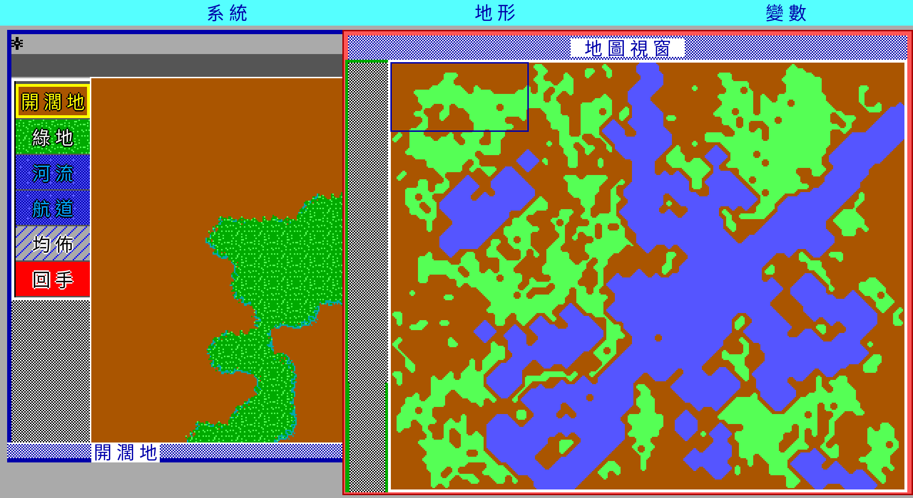

1990 年隨磁片附的《SimCity Terrain Editor》。原版是獨立程式，remake 把整支做進來：
三個選單（系統／地形／參數）、左邊六格工具盤（空地、樹林、河流、水道四個畫筆，
加上油漆桶與復原）、編輯視窗、右邊的全市地圖。**它用的是遊戲本體那一套視窗系統**，
座標與遊戲完全相同——這是把原版跑起來逐像素量出來的。
畫筆寫進地圖的值來自遊戲與編輯器共用的工具描述表，復原是五千格的環加四份全圖快照。
出口照原版：編輯器只存檔，回遊戲之後自己讀那個檔。

**這些畫面是跟原版逐格對過的，不是「看起來像」。** 判準是把 remake 的畫面降回
640×350，拿去跟 DOSBox 裡跑的原版比到位元組：

| 比什麼 | 結果 |
|---|---|
| 關閉 City Form 後的完整編輯區 512 格 | **498 格逐位元相同**；不同的 14 格全是兩側各自畫的游標框。**六個資料片風格量出來是同一個數字，而且差異格的位置完全一樣**（[`docs/playtest/style-parity-2026-09-03.md`](docs/playtest/style-parity-2026-09-03.md)）|
| City Form 完整區域（外框、標題列、圖層圖示欄與地圖）| 最新重跑 **130 581／131 600 個像素相同**（99.226%）；地圖本體 **107 834／108 300**（99.570%），差異集中於中英文標題及兩側游標；游標取樣會讓單次總數小幅變動 |
| 招牌與劇本選單兩幅畫面 | **224 000 個像素只差滑鼠游標那個 16×15 的方塊** |

重現：`tools/screen_parity.sh`（自己跑一次 DOSBox 產基準，原版素材與原版畫面
都不進版控）。這條判準抓到過調色盤偏暗一階、工具盤位置差兩像素、地圖圖塊
把黑色當透明、城市檔的地圖整張平移八列，以及 `.PPF` 的位元平面組反
（版面分毫不差、字讀得出來，只有顏色整組錯位）——全都是**編得過、測得過、
玩得動**的錯，最後一個連目視都很難察覺。

| | |
|---|---|
|  |  |
| 同一座城市換成中世紀資料片。**工具名稱跟著換**——發電廠叫「水車」、鐵路叫「馬車道」、體育館叫「比武場」。那是原版六個資料片的設計，不是翻譯自由發揮。 | 地圖視窗，犯罪率圖層。十一個圖層都在，用 1–9、0、`-` 切換。 |


劇本簡介也跟著資料片改寫：底特律 1972 的犯罪問題，在中世紀變成「虎城，1563 年」。


評估視窗。公眾意見、四大嚴重問題與統計數據七列（人口總數、遷出入數、
市有財產總數、城市類別、遊戲等級、整體成績、年度成績），數字全部來自模擬層本身。

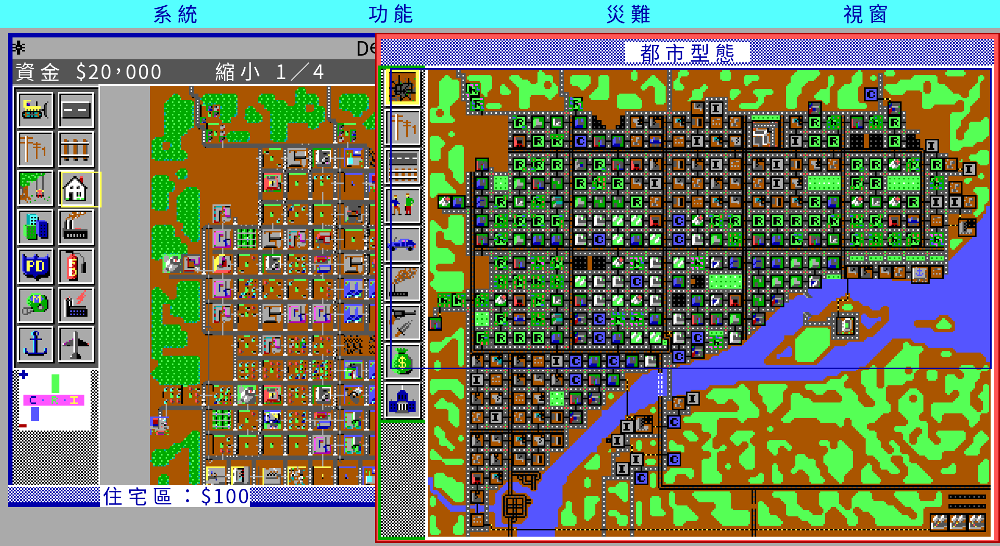

**縮小、多語與背景音樂都是 remake 加的，原版沒有。** 原版的編輯視窗永遠一格 16 像素——
1989 年的 EGA 畫面就那麼大，想看整座城市只能開右邊那個 3×3 的縮圖。
這裡按 `-`（或滾輪）可以縮到 1/2、1/4，**縮小之後照樣蓋得動**；
把編輯視窗拉到最寬時，1/4 剛好一次看完整張 120×100 的地圖。
作法與兩個陷阱寫在 [`docs/spec/controls.md`](docs/spec/controls.md) §十。

### 六種顯示模式

1989 年的 PC 有很多種螢幕。`SIMCITY.CFG` 自帶的解碼表列了八個代號，
遊戲實際附了六套美術：EGA 高解析彩色（640×350）、EGA 低解析彩色、
Tandy 彩色、VGA 256 色、單色 VGA、CGA 單色（640×200 兩色）。
六套都解得開，也都能在遊戲裡切——`-mode` 或 **SYSTEM→顯示模式**。

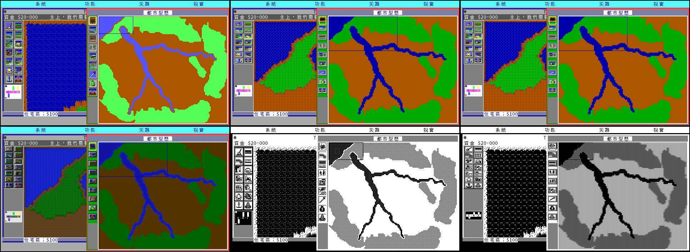

同一座城市（台北，古代亞洲資料片）在六種顯示模式下的樣子。
上排：EGA 高解析彩色、EGA 低解析彩色、Tandy 彩色；
下排：VGA 256 色、單色 VGA、CGA 單色。
圖塊來自玩家自備的原版資料檔，本專案不散布那些檔案。

**換的是全部美術與配色，不是版面。**

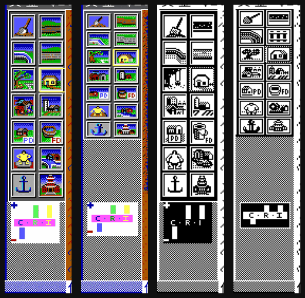

工具盤、需求指標、統計圖按鈕、圖層圖示都用該模式自己的美術
（左起：EGA 高解析、Tandy、單色、CGA）。這幾庫**不是同一份的縮放版**，
是各自為自己的螢幕畫的——工具盤在 EGA 高解析是 57×182、Tandy 是 56×123、
CGA 是 55×120，格子大小與列距全都不同，圖層圖示連排法都不同
（EGA 與單色是直的一欄九格，Tandy 是兩欄五列，**CGA 是橫的九欄一列**）。
所以每個模式量一組格線，不然按鈕會點到隔壁那一格。

連程式自己畫的那一半（選單列、視窗框、標題列、資金帶、對話框、選取框）
也跟著換。判準是量原版：六個模式各跑一次 DOS 原版截圖數顏色，
**單色 VGA 與 CGA Mono 整張畫面只有 `#000000` 與 `#ffffff` 兩色**，
所以那兩個模式的介面收斂成黑白，選取框改畫網點外框——原版就是這樣做的。

⚠ 版面只有一套：本專案的每一個座標都是照 EGA 高解析（640×350）的美術量的。
所以這是「用 Tandy 或 CGA 的美術玩 EGA 高解析版面」，**不是原版任何一種畫面**，
是本專案自訂的組合。理由與量法見
[`docs/spec/ui-layout.md`](docs/spec/ui-layout.md) 的「顯示模式」一節。

語系可從 **SYSTEM→設定** 選擇繁體中文、简体中文、日本語或 English；選擇會寫入
使用者設定目錄的 `chengshi/settings.json`，下次啟動自動套用。`-lang` 可只覆蓋本次
啟動而不改寫偏好。SYSTEM 最下方的「設定」是明示的 remake 擴充，原版項目仍保持
原順序；格式與失敗退路見 [`docs/spec/settings.md`](docs/spec/settings.md)。

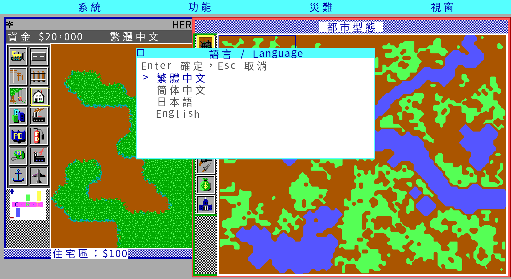

**原版沒有音樂**——這件事查清楚了，五條證據互相印證
（[`docs/re/19-no-music.md`](docs/re/19-no-music.md)）：官方手冊的製作名單只有
`Sounds:` 沒有 `Music:`、`SIMCITY.CFG` 只選得了音效裝置、執行檔字串表裡沒有
任何音樂相關的字、69 個資料檔裡的音訊只有那八段合計三秒的音效，
而 **148 秒的實機錄音裡只有 1 秒不是靜音**（那 1 秒是對話框的提示音，
正好當正對照）。招牌畫面停了 12 秒，有片頭音樂的話那是最該響的地方。

所以 remake 的音樂放的是**玩家自己準備的檔案**（`music/` 底下的 `.ogg`／
`.wav`）。找到曲目便會自動播放；`M` 開關、`[`／`]` 換曲，`-mute` 會同時關閉
音效與音樂。若曲名符合玩家自備的《SimCity 2000 Special Edition》曲目，平時會依
城市規模換曲；火災、水災、事故、龍捲風、地震、怪獸、空襲與核熔毀會立即插播各自
固定主題，完整播完一次再回平時曲池。手動選曲不受一般情境干擾，但災難優先。
完整選曲表與失敗退路見 [`docs/spec/adaptive-music.md`](docs/spec/adaptive-music.md)。
本專案不在公開發行包散布任何原版音樂，也不把續作配樂寫成一代原有功能。

DOS 原版主要玩家畫面的最新逐格／逐像素結果、僅版面項目與刻意差異，集中記錄在
[畫面對拍報告](docs/playtest/visual-parity-2026-08-31.md)。**發行的 Linux AppImage
另外單獨對過一次**，驗的是玩家實際拿到的那顆二進位而不是工作樹的原始碼，見
[AppImage 對拍報告](docs/playtest/appimage-parity-2026-09-01.md)。

> 圖裡的地圖圖塊、建築與精靈來自**玩家自己那份原版**，程式讀進來繪製而已。
> 本專案不散布原版素材，發行包裡也沒有。截圖只作為說明用途。

---

<a name="no-chinese"></a>
## 一件當年沒發生的事

台灣代理的《模擬城市》一代**沒有中文版**。

軟體世界珍藏版 29，NT$180，兩片磁片，封面印著「16 BIT」，右下角是那隻站在舊金山
天際線前面的綠色蜥蜴。盒裡附一本中文說明書——但遊戲本身是英文的。

這不是推測。骨灰集散地保存的〈模擬城市系列經典回顧〉（Tony Chen，2002 年 11 月發表於
《電腦玩家》雜誌）附了一張系列規格對照表，一代那一欄逐字寫著：代理公司「軟體世界」、
售價 180、儲存媒介「磁片」、顯示「EGA 16 色」、硬體「XT」、
**中文版本「無」**。二代之後才有中文版。

所以這個專案不是「還原某個中文版」，而是**依台灣說明書重新製作 1989 年一代的
繁體中文重製**。在完成逐地區、逐平台的發行史查證前，不宣稱它是華人圈第一個版本。

---

<a name="manual"></a>
## 那本說明書留下了什麼

軟體世界珍藏版 29 的中文說明書，由骨灰集散地的「軟體世界說明書補完計劃」掃描保存，
共 56 張跨頁。它留下的不只是操作步驟，還有一整套 1990 年代初的台灣譯法：

| 原文 | 軟體世界譯名 |
|---|---|
| SCENARIOS | **悲情城市** |
| DULLSVILLE | 達斯維利 |
| SAN FRANCISCO ／ TOKYO ／ DETROIT | 舊金山／東京／底特律 |
| BOSTON ／ RIO DE JANEIRO | 波士頓／里約熱內盧 |
| HAMBURG ／ BERN | 漢堡／伯恩 |
| （劇本的通關目標）| **明日之都** |
| （通關獎勵）| **市鑰** |

說明書第 13 頁對劇本的介紹是這麼寫的：

> 這些城市提供你真假參半的劇情，處理八個有名的都市，它們各會遭遇不同的「悲情問題」；
> 有些會遭受災難蹂躪，有的則有嚴重的慢性社會問題——犯罪率節節高升。
> ……假如你作得好，把該市治理成為市民理想中的「明日之都」，你將獲頒市鑰。
> 否則……市民可是會炒你魷魚的哦！！

**這些選字不會被「潤飾」掉。** `docs/manual-cht/` 逐頁完整轉錄，保留當年的用語、
譯名與行文；原文的誤植照原樣轉錄並加註，讀不清的字標〔字跡不清〕而不猜。
`translations/glossary.md` 以說明書既有譯名優先，說明書沒收的詞才另譯，並在表上標明。

掃描件本身不進版控、不進發行包——補完計劃的說明檔要求「請勿在掃描檔加上其他符號或
用來牟利」，這個專案照辦。

---

<a name="reception"></a>
## 這款遊戲當年在吵什麼

重製一款遊戲之前，得先知道它為什麼值得重製。以下每一條都附來源；
**「一手證據」與「玩家講法」分開標**。

### 一款贏不了也輸不了的遊戲

Brøderbund 一開始拒絕發行，理由是這東西沒辦法行銷——它既不能贏也不能輸。
八個劇本是發行商要求加上去的，用來把它拉回比較傳統的遊戲形式
（[Wikipedia](https://en.wikipedia.org/wiki/SimCity_(1989_video_game))）。

有意思的是，**兩個年代、兩種語言的評論者都認為劇本不是重點**：

> 「劇本再好，也遠不如自己設計一座城市來得吸引人。……當你可以打造一台客製法拉利的時候，
> 為什麼要玩別人開過的二手雪佛蘭？」
> —— Johnny L. Wilson，《Computer Gaming World》第 59 期，1989 年 5 月
> （[原文存檔](https://archive.org/details/Computer_Gaming_World_Issue_59)）

> 「《模擬城市》中沒有結局也沒有特定的遊戲路線要遵循，有的只是玩家無限的創意及挑戰性。」
> —— Tony Chen，〈模擬城市系列經典回顧〉，《電腦玩家》2002 年 11 月

### 1989 年的編輯部在抱怨什麼

CGW 那篇評論最好看的部分不是結論，是細節。當年 CGW 編輯部每個人都有自己的城市，
還把地圖印出來互相品頭論足；而他們的抱怨具體到可以當驗收項目：

- **機場一蓋就墜機**。評論者的機場撐了四個月就被飛機撞毀；總編輯的城市**六個月內墜機五次**。
- **船一直撞同一座橋墩**，或在同一格推平過的海岸擱淺。
- **住宅區突然「變公寓」**：「Oh, no! My prime residential area just went condo!」
  他們的解法是推平區內一格改蓋公園，凍結該區發展。
- **熵**：不成長的東西會衰敗。「SimCity takes the laws of entropy seriously.」

### 三個 1989 年就有的漏洞

| 漏洞 | 做法 | 來源 |
|---|---|---|
| Banzai 稅率 | 12 月把稅率拉到上限 20%，收完稅隔年 1 月降回 0%，市民不會察覺 | CGW #59, 1989 |
| Shift + `FUND` | Mac／Amiga 版每次 +$10,000；C-64/128 按 F1 得 $4,000 | CGW #59, 1989 |
| 公園凍結法 | 住宅區長到滿意後推平一格改蓋公園，等於送出「別再長了」的訊號，同時降犯罪、抬地價 | CGW #59, 1989 |

CGW 當時就寫了 Maxis 正在考慮在後續版本堵掉 Banzai 稅率。

### 哥吉拉是生態學家

CGW 那篇有個小標叫 **"Godzilla Is An Ecologist"**：怪獸**會避開公園、直奔重工業區**，
城市越大待越久，文章戲稱牠是「環保署——蜥蜴組」。

但**遊戲裡那隻怪獸沒有名字**。IBM 版手冊的東京劇本只寫「A large reptilian creature
rose from Tokyo Bay」，CGW 也註明「the monster which attacks a city is not named」。
中文圈則直接叫牠哥斯拉——Tony Chen 那篇的圖說就寫「右上方正在破壞城市的綠色物體便是
有名的哥斯拉怪獸」。

### 兩個被講錯很久的數字

- **「7% 稅率」不是迷信，它就是遊戲的預設值。** IBM 版手冊寫的是
  「The optimum tax rate for fast growth is between 5 and 7%」——一個**區間**；
  而原始碼把初始稅率設成 7（`sim.c:182 CityTax = 7`）。玩家記得的那個數字，
  同時是預設值與手冊區間的上緣。
- **Dullsville 的官方難度是 Easy。** 手冊給八個劇本的難度標示如下；
  網路上流傳「Dullsville 最難」是玩家講法，與手冊相反。

| 劇本 | 說明書譯名 | 主題 | 英文手冊難度 | 中文說明書 | 時限 | 過關條件 |
|---|---|---|---|---|---|---|
| DULLSVILLE, USA 1900 | 達斯維利 | 發展停滯 | Easy | 易如反掌 | 30 年 | 大都會 |
| SAN FRANCISCO, CA 1906 | 舊金山 | 8.0 地震 ＋ 大火 | **Very Difficult** | 比登天還難 | 5 年 | 大都會 |
| HAMBURG, GERMANY 1944 | 漢堡 | 空襲火風暴 | **Very Difficult** | 難上加難 | 5 年 | 大都會 |
| BERN, SWITZERLAND 1965 | 伯恩 | 交通壅塞 | Easy | 易如反掌 | 10 年 | 交通密度低疏 |
| TOKYO, JAPAN 1957 | 東京 | 怪獸襲擊 | Moderately Difficult | 難上加難 | 5 年 | 整體成績超過 500 分 |
| DETROIT, MI 1972 | 底特律 | 犯罪 | Moderately Difficult | 難易適中 | 10 年 | 低犯罪率 |
| BOSTON, MA 2010 | 波士頓 | 核電廠熔毀 | **Very Difficult** | 難上加難 | 5 年 | 整體成績超過 500 分 |
| RIO de JANEIRO, BRAZIL 2047 | 里約熱內盧 | 溫室效應海平面上升 | Moderately Difficult | 難易適中 | 10 年 | 整體成績超過 500 分 |

中文那一欄有**四種說法**而英文只有三級，東京兩邊也對不起來——那是譯者的
行文，不是另一套分級。逐城原文在
[`docs/manual-cht/p09-22-entering.md`](docs/manual-cht/p09-22-entering.md)。

手冊還教了一招規避劇本災難：存檔再讀回來。

⚠ **一代沒有水管。** 全份 IBM 手冊裡的 "water" 只指地形上的水域；
自來水系統是 SimCity 2000 以後才有的。這條寫在這裡是因為它是最容易誤植的「回憶」。

### 它真的被拿去上課

- 南加州大學與亞利桑那大學都曾在都市規劃與政治學課堂使用（Wikipedia）。
- CGW 1989 年那篇就提到，當年 8 月的都市規劃研討會上有一篇論文把 SimCity 當成
  都市規劃的動態模型來討論。
- 1990 年《Providence Journal》請五位普洛威頓斯市長候選人玩仿該市的 SimCity。
  候選人 Victoria Lederberg 把自己在民主黨初選的些微落敗，歸咎於報紙描述她遊戲表現不佳；
  遊戲玩得最好的前市長 Buddy Cianci 當年贏得選舉。

### 這個模型是有立場的，而且開發團隊承認

- CGW 1989：「The design team **admits a bias toward rail-based mass transit**.」
- Maxis 總裁 Jeff Braun：「We're pushing political agendas.」（Wikipedia 引）
- Will Wright 承認受 Jay W. Forrester 的 System Dynamics 與《Urban Dynamics》(1969) 影響。
  後世對「這款遊戲把一套 1960 年代的美國都市理論寫死進去」的批評，出發點就在這裡。

這對 remake 是個**技術問題**而不是立場問題：這些偏向就寫在模擬公式的係數裡。
重製的責任是**把它們原樣重現並註明出處**，不是「修正」成 2026 年的都市規劃觀點。

---

<a name="gap"></a>
## 華人圈的發行與記憶

目前可直接查證的材料以台灣最完整，而且呈現一條清楚的轉變：1990 年代初的一代是
**英文遊戲＋軟體世界繁體中文說明書**；《模擬城市 2000》才有台灣中文版。1999 年
iThome 引述 EA 台灣分公司，估計 2000 代在台銷量約四至五萬片；它的熱賣也成為
1997 年台灣自製《模擬首都》的直接市場背景。到《模擬城市 3000》與 2003 年
《模擬城市：福爾摩沙》，在地化已從文字翻譯擴張到台灣地標與地圖。

一代那本手冊的意義因此不只是「盒內有中文」：它建立「悲情城市」「明日之都」等術語，
並用十七頁介紹都市發展與規劃。另一方面，香港、澳門與中國大陸的一代代理與版本狀態
目前仍缺直接證據，不能把台灣史泛化成整個華人圈。完整時間線、證據等級與來源見
[`docs/research/simcity-chinese-world-history.md`](docs/research/simcity-chinese-world-history.md)。

### 影片

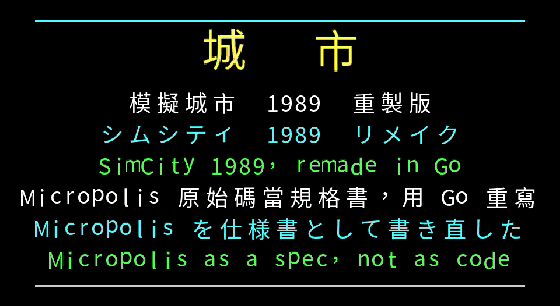

五十七秒走一遍現在做到哪裡：原版招牌、繁中介面、軟體世界 1990 年畫的台灣與高雄、
本專案補的台北台中台南、**1990 年那支地形編輯器**、從一片空地蓋起一座城市、
六種天災、預算統計評估三個資料視窗、八個悲情城市，最後是同一幅招牌在
CGA／Tandy／EGA／VGA／Mono 底下的樣子。

畫面上的圖塊與聲音都來自玩家自備的原版，影片本身是本重製版跑出來的。
`promo.mp4` 的聲音是**原版那八段音效**——這款遊戲沒有背景音樂
（四條證據見 [`docs/re/19-no-music.md`](docs/re/19-no-music.md)），
所以不配旋律，也不自己合成一段頂替。上面內嵌的 GIF 沒有聲音。
重產指令是 [`tools/promo_video.sh`](tools/promo_video.sh)。

### 軟體世界畫的台灣與高雄

代理商做的不只是翻譯說明書。Maxis 的《SimCity Terrain Editor》1990 年由
**軟體世界研究中心（高雄）** 重新打包發行，磁片裡除了 Maxis 自己那幾座示範城市，
還多了兩個台灣做的地圖檔：`TAIWAN.CTY` 與 `KAOHSIUN.CTY`。磁片上的 `README`
只有一個方框，寫著地址與一組 BBS 電話 `(07) 384-8901`。

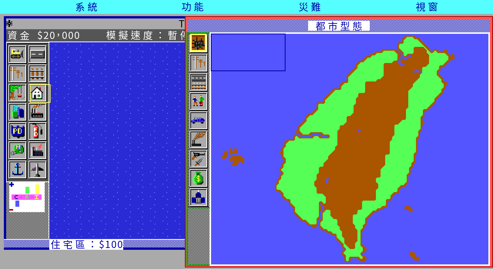

台灣島、中央山脈、西邊的澎湖，東南方還有綠島與蘭嶼。城市名讀自城市檔的
128 位元組檔頭，標題列顯示的 `TAIWAN` 是檔案裡原本就寫著的字。

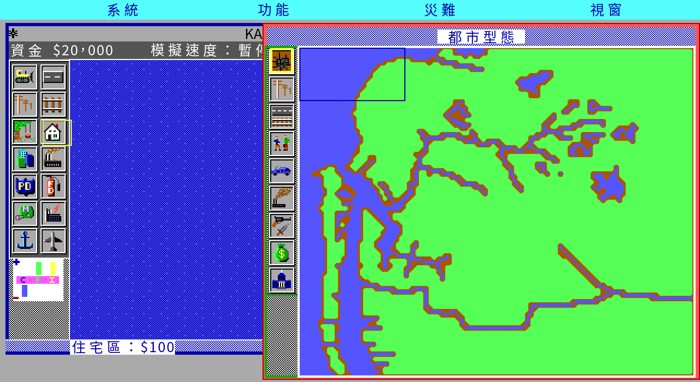

高雄那張是港灣地形：西側那條長潟湖與內陸的水系都畫出來了。

兩張地圖都是 1990 年在高雄做的，與珍藏版 29 說明書同一個代理商，
比台北與高雄市民能投票選出自己的市長早了四年。逐檔盤點與雜湊見
[`docs/formats/00-e220-terrain-editor.md`](docs/formats/00-e220-terrain-editor.md)。

這兩個地圖檔收在 [`cities/`](cities/)。權利狀態的說明在 [`LICENSE`](LICENSE)
附註第五條——「當年在台灣合法」與「今日可自由散布」是兩件事，那個保留寫在那裡。
畫面上的圖塊仍然來自玩家自備的原版，本專案不散布原版素材。

### 另外三張：台北、台中、台南

軟體世界畫了台灣與高雄，剩下的由這個專案補。這三張是本專案自己畫的，
可以自由散布。

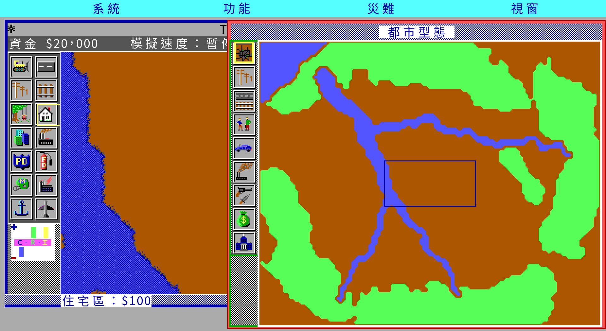

台北。盆地被大屯、內湖南港、木柵新店與林口台地圍住；基隆河自東、新店溪自南、
大漢溪自西南，在畫面中央會合成淡水河往西北出海。

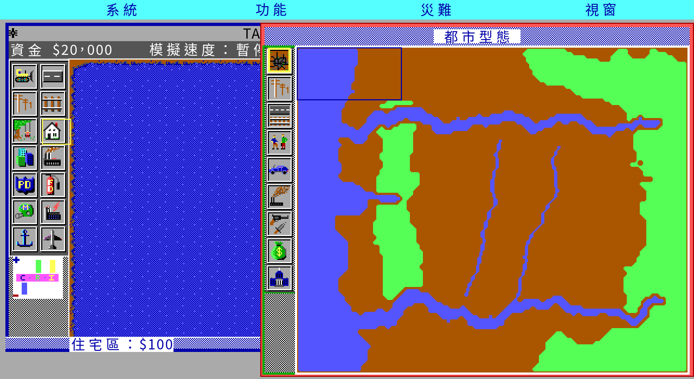

台中。西邊是台灣海峽與台中港，海岸與盆地之間隔著南北向的大肚台地；
大甲溪在北、大肚溪在南，兩條都由東往西入海；東側是中央山脈的山腳。

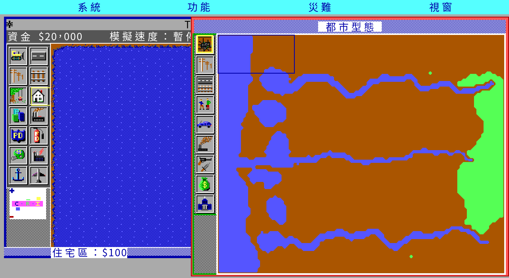

台南。西岸是沙洲與潟湖（台江內海的殘跡）與安平港水道；曾文溪、鹽水溪、
二仁溪三條由東往西入海；東側是新化丘陵，其餘是嘉南平原的平地。

**這是風格化的地形，不是測繪資料。** 120×100 格要放下一座城市的水系與地勢，
河道得加寬到看得見、丘陵化成連續的林地。岸線與林緣的圖塊交給引擎自己的
`smoothRiver`／`smoothTrees` 去長，那是原版 `s_gen.c` 的邊界規則，所以外觀與
原版的地形產生器同一套。形狀由固定種子的值雜訊推出來，重跑一次結果相同——
做法與重產指令見 [`cities/README.md`](cities/README.md)。

---

<a name="project"></a>
## 這個專案在做什麼

用 Go / Ebiten 重寫 1989 年的《模擬城市》，並做繁體中文化。**只做一代**，不做 2000 以後。

### 證據優先序

| 序 | 來源 | 適用範圍 |
|---|---|---|
| 1 | **Micropolis C 原始碼**（EA 2008 年以 GPL-3.0 釋出的 SimCity Unix 版原始碼）| 模擬規則層的一切行為 |
| 2 | **DOS 1.10 資料檔本身** | 圖形集、劇本、訊息、音效、存檔格式 |
| 3 | **DUX X11 版的 Tcl 腳本與 XPM** | 介面語意、字串、`.cty` 樣本 |
| 4 | DOS 執行檔反組譯／DOSBox 實跑 | DOS 專屬行為、眼睛確認 |
| 5 | **軟體世界中文說明書** | 譯名與當年台灣用語 |
| 6 | 官方英文手冊、社群、雜誌回顧 | 最後才用，且要標明 |

規則層讀原始碼，呈現層做 DOS 版——這是本專案的分工。詳見 [`CLAUDE.md`](CLAUDE.md) §1。

### 四道閘門

任何機制在原始碼裡讀出來並寫成筆記之前，**不寫任何一行引擎程式**。
機制確認（含 `檔名:行號`）→ 規格收攏（標 READY）→ 實作 → 接線登記，逐道通過。
每條斷言都要帶推論等級：已確認／強證據／假說／未解。細節見 [`CLAUDE.md`](CLAUDE.md) §0。

**社群共識不是證據。** 上一節那些「玩家講法」很好看，但它們不會變成程式碼裡的常數；
會變成常數的只有原始碼與資料檔。兩者衝突時原始碼贏，衝突本身記進筆記。

### 逐 tick 對拍

《模擬城市》的狀態就是一張 **120×100** 的格子陣列加上幾十個純量，全部可以序列化。
所以同一顆隨機種子、同一串操作可以同時餵進 Micropolis 與 Go 版，**逐 tick 比對整張地圖**。

這已經做出來了：Micropolis 在 docker ＋ Xvfb 裡編得起來、跑得動，而且它內嵌的 Tcl
直譯器暴露了 128 個狀態存取子指令（`sim Tile x y`、`sim Funds`、`sim Rand`…），
可以用 pty 腳本驅動。細節與第一批已確認常數見
[`docs/re/01-oracle-harness.md`](docs/re/01-oracle-harness.md)。

對到什麼程度：**三份 8000 個 frame（各 500 個遊戲刻）的對拍全部逐 frame
完全一致**——空地上的小實驗（13 954 次抽樣）、Dullsville 劇本
（122 314 次，有人口、交通、稅收與週期性的城市評估），以及東京
（**955 206 次**：大城，劇本災難是怪獸，火車、船、飛機、直昇機與爆炸
全員上場）。每一個 frame 比的是抽樣次數、亂數狀態、五個週期性掃描落在
哪一刻、三個需求閥門、城市評估的分數與問題表、**場上每一隻精靈的十八個
欄位**，以及**整張 12 000 格地圖的雜湊**；跑完之後地圖與資金也相同。

走到這一步的關鍵不是把規則寫得更對，而是**先讓原版可以單步**。原版的 Tcl
介面只能設速度，跑幾個 frame 由事件迴圈決定；起始的相位與掃描計數器又從外面
看不到，只能用搜的——而「搜得到」是個很弱的判準。給 oracle 的原始碼加五個
唯讀觀測指令之後（只加觀測、不動規則，而且建在副本上），分岔點從「用搜的」
變成「查表」，幾個一直被掩蓋的差異當天就露出來了：需求閥門的計算該用
32 位元浮點與整數除法（整座城市的地圖差異因此從 8 格變成 0 格）、電力掃描
不該直接把「有電」寫回地圖、對拍腳手架自己多推了四步亂數（症狀極隱蔽：
抽樣次數照樣對得上，只有吃到的亂數值整整晚四個），以及**原版的介面在挑
音效時和模擬共用同一顆亂數產生器**——那一次多抽讓劇本版卡在第 1512 個
frame，拿掉之後直接跑完八千個。

東京那份逼出兩個**真的遊戲 bug**，不只是對拍問題。一個是**載入城市時整段
清場的儀式沒做**——原版讀檔之後會把地價、汙染、犯罪、交通與精靈全部歸零，
我們沒有，所以讀第二座城市會留著前一座的數字。另一個是**精靈串列被重建**：
原版走鏈結串列，怪獸拆掉一棟大樓時生出來的爆炸會插在游標前面、留在串列裡；
我們照著「走一遍、順手重建」的習慣寫法搬到 Go 的切片上，那隻爆炸在同一個
frame 就被蓋掉了——怪獸拆房子不會爆炸。這一個是加上**逐 frame 的地圖雜湊**
才看得見的：`Destroy` 不抽亂數，在那之前所有以抽樣次數為判準的測試對它
完全不敏感。量法、分母與每一段的結果見
[`docs/re/12-tick-parity.md`](docs/re/12-tick-parity.md)。

亂數是這件事的關鍵：原版的 LCG 模 2²⁴ 可逆，所以**亂數狀態就是一個時鐘**——
兩邊狀態一樣，就等於抽過一樣多次。這讓「哪一刻開始分岔」變成可以二分搜尋的問題。

> 順帶一提，這件事立刻推翻了本文上面引用過的一條二手數字：
> Tony Chen 2002 年的規格表寫「建設範圍 128 × 128」，
> 但原始碼是 `SimWidth 120` / `SimHeight 100`，存檔大小
> `120 × 100 × 2 = 24000` 也對得上。**一手贏二手**，即使二手是當年的雜誌。
> DOS 版是不是同一個尺寸還沒證實。

---

<a name="assets"></a>
## 素材盤點與已知風險

**原版素材一律不進版控、不進發行包，玩家自備合法原版。**

| 素材 | 內容 | 風險 |
|---|---|---|
| DOS 版 1.10（69 檔）| 四套顯示模式圖形、8 個劇本、6 組資料片訊息與音效 | ⚠ **是破解版** |
| DOS 版 1.03（27 檔）| **六種顯示模式的圖形全齊**，8 個劇本 | 執行檔未打包、未破解 |
| DOS 版 1.02（19 檔）| CEGA 與 MONO 圖形、8 個劇本 | 執行檔未打包、未破解 |
| 軟體世界地形編輯器磁片（1990）| Maxis 編輯器 ＋ 六模式美術 ＋ 11 個城市檔 | Maxis 素材只留本機 |
| DUX X11 版（1993）| 執行檔 ＋ 30 個 Tcl ＋ 154 個 XPM ＋ 46 個音效 ＋ 23 個 `.cty` | ⚠ 未授權的商業發行包；**沒有 C 原始碼** |
| 軟體世界珍藏版 29 說明書 | 56 張跨頁掃描 | 補完計劃要求不得牟利，只轉錄文字 |
| Micropolis 原始碼 | GPL-3.0 | 已封存，當規格書讀，不照抄（見[下文](#license)）|

### 手上這三個 DOS 版本差在哪

三份都是玩家自備、不進版控。差異是實測出來的，不是照版本號推的：

| | 1.02 | 1.03 | 1.10 |
|---|---|---|---|
| 檔數 | 19 | 27 | 69 |
| `SIMCITY.EXE` | 191 235 位元組 | 192 795 | **126 542** |
| 可讀字串 | 896 | 859 | **266** |
| 打包／破解 | 都沒有 | 都沒有 | **兩者都有** |
| 顯示模式圖形 | CEGA、MONO | **CEGA、MONO、sega、CGA、Tandy** | CEGA、MONO、sega、**mcga** |
| `.PPF` 畫面 | 只有 CEGA | **五種模式各兩幅** | CEGA、sega、mcga |
| 資料片圖形集 | 無 | 無 | **六組**（古城風情 ＋ 回到未來）|
| `SIMCITY.CFG` | 5 位元組二進位 `ENI1` | 沒有（首次執行才生成）| 548 位元組明文 |
| 悲情城市 | 8 | 8 | 8 |

三件值得記的事：

**1.03 是目前唯一六種顯示模式都齊全的一份。** CGA 與 Tandy 的圖形在 1.10 那份
是缺的，而 1.10 反過來多了 mcga 與六組資料片美術——**顯示模式不是只增不減**，
CGA 與 Tandy 在 1.10 就消失了。`.PPF` 的六種版面因此是靠 1.03 才解齊的。

**1.02 與 1.03 的執行檔沒有被打包，也沒有被破解。** 1.10 那顆是打包過的，
而且進入點是破解程式的 stub，所以從它反組譯的結論一直帶著「來源版本存疑」
這個註記。1.03 有 859 條可讀字串（1.10 只有 266 條，因為被壓縮了），
是目前手上最乾淨的反組譯目標。

**版本號是二手資訊。** 三份的版本號都來自壓縮檔或資料夾名稱，執行檔裡沒有
版本字串。而且「1.03」那個資料夾裡的 `README` 開頭寫的是 `SimCity V1.1
NOTICES`，還把 MCGA 講成新功能——所以那份 README 至少不屬於 1.03。
本文用這些名稱只是為了指稱三份副本，不主張它們就是原廠的版本編號。

### 手上這份 DOS 1.10 是破解版

`read.me` 由 "Knight Rider" 署名，明載「This version has had all the copy protection
removed」，並附了作弊程式 `SIMCHEAT.EXE`。檔案時間戳混著 1991-05（原廠）與
1996、2012（被動過）。後果有三：

1. `SIMCITY.EXE` 已被改過，反組譯出來的**不是原廠碼**。
2. 哪些檔案被動過還沒查清楚——分群時間戳是工作清單第 3 項。
3. 在找到一份未破解的 1.10 副本比對之前，從這份得到的行為結論**一律標「假說」**。

### `SIMCITY.CFG` 是明文的自我說明檔

這是盤點時最有用的發現。設定檔自己帶著解碼表，直接給出八種螢幕模式與圖形集的命名規則：

```
Screen Mode: E
Graphics Set: WESTCEGA

    Screen Mode:
        H - Hercules Graphics      M - Hires EGA Monochrome
        C - CGA Monochrome         e - Lores EGA Color
        T - Tandy Color            E - Hires EGA Color
        V - Monochrome VGA/MCGA    2 - 256 Color VGA/MCGA
```

所以圖形檔名的規則是 `<圖形集><模式>`：`WESTCEGA.PGF` ＝ Wild West 集的
Hires EGA Color 版。六個圖形集前綴 `ASIA`／`MEDI`／`WEST`／`FUSA`／`FEUR`／`MOON`
對得上當年兩套資料片——「古城風情系列」與「回到未來系列」。

這件事對中文化有直接後果：**畫布尺寸不能只假設一種版面**。
Hires EGA 640×350 與 MCGA 320×200 是兩套不同的字元格。

---

<a name="status"></a>
## 現況

工作清單與逐項狀態的單一真相是 [`CONTEXT.md`](CONTEXT.md)。這裡只放結論。

### 接通了什麼

正常玩家路徑走得完：開新城市或八個悲情城市 → 選工具 → 蓋 → 看四個資訊視窗 →
查詢地塊 → 存檔 → 離開 → 重開讀檔。這條路徑由
[`tools/playtest.sh`](tools/playtest.sh) 在 Xvfb 裡用**真的按鍵與滑鼠**跑，
每一步截圖，最後拿存檔內容做機械判定，不是用 debug 入口繞過去的。

| 層 | 狀態 |
|---|---|
| 模擬規則 | 十六相位主迴圈、電力、四個逐格掃描、交通、分區成長、普查、需求閥、預算、評分、災難、精靈、訊息、玩家工具 |
| 資料格式 | `.PGF` 圖形、`.PTF` 訊息、`.PSN` 劇本、`.PSF` 音效、`.cty` 城市檔，一套共用的 LZSS |
| 呈現 | 圖塊繪製與動畫（火在燒、煙在冒、車在跑）、工具列、地圖／統計圖／預算／評估四個視窗、災難與系統兩個選單、整頁圖片訊息、六種風格 |
| 中文化 | 基本檔 226 條 ＋ 六個風格包的覆寫，合計 695 條；譯名以軟體世界說明書為準 |
| 城市外觀 | 基本 ＋ 六個資料片風格，**六種顯示模式的圖形檔都解得開**（EGA 高／低解析彩色、Tandy 彩色、VGA 256 色、單色、CGA 單色，可在遊戲中切換；**工具盤、需求指標、統計圖按鈕、圖層圖示與整套配色也跟著換**——單色與 CGA 的畫面是黑白的，那是量原版量出來的；版面維持 640×350 一套）；**六個風格都與原版做過畫面級對拍** |
| 地形編輯器 | 1990 年隨磁片附的 `TERRAIN.EXE` **整支重製**：三個選單十七條命令、六格工具盤（空地／樹林／河流／水道四個畫筆 ＋ 油漆桶 ＋ 復原）、五千格的復原環加四份全圖快照、參數對話框、遊戲年份、市名與難度、City Map 視窗 |
| 存讀檔 | 原版 DOS 存檔格式（128 位元組檔頭 ＋ 27120 檔身），城市名存在檔頭裡；讀取端另外吃得下 Micropolis 的 27120 裸檔身 |

### 對原版驗收過的

| 切片 | 驗收方式 | 結果 |
|---|---|---|
| 亂數產生器 | 從活的原版取 24 個連續輸出，看四個就反推內部狀態 | 其餘 20 個逐項預測正確 |
| 地圖與圖塊編碼 | 130 條常數由工具從 `sim.h` 重產；實測值解碼 | 產物與工具輸出逐位元組相同 |
| **地形產生** | 四顆種子各 12000 格逐格對拍（含造島那條 10% 分支）| **48000 格完整 16 位元字全部相同** |
| 城市檔格式 | 32 個城市檔逐位元組 round-trip；存出來的檔拿回原版載入 | round-trip 全部相同；原版讀得起來，12000 格圖塊一致 |
| 電力傳導 | 受控實驗 12000 格逐格對拍 | 劇本 1 的 266 格 `PWRBIT` 差異全部收掉 |
| 四個逐格掃描 | 收斂後的地價／汙染／犯罪平均值 | 與原版相同 |
| 自動接線 | 八座劇本城市的 15 447 格線路 | 99.83% 形狀一致，剩下的 26 格已歸因 |
| **逐 frame 對拍** | 四份實驗，每份 8000 個 frame（東京那份 955 206 次抽樣）。每個 frame 比抽樣次數、亂數狀態、`Scycle`、三個需求閥門、評分與問題表、**場上每一隻精靈的十八個欄位**、**整張 12 000 格地圖的雜湊** | **四份全部 8000/8000**，終點地圖與資金也相同 |
| 劇本勝敗判定 | 八個劇本各載入後不出手跑到自己的判定時限 | 八個都在時限內送出判定，勝敗兩種結果都出得來（不出手 2/8 過）|
| `.PGF` 圖形 | 42 個檔（6 種顯示模式 × 7 組）的長度公式 | 全部解開；第 0 庫一律 960 張，與 `TILE_COUNT` 對得上。Tandy 的 16 色是**封裝式**不是 EGA 平面式（六個風格 × 960 張與 sega 逐格比色號，零張不同）；CGA 是 **640×200 兩色、圖塊 16×8**（三種讀法只有這一種能一路串到檔尾）|
| 點陣字覆蓋 | 掃過譯文與程式碼裡出現的每一個字 | 缺字會讓測試變紅，不會等到玩家看到空白 |
| **六個資料片風格的畫面** | 每個風格在同一個劇本、同一個鏡頭下與 DOS 原版逐格比到位元組（[`docs/playtest/style-parity-2026-09-03.md`](docs/playtest/style-parity-2026-09-03.md)）| **六個都是 498／512 格逐位元相同**，不同的 14 格在六個風格裡位置完全一樣（游標框，兩邊各自畫）|
| 地形編輯器對話框 | 把原版 `TERRAIN.EXE` 跑起來，逐像素量它的版面再與反組譯推出來的欄列對照 | 六個增減鍵的欄號與四個列號**全部吻合**；原本未解的視窗絕對位置、按鈕尺寸與配色由量測補齊 |
| 地形編輯器主畫面 | 同上，量選單列、編輯視窗、工具盤、City Map 與狀態列的座標 | **與遊戲本體的視窗系統完全相同**（`docs/spec/ui-layout.md` §二 的每一個數字都成立），差別只有工具盤、標題列內容與右邊視窗少了圖層圖示 |
| 地形編輯器的規則層 | 四個畫筆寫的 16 位元字、油漆桶的三個地物帶、復原環與快照、清除人造物、平滑河流的前置，逐條對反組譯出來的位址 | `internal/sim/editor_test.go` 八個測試；判準寫的是原版行為不是 remake 現況 |

每一條的證據鏈在 `docs/re/` 與 `docs/formats/`，並由
[`docs/re/00-wiring-status.md`](docs/re/00-wiring-status.md) 與一個測試守著
「筆記解出來了但程式碼沒用上」這種漏接。

### 還沒做的

- **聲音有了，但取樣率還沒定案。** `.PSF` 的八段各是什麼事件已經解出來
  （脫殼反組譯 `PlaySound(n)` 的十一個呼叫點，逐支比對 Micropolis 的對應
  函式：0 交通壅塞、1 爆炸、2 怪獸、3 警笛、4 船笛、5／6 工具成功、7 工具失敗，
  [`docs/re/16-dos-oracle.md`](docs/re/16-dos-oracle.md) §五之四），
  遊戲也接上去了。**取樣率取 5400 Hz，那是量出來的，不是從程式碼直讀的常數**——
  規格裡標成暫代值（[`docs/spec/sound.md`](docs/spec/sound.md) §三），
  解出真值只要改一個常數。兩個對不同誤差敏感的方法都指到它：長度比給 5300–5450，
  拿頻譜形狀去對 X11 版的 `expl-hi` 給 5320–5410
  （[`tools/snd_rate_fit.py`](tools/snd_rate_fit.py)，附正對照）。
  誤差 ±1.4% ＝ ±0.24 個半音。
  **用耳朵和原版比這件事做不到**：那八段只走外接 DAC，而 Tandy 走的是
  DOSBox-X 沒實作的 `INT 1Ah AH=83h`，Covox Sound Master 沒有模擬器，
  內建喇叭放的是程式自己合成的嗶聲。所以驗收只做到「錄下真正送到音效裝置的
  位元組，量長度」（`tools/audio_capture.sh`）。
- 說明書**逐頁轉錄完了**（p.1–82，操作手冊全本 ＋ 參考手冊兩章），另外補上
  夾在裡面的《模擬城市參考附表》（按鍵對照 ＋ 中英對照的都市動力表）。
  唯一沒轉錄的是附贈的防拷密碼表——它不是說明書內容（說明書自己說是「附贈的」
  另一張活頁），而它的全部內容就是一份防拷答案表。

### 自評

打分數是為了讓「還差什麼」講得具體一點。**每一列都寫出分母與量法**，
沒有分母的地方就承認沒有——「幾乎完成」這種說法不算數。

**這是自評，不是外部驗收。** 除了原版 DOS 1.10 與 Micropolis 這兩個
oracle 之外，沒有第三方跑過這些數字。

| 面向 | 自評 | 量法與分母 | 分是扣在哪 |
|---|:-:|---|---|
| 模擬規則層 | 9.5 | 四份逐 frame 對拍各 8000 個 frame，東京那份 955 206 次抽樣，判準含精靈全欄位與整張地圖雜湊；另與 DOS 原版做八個劇本的抽樣對拍 | 兩處**刻意**偏離原版（`oFireZone` 補了邊界檢查、載入不重設亂數種子），都寫在筆記裡；沒有跨越八千個 frame 之外的長時間對拍 |
| 資料格式 | 9.5 | 六種格式（`.PGF`／`.PPF`／`.PSN`／`.PTF`／`.PSF`／`.cty`）；42 個圖形檔全解，連庫表外那塊（地圖縮圖 ＋ 自帶字型）與精靈遮罩都解了；32 個城市檔逐位元組 round-trip，DOS 存檔那 128 個位元組的檔頭也解開了（城市名讀出來接到編輯視窗標題列，存回去逐位元組相同）；**`.PPF` 六種顯示模式全解**——1.10 的三種（CEGA 640×350×4、sega 320×200×4、mcga 320×199 每像素一位元組，調色盤取自同一個圖形集的 `.PGF`）加上 1.03 補齊的三種（Tandy 320×200×4、mono 640×350×1、**CGA 640×200×1**），共 16 幅畫面解出正確尺寸，其中三幅與原版逐像素只差滑鼠游標；**另有一道畫面本身的檢查**——量橫向同色連續段的平均長度，解對的在 4.83–11.52 之間，版面解錯（封裝式當成位元平面）是 1.28，而那種錯誤的尺寸與長度檢查全都會過 | `.PGF` 第 8、9 庫（沒有配對的單平面庫）用途未解；兩份 `SOUNDDAT.PSF` 不知道哪一份會被讀——**三種弄壞法都試過，音效檔不是開機時載入的**，DOSBox 放不出這張卡的聲音，這條路走不通（`docs/re/16-dos-oracle.md` §八） |
| 呈現層與操作 | 9.5 | **版面照原版 DOS 重現並逐項對拍**（[`docs/spec/ui-layout.md`](docs/spec/ui-layout.md)）：選單列 ＋ 四個下拉選單（內容直接吃訊息檔，含分隔線）、編輯視窗（資金訊息帶／工具盤／地圖／工具帶／需求指標／標題列的城市名與年月）、City Form 視窗、三個資料視窗做成浮動視窗（位置、大小、內部版面都照原版）、查詢面板、視窗疊放與搬動、`Ctrl-C／H／E／R`、五段速度、**`F2`–`F5` 拉四個選單**（哪個 F 鍵開哪個選單是拿 DOS 原版逐鍵實測裁決的——兩份一手資料說法不一致）；工具盤、圖層圖示、統計圖按鈕、需求指標全部直接用原版 `.PGF` 的美術；City Form 的地圖用原版自帶的 960 張 3×3 圖塊縮圖，不是純色方塊；編輯視窗標題列的城市名與年月照原版的錨點（拖著原版改大小量兩次）；建造新城市的「市名欄 ＋ 技術等級」對話框；工具盤十四格的順序逐格實測確認；**字格照原版排**（英數一格 24×42、中文兩格 48×42），所以 `Funds: $20,000` 這種純英數欄位與原版一樣寬；**招牌與劇本選單兩幕**（原版的 `.PPF`）也接上了，一啟動就在那裡，三個按鈕與八格縮圖的座標是量原版那兩幅圖得到的；純鍵盤的 `Ctrl` ＋ 方向鍵捲動照原版接（其餘鍵盤路徑實測確認**原版自己在有滑鼠時也沒有反應**）；**City Form 的九個圖層圖示點得動，兩個「一格管兩個圖層」的按住式小選單也接上**（少的消防範圍與人口成長就藏在那裡，見 `docs/spec/controls.md` §九），色階圖例（庫 6／7）與跟著圖層走的標題一併補上；數值圖層改成原版的畫法——**先畫縮圖再蓋色階**，值太低的格子露出底下的地形；存檔格式在系統選單裡可選（DOS 版面／純本體），選擇跟語言一樣記進設定檔 | 視窗的預設位置是量原版**這一次開機**的結果，原版可以搬所以那不是常數；原版怎麼蓋核能廠還沒解（點那一格只給三千元那一種，三種操作都試過），remake 用副選單代替；數值圖層的**第五級門檻是暫代值**——原版實測是五級，Micropolis 的 `GetCI` 只有四級（50／100／150／200），多出來那一級照等距外推填 250 |
| 中文化與多語 | 9.5 | 遊戲內 695 條全譯（繁中）；說明書 p.1–82 逐頁轉錄 ＋ 參考附表。**語言資料改成 TSV，一列一筆四種語言並排**，遊戲內可切繁中／简中／日文／English（`-lang`，或系統選單）| 简中是繁中的**字面**轉換，不是用語在地化；日文是**本專案新譯**且只做了標籤那幾段（工具、月份、選單、地圖圖層、地物名、評估欄位），訊息與圖片文字走退路顯示繁中；英文取自玩家自備的原版 `.PTF`，沒有原版就沒有英文 |
| 音效 | 8 | 八段的事件對應全部解出（`PlaySound(n)` 的十一個呼叫點逐支反組譯，與 Micropolis 對應函式比對到位移表、門檻值與訊息編號都一致）**並接進遊戲**；驗收錄下真正送到音效裝置的位元組，五段的長度都對得上（`tools/audio_capture.sh`）| **取樣率是暫代值**：三段獨立的長度比指向 5300–5450 Hz，程式取 5400，還沒從程式碼直讀（已排除 PIT，那是一張 DMA 驅動的卡）。而且手上沒有能放出原版 DAC 的模擬器，**沒有人拿原版的聲音對過**——驗的是長度不是音色 |
| 可玩完成度 | 8 | 上面三項，加上**與 DOS 原版的抽樣對拍**（[`docs/re/18-dos-parity.md`](docs/re/18-dos-parity.md)）與**自動玩家**（[`internal/autoplay`](internal/autoplay)）：只用玩家在畫面上做得到的操作（`ApplyTool` 與稅率），**從一張白紙蓋到一座能自我維持的城市**（五顆種子五十年後都是等級 2、人口兩萬到三萬、資金為正、還在長），以及八個劇本 40 次跑過 **30** 次——**八個裡有六個五顆種子全過**（漢堡、伯恩、東京、底特律、波士頓、里約）；不出手只過 5 次 | **達斯維利與舊金山五顆種子全掛**。原因量到底了。達斯維利：把資金補滿、積極鋪路開地、每年蓋滿，三十年飽和在 **52 000–62 000**（門檻十萬），而且再放寬上限數字**逐位元不變**——所以是這一類策略的天花板，不是參數。同一套策略給一百二十年是 101 720（等級 4），**所以門檻不是不可達，是需要約三倍的時間**。舊金山差的是 6%：結算時 72 000–94 000，而門檻是加權人口十萬（不出手只有 43 000，所以策略有用，只是不夠）。地震斷線要修四年，修完只剩一年可以長。七種介入量下來全部沒有提升通關數（`WORKLOG.md` 2026-08-30），所以這是一個**局部最佳解**：要再往上得重新設計策略，不是調參數。而且**還是沒有人用手玩通過**：自動玩家證明的是「規則允許贏」，不是「介面好用」 |
| 跨平台發行 | 8.5 | Linux tar.gz＋AppImage、Windows ZIP、macOS universal；`tools/verify_package_all.sh` 驗包本身，Linux AppImage 另走招牌→劇本選單→城市→滑鼠調整速度。**發行的 Linux AppImage 再做一次畫面級對拍**（[`docs/playtest/appimage-parity-2026-09-01.md`](docs/playtest/appimage-parity-2026-09-01.md)）：十四幕玩家畫面對同一份原始碼現建的執行檔，**十三幕有逐位元完全相同的截圖**；四項對 DOS 原版的逐格與逐像素數字改用該 AppImage 重量，與現建版的收據一致（編輯區 502／512 格、City Form 130 583／131 600）。驗的是玩家實際拿到的那顆二進位，包裝層（發行旗標、內嵌字型與圖集、AppImage runtime、資料路徑解析）沒有改變任何一幕。發行包另附城市地圖（公開包五張、本機完整版十四張），**四種產物都實查過讀得到**——AppImage 從不相干的工作目錄啟動，載入清單一樣列得出來，`-load TAIPEI.CTY` 解析到掛載點裡的那一份；`verify_package_all.sh` 54 項全過 | **Windows 與 macOS 都沒有實機試玩**——Linux 上跑不了那兩個平台的 binary，工具鏈裡也沒有 wine，靜態驗收全過只代表不會因結構問題開不起來；`verify_package_all.sh` 的獨立權利掃描只重掃 Linux tar 與兩個 AppImage，Windows zip 只有打包器內那一次（內容另外實查過，五個檔全乾淨）；AppImage 在容器裡以 `APPIMAGE_EXTRACT_AND_RUN=1` 啟動，FUSE 掛載那條路徑沒驗；沒有 Android 包 |
| 素材保存 | 8.5 | 中文說明書 56 張掃描逐頁轉錄成 p.1–82 ＋ 參考附表；譯名表以說明書當年的選字為準；手上三個 DOS 版本（1.03／1.10 原廠／1.10 重打包）與地形編輯器磁片**逐檔 SHA-256 盤點**（[`docs/formats/00-dos110-inventory.md`](docs/formats/00-dos110-inventory.md)、[`docs/formats/00-e220-terrain-editor.md`](docs/formats/00-e220-terrain-editor.md)）；**軟體世界 1990 年畫的台灣與高雄兩張城市檔隨發行包散布**，另補三張本專案畫的（台北／台中／台南），來源與畫法逐張標在 [`cities/README.md`](cities/README.md) | 掃描件本身不入版控，**保存下來的是轉錄不是原件**；軟體世界那兩張地圖的權利狀態是依 1992 年以前的台灣著作權法推的，**當年合法散布不等於今天可以自由散布**（`LICENSE` 附註第五條已把這個張力寫明並留了下架窗口）；地形編輯器整支重製了，但**確認框的版面與兩個小視窗的絕對位置未解**（清單在 [`docs/re/20-terrain-editor.md`](docs/re/20-terrain-editor.md) §十六）；Maxis 的九座示範城市與編輯器美術只進本機完整版，公開包裡沒有；手上的 1.10 是破解重打包版，原廠磁片映像還沒找到 |

**整體 9 / 10。** 權重不平均：規則層與中文化是這個專案的目的，兩項都接近滿分；
扣分集中在兩件事——**取樣率還是暫代值**（聲音已經接上，見上一節），
以及**沒有人真的用手把一座城市或一個劇本玩完**（自動玩家證明了規則允許贏，
那不是同一件事）。後者需要一個人坐下來玩，不是工具能代勞的。

這一版把 `.PPF` 的六種顯示模式補齊、把城市地圖接進四種發行產物，還多了一列素材保存，
量法欄位長了一截，**分數卻沒有跟著動**。分數綁的是「還剩什麼沒解」，不是「做了多少事」：
`.PGF` 第 8、9 庫與 `SOUNDDAT` 該讀哪一份還沒解開，資料格式就上不了 10。

---

<a name="run"></a>
## 怎麼跑

### 玩

先自備一份合法的 **SimCity 1.10（DOS）**，解開到某個目錄——裡面要看得到
`CEGA/`、`mcga/`、`MONO/`、`sega/`、`DATA/`、`SCENARIO/`。本專案不散布這些檔案。

公開發行包（Linux tar.gz／AppImage、Windows、macOS universal）用
[`tools/package_all.sh`](tools/package_all.sh)
產，內容只有執行檔、授權條款與讀我——字型與譯文都內嵌在執行檔裡。解開後：

```bash
./chengshi -data "/path/to/SIMCITY 1.10"                 # 新城市
./chengshi -data "…" -style medi                          # 換城市風格
                                                          # 不給 -style 就照原版
                                                          # SIMCITY.CFG 的 Graphics Set
./chengshi -data "…" -scenario 6                          # 第 6 個悲情城市（底特律）
./chengshi -data "…" -load city.cty                       # 讀城市檔
chmod +x chengshi-*-linux-amd64.AppImage
./chengshi-*-linux-amd64.AppImage -data "/path/to/SIMCITY 1.10"
```

沒有指定 `-seed`、`-scenario`、`-load`、`-window` 或 `-cam` 時，啟動後會先進入
原版招牌遊戲選單，可用滑鼠選擇新城市、讀取城市或悲情城市。進城後的下拉選單與
浮動副選單都可直接點擊，包括 **功能→調整速度** 的五個細項。

路徑不想每次打，設環境變數 `CHENGSHI_DATA`，或把 `SIMCITY 1.10` 目錄放在
執行檔旁邊、`~/.local/share/chengshi/`（Linux）、
`~/Library/Application Support/chengshi/`（macOS）任一處。存檔預設落在使用者
資料目錄，不會寫進程式所在的位置。完整參數與操作說明見發行包裡的 `讀我.txt`。

macOS 的 `城市.app` 是在 Linux 上交叉編的，**沒有簽名也沒有公證**——
第一次開啟要右鍵 → 打開。執行檔本身有 ad-hoc 簽章（否則 Apple Silicon 會
直接 `Killed: 9`），這一項與「只相依系統庫」「雙架構」都由
[`tools/build-mac.sh`](tools/build-mac.sh) 的靜態驗收擋著。
⚠ **Linux 上執行不了 macOS binary**，所以 macOS 版只有靜態驗收，
沒有像 Linux 那樣的實機試玩。

風格代號：`base` 基本（預設，就是沒裝資料片的原始外觀）、`asia` 古代亞洲、
`medi` 中世紀、`west` 西部拓荒、`fusa` 未來美國、`feur` 未來歐洲、
`moon` 月球殖民地。

### 從原始碼建置與驗證

所有建置、測試、抓圖都在 docker 裡，不裝任何東西到系統。

```bash
docker build -f docker/go.Dockerfile -t simcity-go:1.25 docker/

tools/go.sh test ./...              # 全部測試，含接線檢查與字型覆蓋率
tools/playtest.sh                   # 正常玩家路徑實機驗證（真視窗、真鍵盤、真滑鼠）
tools/screenshot.sh 12 out.png      # 單張截圖，GAME_ARGS／GAME_KEYS 控制情境
tools/release.sh                    # 打發行包（Linux／Windows／macOS）
tools/verify_release.sh             # 驗發行包本身（不是驗 build 出來的執行檔）
tools/package_all.sh v.1.0.0-20260901       # 重建 dist-all/<版本> 的 full／release／promo
tools/verify_package_all.sh v.1.0.0-20260901 # 另驗 AppImage 招牌入口、滑鼠選單與音訊
tools/build-mac.sh                  # 只編 macOS universal ＋ 靜態驗收
tools/font.sh                       # 改過譯文之後重烘點陣字圖集
tools/i18n.sh                       # 重新合併七份訊息檔的譯文
```

逐刻對拍另外需要自備 [Micropolis](https://github.com/SimHacker/micropolis) 封存，
放在 `workplace/ref/micropolis/`；沒有它的測試會跳過，不會紅。

```bash
tools/oracle/build.sh               # 把 Micropolis 編成對拍用的 oracle
tools/oracle/drive.sh <tcl> <json>  # 用 pty 驅動 oracle 取狀態
```

---

<a name="docs"></a>
## 文件導覽

| 檔案 | 內容 |
|---|---|
| [`CONTEXT.md`](CONTEXT.md) | 現況、術語、工作清單。接手時先讀這份 |
| [`CLAUDE.md`](CLAUDE.md) | 方法論：四道閘門、證據優先序、中文化政策、授權立場 |
| [`docs/re/`](docs/re/) | 反組譯與讀原始碼的筆記，一份一個機制，含 `檔名:行號` |
| [`docs/spec/`](docs/spec/) | 收攏成 `READY` 的規格，實作照這份寫 |
| [`docs/formats/`](docs/formats/) | DOS 資料檔格式：LZSS、`.PGF`、`.PTF`、`.cty` |
| [`docs/manual-cht/`](docs/manual-cht/) | 軟體世界中文說明書的逐頁轉錄 |
| [`docs/manual/`](docs/manual/) | 官方英文手冊機制章的繁中整理，逐節與原始碼對照（手冊當 oracle 有多可信）|
| [`docs/walkthrough/`](docs/walkthrough/) | 繁中攻略。以原始碼為根據，含八個劇本的真實過關條件與常見錯誤說法的訂正 |
| [`translations/glossary.md`](translations/glossary.md) | 譯名表，每一條標明依據是說明書還是本專案新譯 |
| [`licenses/`](licenses/) | 第三方授權（內建點陣字型的 OFL 1.1）|
| [`LICENSE`](LICENSE) | 授權條款全文 ＋ 商標與規格參考揭露 |
| [`docs/research/`](docs/research/) | 上面那些引文的查證筆記：來源 URL、年份，以及「事實／意見」的分界 |
| [`WORKLOG.md`](WORKLOG.md) | 工作歷程、驗證命令與封包紀錄；README 不累積逐輪流水帳 |

---

<a name="license"></a>
## 授權與聲明

本專案採 **RRSAL-1.0**（復古重製 source-available 授權條款 1.0／
Retro Remake Source-Available License 1.0，SPDX `LicenseRef-RRSAL-1.0`）。
**source-available，不是 open source**：

- **非商業用途免費**，不必事先取得同意：使用、執行、重製、散布、
  **修改並散布修改版**、做其他語言的語言包。
- **實況、影片、評論、報導、論文、展覽明示允許**，而且**平台分潤與觀眾贊助
  也不算商業使用**。條件是署名：作品名、作者、儲存庫網址。
- 條件：保留條款全文；修改版要標明改了什麼、誰改的、原始出處；不對本作品收費；
  不散布原版素材。
- **商業用途要先洽談**：<wicanr2@gmail.com>。這一條的用意是保留商業條件的決定權，
  不是拒絕合作。
- 送 PR 就等於授權著作權人把那份貢獻用於包含商業在內的條件（第 7 條）；
  貢獻者保留自己的著作權。沒有這一條，日後要談商業授權得回頭逐一找貢獻者簽字。

條款全文見 [`LICENSE`](LICENSE)，繁體中文為準、附英文譯本。

**授權不涵蓋原版素材。** 條款只涵蓋本儲存庫中由著作權人創作的內容
（程式碼、文件、規格、機制筆記、譯文與譯名校訂紀錄、工具、字型烘製結果）。
原版的執行檔、資料檔、美術、音樂、點陣字型與說明書掃描件屬於各自的權利人；
本專案不散布它們，使用者必須自備合法的原版副本。

儲存庫裡幾項含有原版成分的東西在條款第 2 條 (c) 逐項點名：本重製版的執行畫面
截圖與推廣影片、由原版量測得出的座標與數值表，以及 `cities/` 底下軟體世界 1990 年
那兩個地形檔（權利狀態的誠實揭露見 [`cities/README.md`](cities/README.md)）。

### 商標

SimCity 與 Maxis 是 Electronic Arts Inc. 的商標或註冊商標。MICROPOLIS 是
Micropolis GmbH 擁有的註冊商標，授權給 Micropolis 都市模擬遊戲專案使用。
本專案與 Electronic Arts、Maxis、Will Wright、DUX Software、Micropolis GmbH、
軟體世界或骨灰集散地皆無隸屬關係，也未獲其背書；上述名稱僅用於指稱原版作品，
屬指示性使用。

### 與 Micropolis 的關係（要講清楚的一件事）

本專案**不是 Micropolis 的 fork，也不散布它的程式碼**。Micropolis 是
Electronic Arts 於 2008 年以 GPL-3.0 釋出的 SimCity Unix 版原始碼；
本專案把它當**可讀的規格書**，讀完寫成 `docs/spec/`，再用 Go 重新撰寫，一行都不照抄。
著作權人據此主張本作品不是 Micropolis 的衍生著作，因而不受 GPL-3.0 拘束。

**這是著作權人的立場，不是法院見解。** 「讀 GPL 原始碼後重寫」是否構成衍生著作，
實務上有爭議。這裡把立場與風險一併寫出來，不粉飾。

### 商標

SimCity 與 Maxis 是 Electronic Arts Inc. 的商標或註冊商標。
MICROPOLIS 是 Micropolis GmbH 擁有的註冊商標，授權給 Micropolis 都市模擬遊戲專案使用。
本專案與 Electronic Arts、Maxis、Will Wright、DUX Software、Micropolis GmbH、
軟體世界、智冠科技或骨灰集散地皆無隸屬關係，也未獲其背書。上述名稱僅用於指稱原版作品。

---

<a name="afterword"></a>
## 移植感言

1990 年 8 月，軟體世界研究中心的人在高雄把台灣島畫進一張 120×100 的格子裡。
那不是測繪。比例、海岸線、山脈的位置都是憑印象放上去的：中央山脈壓在中間偏東，
西岸留一片連著的平地，南端收成一個尖角——認得出來就夠了。
同一片磁片上還有一張高雄，以及一組要用數據機撥的 BBS 電話，(07) 384-8901。

三十六年後這兩個檔案還讀得起來，理由其實很無趣：1989 年的存檔格式簡單到沒有東西會壞。
27 120 個位元組的本體，開頭是 120×100 的地圖，後面接幾十個純量；
DOS 版在前面多加 128 個位元組放城市名。沒有壓縮、沒有版本欄位、沒有指標。
只要知道格子的編號怎麼對到地物，就讀得出來。

不過「讀得起來」有前提：得有一個還在跑的東西願意讀它。
一份沒有程式打得開的 `.CTY` 躺在硬碟裡，那不叫保存，那叫留著。
這個專案做的事情說到底就是這個——不是為了再寫一次模擬城市，
是讓那批檔案在今天的機器上繼續有東西讀得懂它。

所以「把 1989 年的東西保存下來」在這裡是很具體的幾件事：

- 規則不靠記憶、不靠攻略、不靠社群共識。Micropolis 的 C 原始碼當規格書讀，
  讀完寫成筆記，標上 `檔名:行號` 與推論等級，再用 Go 重寫，一行都不照抄。
- 沒解出來的位元組原樣留著。存檔是改寫不是重建，讀進來再寫回去要逐位元組相同。
  不知道那一段是什麼，就不要猜一個填上去。
- 行為要對得起來，不是「差不多」。四份逐 frame 對拍各八千個 frame，
  跟 DOS 原版逐像素比截圖，連滑鼠游標的差別都要交代。

保存的對象是行為，不是檔案。檔案誰都存得住；行為存不住——機器換了、作業系統換了、
顯示卡的介面換了，原本跑得動的東西就停在那一年。

台北、台中、台南是後來補上去的。軟體世界只畫了台灣與高雄，那三張是這個專案照地圖畫的，
哪三張是新的、用什麼方法畫的，逐張標在 [`cities/README.md`](cities/README.md)。
補是為了讓這套地圖用起來完整，不是為了假裝 1990 年就有。

還有一件事值得記著。1990 年畫那張台灣地圖的人，當時還不能投票選自己的市長；
台北與高雄的市長民選要等到 1994 年。他們先在遊戲裡當了四年市長，
才在現實裡拿到那張票。今天在同一張圖上重開一座城市，這個時間差不必特別強調，
但也不該忘記。

最後是一個不太浪漫的預期：這個重製版自己也會過時。Go 會過時，Ebiten 會過時，
AppImage 會過時。比較耐放的是 `docs/` 底下那幾十份筆記——它們記著每個機制在原始碼的
哪一行、每個格式的哪一個位元組是什麼意思、哪些結論到現在還沒解開。
如果三十年後有人要把同一件事再做一次，那批筆記會比這份程式碼有用。

---

<a name="thanks"></a>
## 致謝

- **Will Wright 與 Maxis**：1989 年做出一款贏不了也輸不了的遊戲，並且賣得出去。
- **Electronic Arts 與 Don Hopkins**：2008 年把原始碼以 GPL-3.0 釋出成 Micropolis。
  沒有那次釋出，這個專案只能靠反組譯。
- **軟體世界**：1990 年代把這款遊戲代理進台灣，並且做了一本中文說明書。
- **骨灰集散地（oldgame.tw）與「軟體世界說明書補完計劃」**：把那本說明書掃描保存下來。
  他們自己寫的理由是「隨著時間過去，這些早期的磁片和說明書也逐漸被丟棄，
  若再不發起一個有組織的行動，很多珍貴的說明書及資料將永遠消失」——這個專案在做同一件事。
- **Tony Chen**（〈模擬城市系列經典回顧〉，《電腦玩家》2002）與
  **Johnny L. Wilson**（《Computer Gaming World》#59, 1989）：
  隔了十三年、隔著太平洋，兩篇文章對這款遊戲下了同一個結論。
