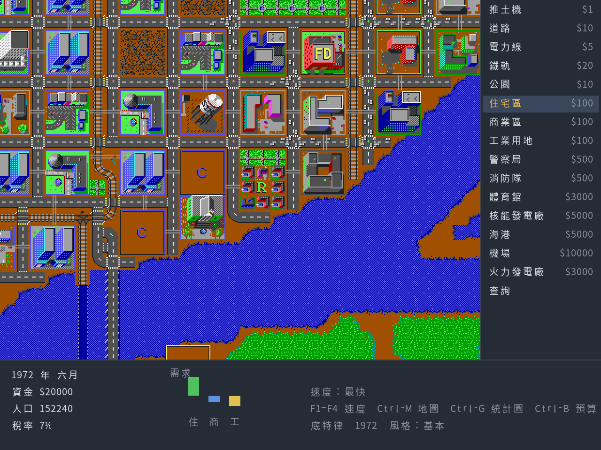
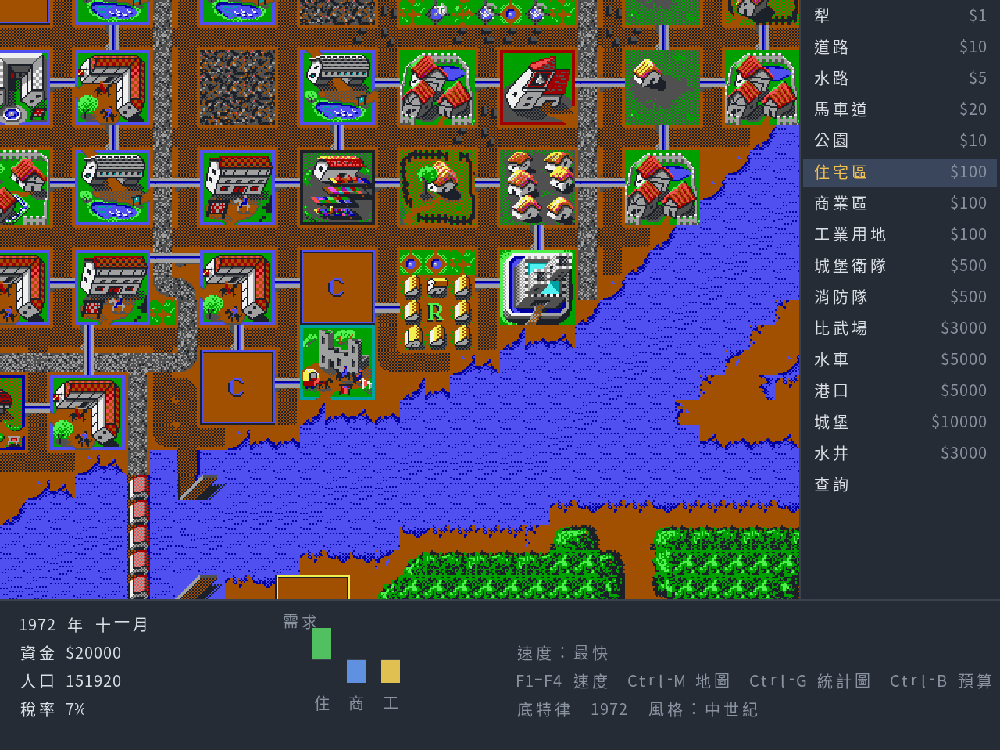
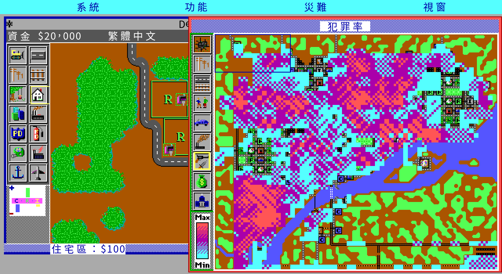
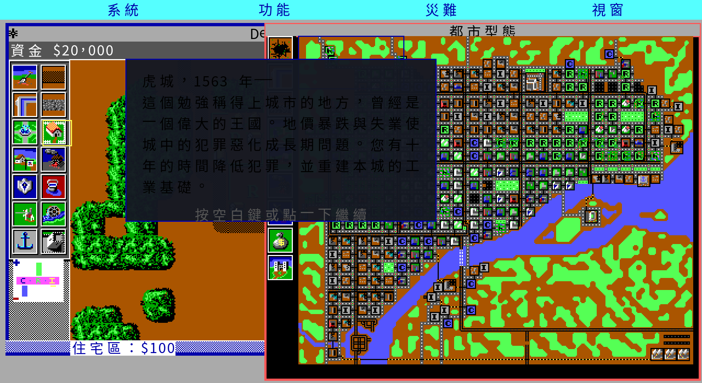
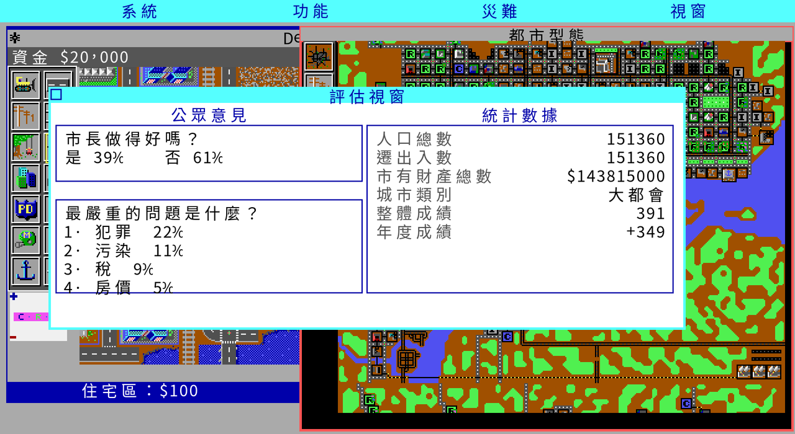

# 模擬城市 — SimCity 繁體中文重製

> Maxis／Will Wright，1989。Go / Ebiten 重寫 ＋ 繁體中文化 ＋
> 軟體世界珍藏版 29 中文說明書保存。

**現況：可以玩了。** 開新城市或八個悲情城市、六種城市風格、蓋東西、四個資訊
視窗、存讀檔都接通了，走的是真的按鍵與滑鼠（[實機驗證](#run)）。逐刻對拍還沒
完全收斂，細節與剩下的差距見 [`docs/re/12-tick-parity.md`](docs/re/12-tick-parity.md)。
本檔不寫進度百分比，現況的單一真相在 [`CONTEXT.md`](CONTEXT.md)。

---

## 目錄

- [畫面](#shots)
- [一件當年沒發生的事](#no-chinese)
- [那本說明書留下了什麼](#manual)
- [這款遊戲當年在吵什麼](#reception)
- [華人圈的空白](#gap)
- [這個專案在做什麼](#project)
- [素材盤點與已知風險](#assets)
- [現況](#status)
- [怎麼跑](#run)
- [文件導覽](#docs)
- [授權與聲明](#license)
- [致謝](#thanks)

---

<a name="shots"></a>
## 畫面



底特律 1972，基本外觀（沒裝資料片時的原始樣子）。狀態列、工具列、訊息全部繁體中文。

| | |
|---|---|
|  |  |
| 同一座城市換成中世紀資料片。**工具名稱跟著換**——發電廠叫「水車」、鐵路叫「馬車道」、體育館叫「比武場」。那是原版六個資料片的設計，不是翻譯自由發揮。 | 地圖視窗，犯罪率圖層。十一個圖層都在，用 1–9、0、`-` 切換。 |



劇本簡介也跟著資料片改寫：底特律 1972 的犯罪問題，在中世紀變成「虎城，1563 年」。



評估視窗。公眾意見、四大嚴重問題與統計數據，數字全部來自模擬層本身。

> 圖裡的地圖圖塊、建築與精靈來自**玩家自己那份原版**，程式讀進來繪製而已。
> 本專案不散布原版素材，發行包裡也沒有。截圖只作為說明用途。

---

<a name="no-chinese"></a>
## 一件當年沒發生的事

台灣代理的《模擬城市》一代**沒有中文版**。

軟體世界珍藏版 29，NT$180，兩片磁片，封面印著「16 BIT」，右下角是那隻站在舊金山
天際線前面的綠色蜥蜴。盒裡附一本中文說明書——但遊戲本身是英文的。

這不是推測。骨灰集散地保存的〈模擬城市系列經典回顧〉（Tony Chen，2002 年 11 月發表於
《電腦玩家》雜誌）附了一張系列規格對照表，一代那一欄逐字寫著：代理公司「軟體世界」、
售價 180、儲存媒介「磁片」、顯示「EGA 16 色」、硬體「XT」、
**中文版本「無」**。二代之後才有中文版。

所以這個專案不是「還原某個中文版」。它是**第一次把 1989 年那一版翻成繁體中文**，
而譯名的依據，是那本說明書。

---

<a name="manual"></a>
## 那本說明書留下了什麼

軟體世界珍藏版 29 的中文說明書，由骨灰集散地的「軟體世界說明書補完計劃」掃描保存，
共 56 張跨頁。它留下的不只是操作步驟，還有一整套 1990 年代初的台灣譯法：

| 原文 | 軟體世界譯名 |
|---|---|
| SCENARIOS | **悲情城市** |
| DULLSVILLE | 達斯維利 |
| SAN FRANCISCO ／ TOKYO ／ DETROIT | 舊金山／東京／底特律 |
| BOSTON ／ RIO DE JANEIRO | 波士頓／里約熱內盧 |
| HAMBURG ／ BERN | 漢堡／伯恩 |
| （劇本的通關目標）| **明日之都** |
| （通關獎勵）| **市鑰** |

說明書第 13 頁對劇本的介紹是這麼寫的：

> 這些城市提供你真假參半的劇情，處理八個有名的都市，它們各會遭遇不同的「悲情問題」；
> 有些會遭受災難蹂躪，有的則有嚴重的慢性社會問題——犯罪率節節高升。
> ……假如你作得好，把該市治理成為市民理想中的「明日之都」，你將獲頒市鑰。
> 否則……市民可是會炒你魷魚的哦！！

**這些選字不會被「潤飾」掉。** `docs/manual-cht/` 逐頁完整轉錄，保留當年的用語、
譯名與行文；原文的誤植照原樣轉錄並加註，讀不清的字標〔字跡不清〕而不猜。
`translations/glossary.md` 以說明書既有譯名優先，說明書沒收的詞才另譯，並在表上標明。

掃描件本身不進版控、不進發行包——補完計劃的說明檔要求「請勿在掃描檔加上其他符號或
用來牟利」，這個專案照辦。

---

<a name="reception"></a>
## 這款遊戲當年在吵什麼

重製一款遊戲之前，得先知道它為什麼值得重製。以下每一條都附來源；
**「一手證據」與「玩家講法」分開標**。

### 一款贏不了也輸不了的遊戲

Brøderbund 一開始拒絕發行，理由是這東西沒辦法行銷——它既不能贏也不能輸。
八個劇本是發行商要求加上去的，用來把它拉回比較傳統的遊戲形式
（[Wikipedia](https://en.wikipedia.org/wiki/SimCity_(1989_video_game))）。

有意思的是，**兩個年代、兩種語言的評論者都認為劇本不是重點**：

> 「劇本再好，也遠不如自己設計一座城市來得吸引人。……當你可以打造一台客製法拉利的時候，
> 為什麼要玩別人開過的二手雪佛蘭？」
> —— Johnny L. Wilson，《Computer Gaming World》第 59 期，1989 年 5 月
> （[原文存檔](https://archive.org/details/Computer_Gaming_World_Issue_59)）

> 「《模擬城市》中沒有結局也沒有特定的遊戲路線要遵循，有的只是玩家無限的創意及挑戰性。」
> —— Tony Chen，〈模擬城市系列經典回顧〉，《電腦玩家》2002 年 11 月

### 1989 年的編輯部在抱怨什麼

CGW 那篇評論最好看的部分不是結論，是細節。當年 CGW 編輯部每個人都有自己的城市，
還把地圖印出來互相品頭論足；而他們的抱怨具體到可以當驗收項目：

- **機場一蓋就墜機**。評論者的機場撐了四個月就被飛機撞毀；總編輯的城市**六個月內墜機五次**。
- **船一直撞同一座橋墩**，或在同一格推平過的海岸擱淺。
- **住宅區突然「變公寓」**：「Oh, no! My prime residential area just went condo!」
  他們的解法是推平區內一格改蓋公園，凍結該區發展。
- **熵**：不成長的東西會衰敗。「SimCity takes the laws of entropy seriously.」

### 三個 1989 年就有的漏洞

| 漏洞 | 做法 | 來源 |
|---|---|---|
| Banzai 稅率 | 12 月把稅率拉到上限 20%，收完稅隔年 1 月降回 0%，市民不會察覺 | CGW #59, 1989 |
| Shift + `FUND` | Mac／Amiga 版每次 +$10,000；C-64/128 按 F1 得 $4,000 | CGW #59, 1989 |
| 公園凍結法 | 住宅區長到滿意後推平一格改蓋公園，等於送出「別再長了」的訊號，同時降犯罪、抬地價 | CGW #59, 1989 |

CGW 當時就寫了 Maxis 正在考慮在後續版本堵掉 Banzai 稅率。

### 哥吉拉是生態學家

CGW 那篇有個小標叫 **"Godzilla Is An Ecologist"**：怪獸**會避開公園、直奔重工業區**，
城市越大待越久，文章戲稱牠是「環保署——蜥蜴組」。

但**遊戲裡那隻怪獸沒有名字**。IBM 版手冊的東京劇本只寫「A large reptilian creature
rose from Tokyo Bay」，CGW 也註明「the monster which attacks a city is not named」。
中文圈則直接叫牠哥斯拉——Tony Chen 那篇的圖說就寫「右上方正在破壞城市的綠色物體便是
有名的哥斯拉怪獸」。

### 兩個被講錯很久的數字

- **「7% 稅率」不是迷信，它就是遊戲的預設值。** IBM 版手冊寫的是
  「The optimum tax rate for fast growth is between 5 and 7%」——一個**區間**；
  而原始碼把初始稅率設成 7（`sim.c:182 CityTax = 7`）。玩家記得的那個數字，
  同時是預設值與手冊區間的上緣。
- **Dullsville 的官方難度是 Easy。** 手冊給八個劇本的難度標示如下；
  網路上流傳「Dullsville 最難」是玩家講法，與手冊相反。

| 劇本 | 主題 | 官方難度 | 時限 | 過關條件 |
|---|---|---|---|---|
| DULLSVILLE, USA 1900 | 發展停滯 | Easy | 30 年 | 成長為 Metropolis |
| SAN FRANCISCO, CA 1906 | 8.0 地震 ＋ 大火 | **Very Difficult** | 5 年 | Metropolis |
| HAMBURG, GERMANY 1944 | 空襲火風暴 | **Very Difficult** | 5 年 | Metropolis |
| BERN, SWITZERLAND 1965 | 交通壅塞 | Easy | 10 年 | 平均車流密度夠低 |
| TOKYO, JAPAN 1957 | 怪獸襲擊 | Moderately Difficult | 5 年 | City Score > 500 |
| DETROIT, MI 1972 | 犯罪 | Moderately Difficult | 10 年 | 平均犯罪密度夠低 |
| BOSTON, MA 2010 | 核電廠熔毀 | **Very Difficult** | 5 年 | City Score > 500 |
| RIO de JANEIRO, BRAZIL 2047 | 溫室效應海平面上升 | Moderately Difficult | 10 年 | City Score > 500 |

手冊還教了一招規避劇本災難：存檔再讀回來。

⚠ **一代沒有水管。** 全份 IBM 手冊裡的 "water" 只指地形上的水域；
自來水系統是 SimCity 2000 以後才有的。這條寫在這裡是因為它是最容易誤植的「回憶」。

### 它真的被拿去上課

- 南加州大學與亞利桑那大學都曾在都市規劃與政治學課堂使用（Wikipedia）。
- CGW 1989 年那篇就提到，當年 8 月的都市規劃研討會上有一篇論文把 SimCity 當成
  都市規劃的動態模型來討論。
- 1990 年《Providence Journal》請五位普洛威頓斯市長候選人玩仿該市的 SimCity。
  候選人 Victoria Lederberg 把自己在民主黨初選的些微落敗，歸咎於報紙描述她遊戲表現不佳；
  遊戲玩得最好的前市長 Buddy Cianci 當年贏得選舉。

### 這個模型是有立場的，而且開發團隊承認

- CGW 1989：「The design team **admits a bias toward rail-based mass transit**.」
- Maxis 總裁 Jeff Braun：「We're pushing political agendas.」（Wikipedia 引）
- Will Wright 承認受 Jay W. Forrester 的 System Dynamics 與《Urban Dynamics》(1969) 影響。
  後世對「這款遊戲把一套 1960 年代的美國都市理論寫死進去」的批評，出發點就在這裡。

這對 remake 是個**技術問題**而不是立場問題：這些偏向就寫在模擬公式的係數裡。
重製的責任是**把它們原樣重現並註明出處**，不是「修正」成 2026 年的都市規劃觀點。

---

<a name="gap"></a>
## 華人圈的空白

查證過程中一個明顯的落差：**中文圈幾乎找不到針對 1989 一代的第一人稱回憶。**
懷舊敘事壓倒性集中在《模擬城市 2000》——例如神楽坂雯麗 2021 年在自由評論網寫的
專欄，講的是 1996 年高二買第一台 PC、第一套正版盒裝就是 2000 代的中文版大補帖。

而 PTT Simcity 板上關於一代的討論，主軸不是玩法，是**取得管道**：2010 年有人發文說
自己是模擬城市迷，想玩一代卻「搜尋了根本找不到入手的方式，就算想買也找不到地方買」，
推文教他去用 DOSBox。

沒有中文版、沒有回憶、找不到管道、說明書正在消失——這四件事加起來，就是這個專案存在的理由。

---

<a name="project"></a>
## 這個專案在做什麼

用 Go / Ebiten 重寫 1989 年的《模擬城市》，並做繁體中文化。**只做一代**，不做 2000 以後。

### 證據優先序

| 序 | 來源 | 適用範圍 |
|---|---|---|
| 1 | **Micropolis C 原始碼**（EA 2008 年以 GPL-3.0 釋出的 SimCity Unix 版原始碼）| 模擬規則層的一切行為 |
| 2 | **DOS 1.10 資料檔本身** | 圖形集、劇本、訊息、音效、存檔格式 |
| 3 | **DUX X11 版的 Tcl 腳本與 XPM** | 介面語意、字串、`.cty` 樣本 |
| 4 | DOS 執行檔反組譯／DOSBox 實跑 | DOS 專屬行為、眼睛確認 |
| 5 | **軟體世界中文說明書** | 譯名與當年台灣用語 |
| 6 | 官方英文手冊、社群、雜誌回顧 | 最後才用，且要標明 |

規則層讀原始碼，呈現層做 DOS 版——這是本專案的分工。詳見 [`CLAUDE.md`](CLAUDE.md) §1。

### 四道閘門

任何機制在原始碼裡讀出來並寫成筆記之前，**不寫任何一行引擎程式**。
機制確認（含 `檔名:行號`）→ 規格收攏（標 READY）→ 實作 → 接線登記，逐道通過。
每條斷言都要帶推論等級：已確認／強證據／假說／未解。細節見 [`CLAUDE.md`](CLAUDE.md) §0。

**社群共識不是證據。** 上一節那些「玩家講法」很好看，但它們不會變成程式碼裡的常數；
會變成常數的只有原始碼與資料檔。兩者衝突時原始碼贏，衝突本身記進筆記。

### 逐 tick 對拍

《模擬城市》的狀態就是一張 **120×100** 的格子陣列加上幾十個純量，全部可以序列化。
所以同一顆隨機種子、同一串操作可以同時餵進 Micropolis 與 Go 版，**逐 tick 比對整張地圖**。

這已經做出來了：Micropolis 在 docker ＋ Xvfb 裡編得起來、跑得動，而且它內嵌的 Tcl
直譯器暴露了 128 個狀態存取子指令（`sim Tile x y`、`sim Funds`、`sim Rand`…），
可以用 pty 腳本驅動。細節與第一批已確認常數見
[`docs/re/01-oracle-harness.md`](docs/re/01-oracle-harness.md)。

對到什麼程度：**單一分區的微實驗，692.5 刻逐次元完全一致**；整座城市的分段對拍
23 段裡 9 段完全一致（含含完整城市評估的段落），資金軌跡與原版相同。剩下的差距
多半落在重建不出來的內部狀態（`Scycle`、需求閥、交通密度…），不一定是實作錯誤。
量法、分母與每一段的結果見 [`docs/re/12-tick-parity.md`](docs/re/12-tick-parity.md)。

亂數是這件事的關鍵：原版的 LCG 模 2²⁴ 可逆，所以**亂數狀態就是一個時鐘**——
兩邊狀態一樣，就等於抽過一樣多次。這讓「哪一刻開始分岔」變成可以二分搜尋的問題。

> 順帶一提，這件事立刻推翻了本文上面引用過的一條二手數字：
> Tony Chen 2002 年的規格表寫「建設範圍 128 × 128」，
> 但原始碼是 `SimWidth 120` / `SimHeight 100`，存檔大小
> `120 × 100 × 2 = 24000` 也對得上。**一手贏二手**，即使二手是當年的雜誌。
> DOS 版是不是同一個尺寸還沒證實。

---

<a name="assets"></a>
## 素材盤點與已知風險

**原版素材一律不進版控、不進發行包，玩家自備合法原版。**

| 素材 | 內容 | 風險 |
|---|---|---|
| DOS 版 1.10（69 檔）| 四套顯示模式圖形、8 個劇本、6 組資料片訊息與音效 | ⚠ **是破解版** |
| DUX X11 版（1993）| 執行檔 ＋ 30 個 Tcl ＋ 154 個 XPM ＋ 46 個音效 ＋ 23 個 `.cty` | ⚠ 未授權的商業發行包；**沒有 C 原始碼** |
| 軟體世界珍藏版 29 說明書 | 56 張跨頁掃描 | 補完計劃要求不得牟利，只轉錄文字 |
| Micropolis 原始碼 | GPL-3.0 | 已封存，當規格書讀，不照抄（見[下文](#license)）|

### 手上這份 DOS 1.10 是破解版

`read.me` 由 "Knight Rider" 署名，明載「This version has had all the copy protection
removed」，並附了作弊程式 `SIMCHEAT.EXE`。檔案時間戳混著 1991-05（原廠）與
1996、2012（被動過）。後果有三：

1. `SIMCITY.EXE` 已被改過，反組譯出來的**不是原廠碼**。
2. 哪些檔案被動過還沒查清楚——分群時間戳是工作清單第 3 項。
3. 在找到一份未破解的 1.10 副本比對之前，從這份得到的行為結論**一律標「假說」**。

### `SIMCITY.CFG` 是明文的自我說明檔

這是盤點時最有用的發現。設定檔自己帶著解碼表，直接給出八種螢幕模式與圖形集的命名規則：

```
Screen Mode: E
Graphics Set: WESTCEGA

    Screen Mode:
        H - Hercules Graphics      M - Hires EGA Monochrome
        C - CGA Monochrome         e - Lores EGA Color
        T - Tandy Color            E - Hires EGA Color
        V - Monochrome VGA/MCGA    2 - 256 Color VGA/MCGA
```

所以圖形檔名的規則是 `<圖形集><模式>`：`WESTCEGA.PGF` ＝ Wild West 集的
Hires EGA Color 版。六個圖形集前綴 `ASIA`／`MEDI`／`WEST`／`FUSA`／`FEUR`／`MOON`
對得上當年兩套資料片——「古城風情系列」與「回到未來系列」。

這件事對中文化有直接後果：**畫布尺寸不能只假設一種版面**。
Hires EGA 640×350 與 MCGA 320×200 是兩套不同的字元格。

---

<a name="status"></a>
## 現況

工作清單與逐項狀態的單一真相是 [`CONTEXT.md`](CONTEXT.md)。這裡只放結論。

### 接通了什麼

正常玩家路徑走得完：開新城市或八個悲情城市 → 選工具 → 蓋 → 看四個資訊視窗 →
查詢地塊 → 存檔 → 離開 → 重開讀檔。這條路徑由
[`tools/playtest.sh`](tools/playtest.sh) 在 Xvfb 裡用**真的按鍵與滑鼠**跑，
每一步截圖，最後拿存檔內容做機械判定，不是用 debug 入口繞過去的。

| 層 | 狀態 |
|---|---|
| 模擬規則 | 十六相位主迴圈、電力、四個逐格掃描、交通、分區成長、普查、需求閥、預算、評分、災難、精靈、訊息、玩家工具 |
| 資料格式 | `.PGF` 圖形、`.PTF` 訊息、`.PSN` 劇本、`.PSF` 音效、`.cty` 城市檔，一套共用的 LZSS |
| 呈現 | 圖塊繪製、工具列、地圖／統計圖／預算／評估四個視窗、整頁圖片訊息、六種風格 |
| 中文化 | 基本檔 226 條 ＋ 六個風格包的覆寫，合計 695 條；譯名以軟體世界說明書為準 |
| 城市外觀 | 基本 ＋ 六個資料片風格，四種顯示模式的圖形檔都解得開 |
| 存讀檔 | 原版 `.cty` 格式，可與原版 SimCity 與 Micropolis 互通 |

### 對原版驗收過的

| 切片 | 驗收方式 | 結果 |
|---|---|---|
| 亂數產生器 | 從活的原版取 24 個連續輸出，看四個就反推內部狀態 | 其餘 20 個逐項預測正確 |
| 地圖與圖塊編碼 | 130 條常數由工具從 `sim.h` 重產；實測值解碼 | 產物與工具輸出逐位元組相同 |
| **地形產生** | 四顆種子各 12000 格逐格對拍（含造島那條 10% 分支）| **48000 格完整 16 位元字全部相同** |
| 城市檔格式 | 32 個城市檔逐位元組 round-trip；存出來的檔拿回原版載入 | round-trip 全部相同；原版讀得起來，12000 格圖塊一致 |
| 電力傳導 | 受控實驗 12000 格逐格對拍 | 劇本 1 的 266 格 `PWRBIT` 差異全部收掉 |
| 四個逐格掃描 | 收斂後的地價／汙染／犯罪平均值 | 與原版相同 |
| 自動接線 | 八座劇本城市的 15 447 格線路 | 99.83% 形狀一致，剩下的 26 格已歸因 |
| 逐刻對拍 | 微實驗 692.5 刻、整城分段 23 段 | 微實驗完全一致；分段 9/23 完全一致 |
| `.PGF` 圖形 | 24 個檔（4 種顯示模式 × 6 種風格）的長度公式 | 全部解開；第 0 庫一律 960 張，與 `TILE_COUNT` 對得上 |
| 點陣字覆蓋 | 掃過譯文與程式碼裡出現的每一個字 | 缺字會讓測試變紅，不會等到玩家看到空白 |

每一條的證據鏈在 `docs/re/` 與 `docs/formats/`，並由
[`docs/re/00-wiring-status.md`](docs/re/00-wiring-status.md) 與一個測試守著
「筆記解出來了但程式碼沒用上」這種漏接。

### 還沒做的

- **逐刻對拍還沒完全收斂**：23 段裡 14 段仍有差異，多半歸因於重建不出來的
  內部狀態，但還沒逐段證實。
- **沒有聲音**：`.PSF` 解得開，但還沒接到播放。
- **macOS 版**：Ebiten 的 macOS 後端要 Objective-C，交叉編要 osxcross，這一版沒出。
- 說明書的安裝步驟、密碼表與參考手冊的策略討論還沒轉錄（譯名價值低，排在後面）。

---

<a name="run"></a>
## 怎麼跑

### 玩

先自備一份合法的 **SimCity 1.10（DOS）**，解開到某個目錄——裡面要看得到
`CEGA/`、`mcga/`、`MONO/`、`sega/`、`DATA/`、`SCENARIO/`。本專案不散布這些檔案。

發行包（Linux 與 Windows）用 [`tools/release.sh`](tools/release.sh) 產，
內容只有執行檔、授權條款與讀我——字型與譯文都內嵌在執行檔裡。解開後：

```bash
./chengshi -data "/path/to/SIMCITY 1.10"                 # 新城市
./chengshi -data "…" -style medi                          # 換城市風格
./chengshi -data "…" -scenario 6                          # 第 6 個悲情城市（底特律）
./chengshi -data "…" -load city.cty                       # 讀城市檔
```

路徑不想每次打，設環境變數 `CHENGSHI_DATA` 指過去。存檔預設落在使用者資料目錄
（Linux 是 `~/.local/share/chengshi/`），不會寫進程式所在的位置。完整參數與操作
說明見發行包裡的 `讀我.txt`。

風格代號：`base` 基本（預設，就是沒裝資料片的原始外觀）、`asia` 古代亞洲、
`medi` 中世紀、`west` 西部拓荒、`fusa` 未來美國、`feur` 未來歐洲、
`moon` 月球殖民地。

### 從原始碼建置與驗證

所有建置、測試、抓圖都在 docker 裡，不裝任何東西到系統。

```bash
docker build -f docker/go.Dockerfile -t simcity-go:1.25 docker/

tools/go.sh test ./...              # 全部測試，含接線檢查與字型覆蓋率
tools/playtest.sh                   # 正常玩家路徑實機驗證（真視窗、真鍵盤、真滑鼠）
tools/screenshot.sh 12 out.png      # 單張截圖，GAME_ARGS／GAME_KEYS 控制情境
tools/release.sh                    # 打發行包
tools/verify_release.sh             # 驗發行包本身（不是驗 build 出來的執行檔）
tools/font.sh                       # 改過譯文之後重烘點陣字圖集
tools/i18n.sh                       # 重新合併七份訊息檔的譯文
```

逐刻對拍另外需要自備 [Micropolis](https://github.com/SimHacker/micropolis) 封存，
放在 `workplace/ref/micropolis/`；沒有它的測試會跳過，不會紅。

```bash
tools/oracle/build.sh               # 把 Micropolis 編成對拍用的 oracle
tools/oracle/drive.sh <tcl> <json>  # 用 pty 驅動 oracle 取狀態
```

---

<a name="docs"></a>
## 文件導覽

| 檔案 | 內容 |
|---|---|
| [`CONTEXT.md`](CONTEXT.md) | 現況、術語、工作清單。接手時先讀這份 |
| [`CLAUDE.md`](CLAUDE.md) | 方法論：四道閘門、證據優先序、中文化政策、授權立場 |
| [`docs/re/`](docs/re/) | 反組譯與讀原始碼的筆記，一份一個機制，含 `檔名:行號` |
| [`docs/spec/`](docs/spec/) | 收攏成 `READY` 的規格，實作照這份寫 |
| [`docs/formats/`](docs/formats/) | DOS 資料檔格式：LZSS、`.PGF`、`.PTF`、`.cty` |
| [`docs/manual-cht/`](docs/manual-cht/) | 軟體世界中文說明書的逐頁轉錄 |
| [`translations/glossary.md`](translations/glossary.md) | 譯名表，每一條標明依據是說明書還是本專案新譯 |
| [`licenses/`](licenses/) | 第三方授權（內建點陣字型的 OFL 1.1）|
| [`LICENSE`](LICENSE) | 授權條款全文 ＋ 商標與規格參考揭露 |
| [`docs/research/`](docs/research/) | 上面那些引文的查證筆記：來源 URL、年份，以及「事實／意見」的分界 |

---

<a name="license"></a>
## 授權與聲明

本專案採 **[PolyForm Noncommercial License 1.0.0](https://polyformproject.org/licenses/noncommercial/1.0.0)**
（source-available，**不是** open source）：

- **非商業用途免費**：使用、重製、**散布**、**修改並散布修改版**都可以，不必事先取得同意。
  個人研究、實驗、測試、興趣專案、私人娛樂算非商業；慈善團體、教育機構、
  公立研究機構、公共安全與衛生機構、環保團體、政府機關的使用也算。
- 條件：把條款（或其網址）連同 `Required Notice:` 那一行一起交給拿到副本的人。
- **商業用途要先洽談**：<wicanr2@gmail.com>。這一條的用意是保留商業條件的決定權，
  不是拒絕合作。

條款全文見 [`LICENSE`](LICENSE)——取自 PolyForm 官方 repo 的 `1.0.0` tag，
逐字未改（SHA-256 已記在檔尾）。

**授權不涵蓋原版素材。** PolyForm 的條款只涵蓋本儲存庫中由著作權人創作的內容
（程式碼、文件、規格、機制筆記、譯文與譯名校訂紀錄、工具）。原版的執行檔、資料檔、
美術、音樂、點陣字型與說明書掃描件屬於各自的權利人；本專案不散布它們，
使用者必須自備合法的原版副本。這段寫在 `LICENSE` 的「附註」，**明確標示不是條款的一部分**——
PolyForm 的條款全文一個字都不能改。

### 與 Micropolis 的關係（要講清楚的一件事）

本專案**不是 Micropolis 的 fork，也不散布它的程式碼**。Micropolis 是
Electronic Arts 於 2008 年以 GPL-3.0 釋出的 SimCity Unix 版原始碼；
本專案把它當**可讀的規格書**，讀完寫成 `docs/spec/`，再用 Go 重新撰寫，一行都不照抄。
著作權人據此主張本作品不是 Micropolis 的衍生著作，因而不受 GPL-3.0 拘束。

**這是著作權人的立場，不是法院見解。** 「讀 GPL 原始碼後重寫」是否構成衍生著作，
實務上有爭議。這裡把立場與風險一併寫出來，不粉飾。

### 商標

SimCity 與 Maxis 是 Electronic Arts Inc. 的商標或註冊商標。
MICROPOLIS 是 Micropolis GmbH 擁有的註冊商標，授權給 Micropolis 都市模擬遊戲專案使用。
本專案與 Electronic Arts、Maxis、Will Wright、DUX Software、Micropolis GmbH、
軟體世界、智冠科技或骨灰集散地皆無隸屬關係，也未獲其背書。上述名稱僅用於指稱原版作品。

---

<a name="thanks"></a>
## 致謝

- **Will Wright 與 Maxis**：1989 年做出一款贏不了也輸不了的遊戲，並且賣得出去。
- **Electronic Arts 與 Don Hopkins**：2008 年把原始碼以 GPL-3.0 釋出成 Micropolis。
  沒有那次釋出，這個專案只能靠反組譯。
- **軟體世界**：1990 年代把這款遊戲代理進台灣，並且做了一本中文說明書。
- **骨灰集散地（oldgame.tw）與「軟體世界說明書補完計劃」**：把那本說明書掃描保存下來。
  他們自己寫的理由是「隨著時間過去，這些早期的磁片和說明書也逐漸被丟棄，
  若再不發起一個有組織的行動，很多珍貴的說明書及資料將永遠消失」——這個專案在做同一件事。
- **Tony Chen**（〈模擬城市系列經典回顧〉，《電腦玩家》2002）與
  **Johnny L. Wilson**（《Computer Gaming World》#59, 1989）：
  隔了十三年、隔著太平洋，兩篇文章對這款遊戲下了同一個結論。
