# SimCity — a Traditional Chinese remake

[繁體中文](README.md) · **English** · [日本語](README_jp.md)

**Be mayor first. Vote for one later.**

Taipei and Kaohsiung elected their own mayors for the first time on 3 December 1994.
Before that the heads of those two special municipalities were appointed by central
government. A few years earlier, a Taiwanese publisher called 軟體世界 (Software World)
had already put *SimCity* on the shelves: NT$180, two floppies, one Chinese manual.
The city on the screen — its tax rate, where the roads went, whether the power plant
got built, whether the money went to police or to fire — was decided entirely by the
person at the keyboard.

What the game gives you is not a record of achievement. It is a bad hand and a deadline.
Dullsville has stagnated for a century, the citizens are bored, the treasury holds
$5,000 and you have thirty years. San Francisco 1906 opens with the earthquake: roads
and power lines cut, five years. Detroit 1972 wants crime down in ten. Boston 2010
opens with a nuclear meltdown; the fallout does not clear, so that land is written off
and the city grows elsewhere. Eight scenarios. When time is up you are judged on
numbers, not on explanations.

This project rewrites the 1989 simulation engine in Go, reads the original artwork and
data files back in, adds a Traditional Chinese localisation, and preserves the Taiwanese
manual alongside it. Bring your own legal copy of the original floppies and the chair
is yours.

> Maxis / Will Wright, 1989. Rewritten in Go / Ebiten, localised into Traditional
> Chinese, with the 軟體世界 *Collector's Edition 29* Chinese manual preserved.

**Status: playable.** New cities and all eight scenarios, six city styles, six display
modes, building, the four data windows, save and load — all wired up, driven by real
keys and a real mouse ([verification](#run)). Tick-for-tick parity is not fully
converged; the remaining gap is in [`docs/re/12-tick-parity.md`](docs/re/12-tick-parity.md).
This file carries no progress percentages; the single source of truth for status is
[`CONTEXT.md`](CONTEXT.md).

---

## Contents

- [Screens](#shots)
- [Something that never happened](#no-chinese)
- [What those manuals preserved](#manual)
- [What people argued about in 1989](#reception)
- [Release and memory in the Chinese-speaking world](#gap)
- [What this project does](#project)
- [What this remake brings together](#integration)
- [Source material and known risks](#assets)
- [Status](#status)
- [Running it](#run)
- [Documentation map](#docs)
- [Licence and disclaimers](#license)
- [Acknowledgements](#thanks)

---

<a name="shots"></a>
## Screens

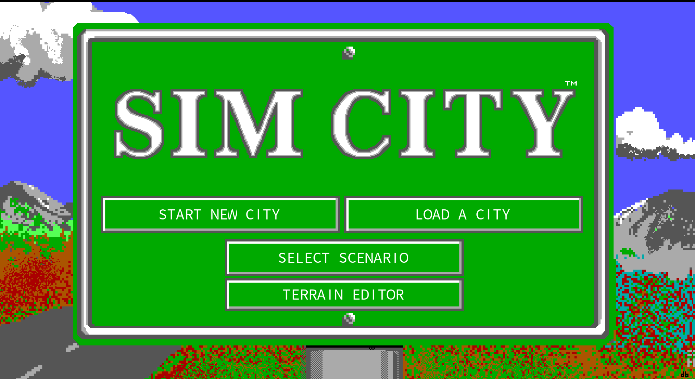

Startup goes to the SIM CITY sign first. The four options are drawn in the current
language — the first three are the original's, the fourth (Terrain Editor) is added by
this remake. The logo, the original three button frames and their click rectangles keep
the original layout; only the English text baked into the picture is replaced by the
remake's four-language text layer. The fourth button sits on a patch of sign green that
was measured to contain **no original artwork**, so it covers nothing up.

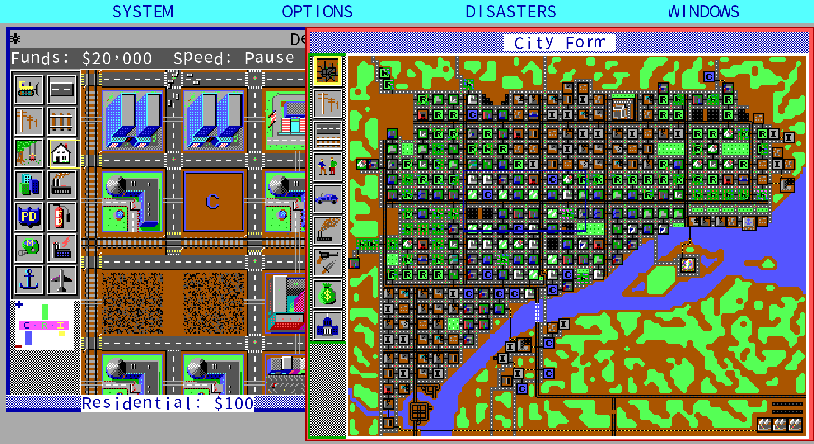

Detroit 1972, base look (what the game looks like with no expansion disk installed).
The layout reproduces the DOS original: menu bar, edit window (city name and date in the
title bar, funds/message band, icon palette, RCI demand indicator, tool band), City Form
window and its layer icon column. Character cells follow the original too (one cell for
Latin, two for Chinese), so a field like `$20,000` is exactly as wide as the original's.

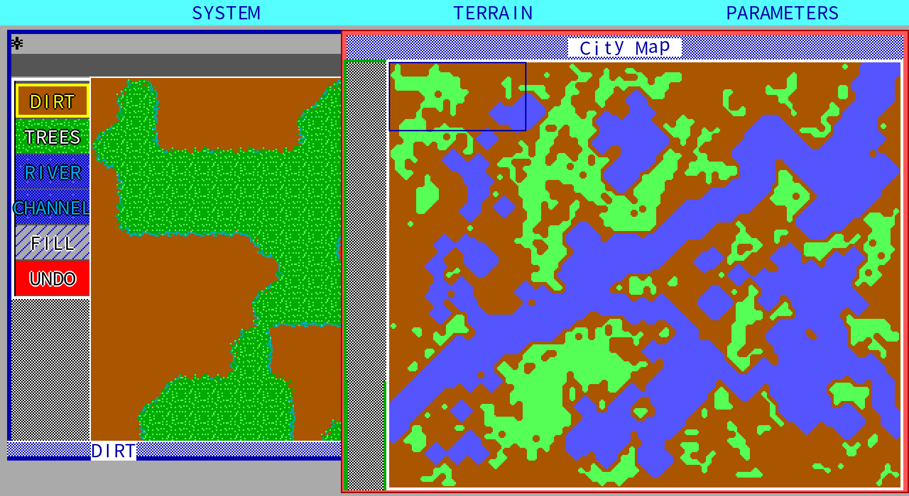

*SimCity Terrain Editor*, shipped on a floppy in 1990. The original is a separate
program; the remake implements all of it: three menus (System / Terrain / Parameters),
a six-cell palette on the left (dirt, trees, river, channel, plus fill and undo), the
edit window and the city map on the right. **It uses the same window system as the game
itself** — the coordinates are identical, which was established by running the original
and measuring it pixel by pixel. The values each brush writes into the map come from a
tool descriptor table shared by the game and the editor; undo is a 5,000-cell ring plus
four whole-map snapshots. The exit path follows the original: the editor only saves;
you load the file from the game.

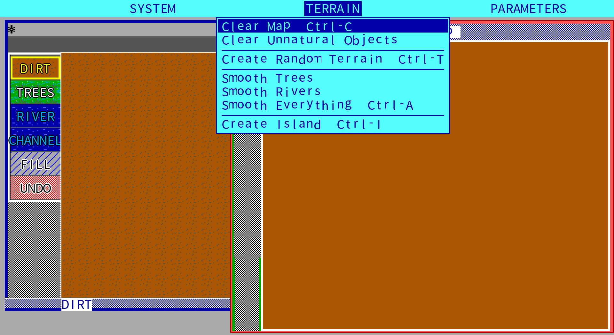

The Terrain menu. In the Traditional Chinese build every one of these seven commands is
worded the way 軟體世界's own 1990 booklet for this editor worded it — see
[Where the Chinese wording comes from](#provenance) below.

**These screens were compared against the original cell by cell, not "looks about
right".** The remake's frame is scaled back down to 640×350 and diffed byte-wise
against the original running under DOSBox:

| What | Result |
|---|---|
| The full edit area, 512 cells, City Form closed | **498 cells bit-identical**; the 14 that differ are all cursor frames each side draws itself. **All six expansion styles give the same number, and the differing cells sit in exactly the same places** ([report](docs/playtest/style-parity-2026-09-03.md)) |
| The City Form window in full | **130,581 / 131,600 pixels identical** (99.226%); the map body **107,834 / 108,300** (99.570%) |
| Title screen and scenario menu | **224,000 pixels differing only by the 16×15 mouse cursor** |

Reproduce with `tools/screen_parity.sh` (it runs DOSBox itself to produce the baseline;
neither the original assets nor the original's frames enter version control). This test
caught a palette that was one step too dark, a tool palette two pixels out of place, map
tiles treating black as transparent, a saved city whose map was shifted eight rows, and
`.PPF` bit planes assembled in reverse (layout perfect, text legible, only the colours
displaced). Every one of them compiled, passed tests and played fine.

| | |
|---|---|
| 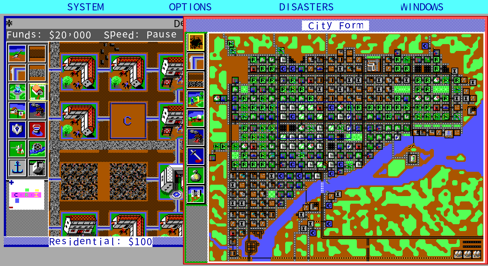 | 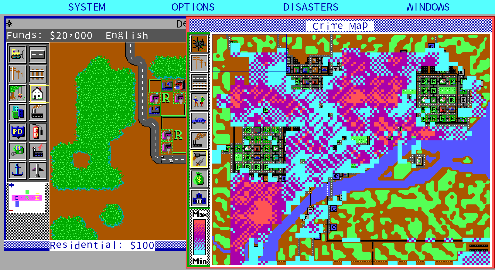 |
| The same city with the medieval expansion. **Tool names change with it** — the power plant becomes a water wheel, the railway a coach road, the stadium a jousting ground (馬術競技場 in Chinese, the word 電腦休閒世界's 1990s manual used). That is the original's design across six expansions, not translator's licence. | The map window, crime layer. All eleven layers are there, switched with 1–9, 0 and `-`. |

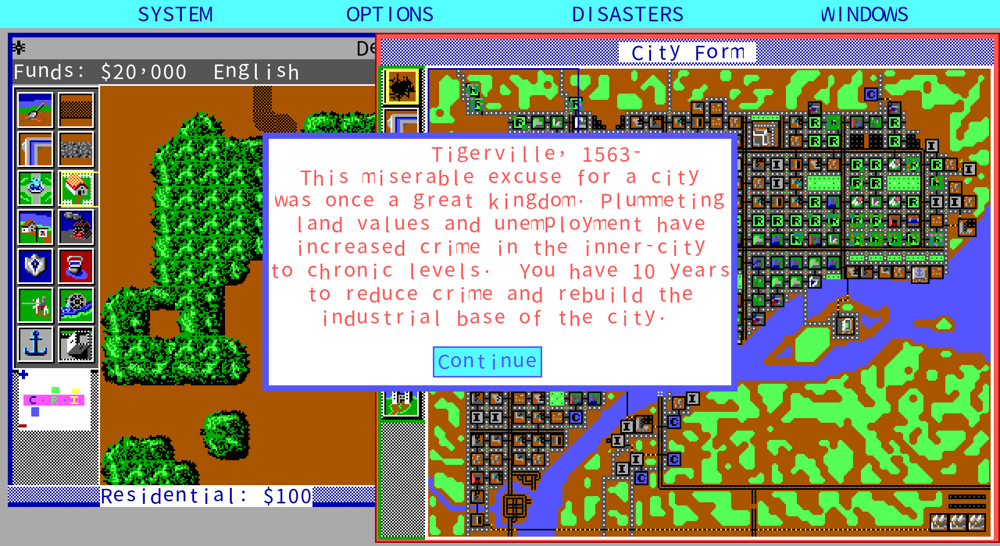

Scenario briefings are rewritten per expansion too: Detroit 1972's crime problem becomes
"Tiger City, 1563" in the medieval set.

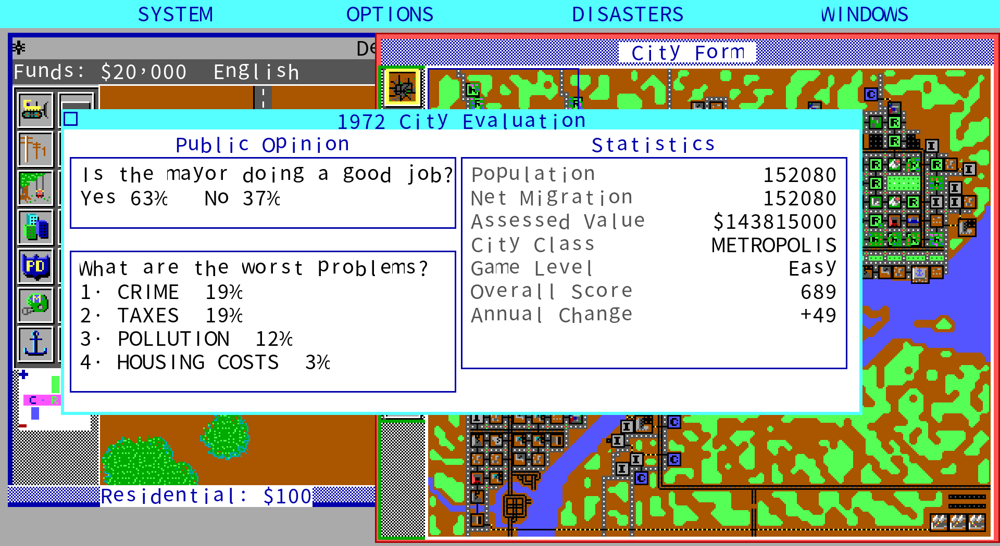

The evaluation window: public opinion, the four worst problems, and seven statistics
(population, migration, assessed value, city class, game level, overall score, annual
score) — all of it produced by the simulation layer itself.

<a name="provenance"></a>
### Where the Chinese wording comes from

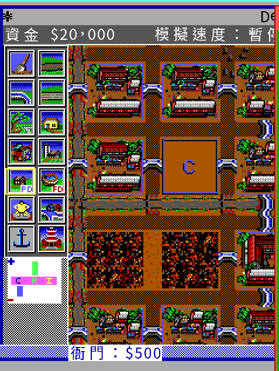

*(This one screenshot is the Traditional Chinese build, because it is the point being
made.)* Ancient Asia expansion; clicking the police cell in the palette puts
**衙門：$500** in the tool-name field — 衙門 (*yamen*) being the imperial-era term for a
magistrate's office. The same cell reads 警局 in the medieval set, 警長 ("sheriff") in
the Wild West, 警防部 in Future Europe and 月球警署 on the Moon. None of those words were
invented by this project; they are what the Taiwanese publishers printed in the early
1990s.

The project holds **four** period Chinese manuals, and every noun on screen traces back
to a page in one of them:

| Words on screen | Which manual | Page |
|---|---|---|
| 悲情城市, 明日之都, 市鑰, the eight scenario cities | 軟體世界 Collector's Edition 29 | pp. 13–14 |
| **大都會區** (`Megalopolis`), 大都會 (`Metropolis`) | 軟體世界 CE 29 | pp. 1, 18 |
| 推土機, 鐵軌, 全自動整地, the budget and evaluation fields | 軟體世界 CE 29 | pp. 23–58 |
| **地形編修程式**, 開濶地, 綠地, 航道, 均佈, **回手** (undo), 地形變數, 河流曲率 | 軟體世界 220, *Terrain Editor* | pp. 13–22 |
| **衙門**, **廟宇**, **摔角場**, **港灣**, 水井灌溉系統 | 電腦休閒世界 022, *Ancient Cities* | p. 56 plate |
| **警局**, **馬術競技場**, 城堡 / **警長**, **賽馬場**, **金礦區** | 電腦休閒世界 022 | pp. 59, 62 plates |
| **小鎮**, **首都** and the rest of the city classes | 電腦休閒世界 022 | p. 46 |
| **警防部**, **雷射競技場**, **水翼船港**, **太空站**, 核子融爐電廠 | 電腦休閒世界 024, *Future Cities* | pp. 17–18 plates |
| **月球警署**, **自由港**, **太空梭站**, **引力波電廠** | 電腦休閒世界 024 | p. 19 plate |

**Four manuals are not four independent sources.** Part One of 電腦休閒世界 022 and
軟體世界's Collector's Edition 29 are *the same Chinese text* — menus, tools, window
fields and all eight scenario briefings match sentence for sentence, down to the figure
number ("Figure 8, Edit Window") — even though the two were licensed from MAXIS by
different Taiwanese publishers. Part B of 024 is in turn a reprint of 220. The lineage
diagram and every term-by-term decision are in
[`docs/manual-cht/naming-crosswalk.md`](docs/manual-cht/naming-crosswalk.md).

**Where a manual is coarser than the English, the manual still wins — but the gap is
recorded.** `Sumo arena` is 摔角場 ("wrestling ground", not sumo); `Rodeo` is 賽馬場
("horse racing"); `Hovercraft Port` is 水翼船港 — **hydrofoil, which is not a hovercraft;
that is a 1990 mistranslation**, and it is kept, with a note.

Three places deliberately do *not* follow the manual: the Moon's two power plants (024's
plate contradicts its own body text), the Moon's stadium (following the manual would let
the string fall back to the base wording, which is exactly what
`TestStyleFilesDoNotInheritBaseWording` guards against), and `Query` (022 renders it as
"parliamentary interpellation", which does not describe clicking a tile to inspect it).

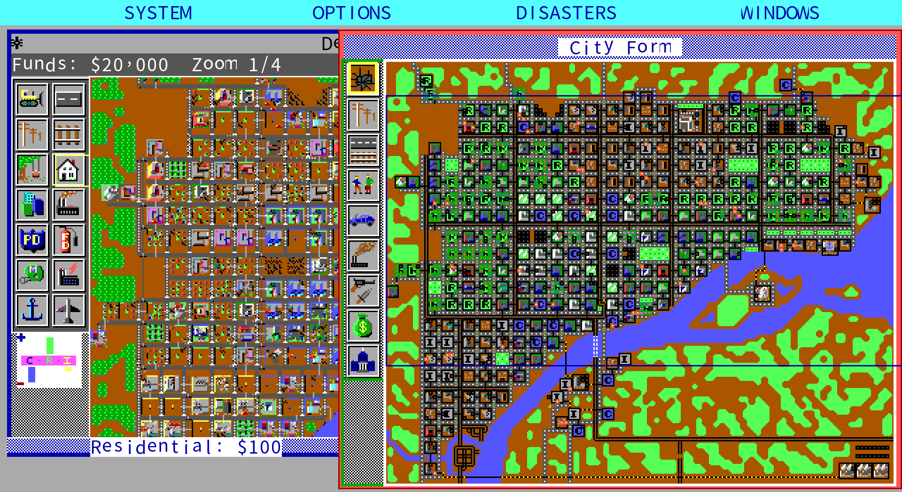

**Zoom, multiple languages and background music are additions; the original has none of
them.** The original's edit window is always 16 pixels per cell — that was the EGA
screen of 1989, and the only way to see the whole city was the 3×3 minimap on the right.
Here `-` (or the wheel) zooms to 1/2 and 1/4, and **you can still build while zoomed
out**; with the edit window at its widest, 1/4 shows the whole 120×100 map at once.

### Six display modes

PCs in 1989 came with many kinds of screen. `SIMCITY.CFG` carries its own decoder table
listing eight codes; the game shipped six sets of artwork: hi-res EGA colour (640×350),
lo-res EGA colour, Tandy colour, VGA 256-colour, monochrome VGA, and CGA monochrome
(640×200, two colours). All six decode, and all six can be switched inside the game —
`-mode`, or **SYSTEM → Display mode**.

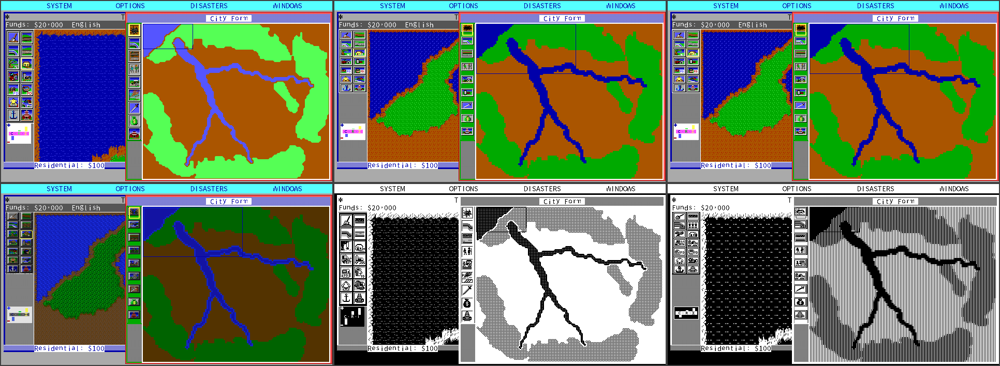

The same city (Taipei, Ancient Asia expansion) in all six modes. Top row: hi-res EGA
colour, lo-res EGA colour, Tandy colour. Bottom row: VGA 256-colour, monochrome VGA,
CGA monochrome. The tiles come from the player's own copy of the original; this project
distributes none of those files.

**What changes is all of the artwork and the colour scheme — not the layout.**


The tool palette, demand indicator, graph buttons and layer icons all use that mode's own
artwork (left to right: hi-res EGA, Tandy, monochrome, CGA). These banks are **not scaled
versions of one another** — each was drawn for its own screen. The tool palette is 57×182
in hi-res EGA, 56×123 in Tandy, 55×120 in CGA; cell sizes and row pitches all differ, and
the layer icons differ even in arrangement (one column of nine in EGA and mono, two
columns of five in Tandy, **nine across in one row in CGA**). So each mode gets its own
measured grid; without it the buttons would hit the neighbouring cell.

The half that the program draws itself — menu bar, window frames, title bars, funds band,
dialogs, selection frames — follows the mode as well. The criterion came from measuring
the original: each of the six modes was run under DOSBox and the colours counted.
**Monochrome VGA and CGA monochrome contain exactly two colours, `#000000` and
`#ffffff`**, so in those two modes the interface collapses to black and white and the
selection frame is drawn as a dithered outline — which is what the original does.

⚠ There is only one layout: every coordinate in this project was measured from the
hi-res EGA (640×350) artwork. So this is "Tandy or CGA artwork on a hi-res EGA layout",
**which is not any screen the original ever produced** — it is a combination this project
invented. Reasoning and measurements: the "Display modes" section of
[`docs/spec/ui-layout.md`](docs/spec/ui-layout.md).

Language is chosen from **SYSTEM → Settings**: Traditional Chinese, Simplified Chinese,
Japanese or English. The choice is written to `chengshi/settings.json` in the user
configuration directory and applied on the next start; `-lang` overrides for one run
without touching the preference.

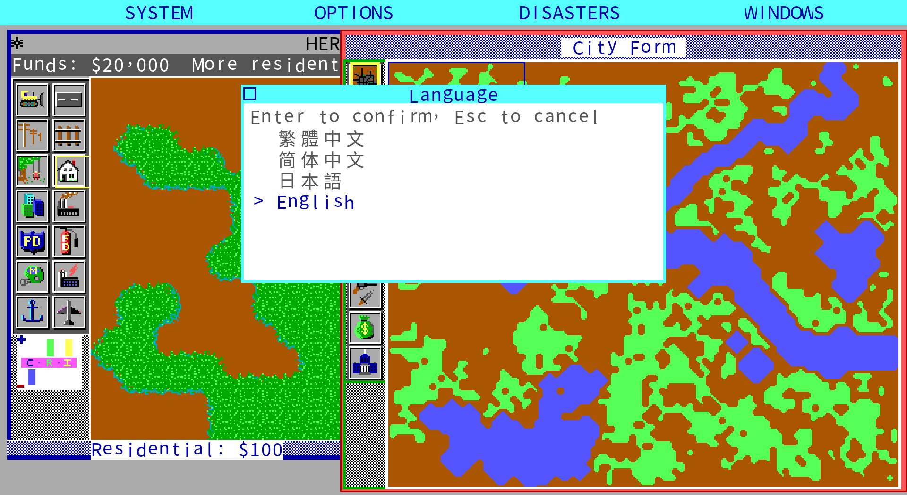

All four cover the whole interface and every piece of in-game text: status messages,
picture messages, the eight scenario briefings, the query panel's grades, the budget
and evaluation fields, and **the wording each of the six expansion sets uses of its
own** — the power plant is a Water Wheel in Ancient Asia, the railway a Wagon Track in
Medieval Times, and the translations have to change with it rather than falling back to
the base file. A test pins that down (`TestStyleFilesDoNotInheritBaseWording` and its
Japanese counterpart): if the original changed a word and the translation did not, it
goes red — that kind of omission is invisible otherwise, because the files are complete,
nothing is empty, and the screen looks fine. English is not in version control; it is
read at run time from your own `.PTF`.

**The original has no music.** That was established, with five mutually supporting lines
of evidence ([`docs/re/19-no-music.md`](docs/re/19-no-music.md)): the official manual's
credits list `Sounds:` and no `Music:`; `SIMCITY.CFG` only selects a sound device; the
executable's string table contains nothing music-related; the audio inside all 69 data
files is the eight sound effects totalling three seconds; and **in 148 seconds of
recording from the real thing, exactly one second is not silence** — and that second is a
dialog beep, which makes a convenient positive control. The title screen sits there for
12 seconds, which is where an opening theme would most obviously be.

So the remake plays **files the player supplies** (`.ogg` / `.wav` under `music/`).
`M` toggles, `[` / `]` change track, `-mute` silences both effects and music. This
project distributes no original music in any public release.

> The map tiles, buildings and sprites in these images come from **the player's own copy
> of the original**; the program only reads and draws them. This project distributes no
> original assets, and none are in the release packages. The screenshots are here for
> explanation only.

---

<a name="no-chinese"></a>
## Something that never happened

**There was never a Chinese version of SimCity 1 in Taiwan.**

軟體世界 Collector's Edition 29: NT$180, two floppies, "16 BIT" on the cover, the green
lizard in front of the San Francisco skyline in the corner. Inside is a Chinese manual —
but the game itself is in English.

This is not a guess. The retrospective "SimCity series classic review" (Tony Chen,
*PC Gamer Taiwan*, November 2002), archived at oldgame.tw, includes a specification table
for the series; the column for the first game lists the publisher as 軟體世界, the price
as 180, the medium as floppy disk, the display as "EGA 16 colour", the hardware as "XT",
and the **Chinese version as "none"**. Chinese versions start with SimCity 2000.

So this project is not a restoration of some Chinese release. It is a **new Traditional
Chinese remake of the 1989 original, built on the Taiwanese manual**. Until the release
history has been checked region by region and platform by platform, no claim is made that
it is the first such version anywhere.

---

<a name="manual"></a>
## What those manuals preserved

Four period Chinese manuals were printed in Taiwan for this game, and all four are
transcribed here page by page:

| Manual | Publisher | Covers | Transcription |
|---|---|---|---|
| Collector's Edition 29, *SimCity* | 軟體世界 | the game's operations and reference booklets (pp. 1–82) | [`docs/manual-cht/`](docs/manual-cht/) |
| 220, *SimCity Terrain Editor* | 軟體世界 | the terrain editor (pp. 1–23) | [`sw220-terrain/`](docs/manual-cht/sw220-terrain/) |
| 022, *Ancient Cities* | 電腦休閒世界 (MAXIS-licensed) | base game + Ancient Asia / Medieval / Wild West (pp. 1–64) | [`chw022-ancient/`](docs/manual-cht/chw022-ancient/) |
| 024, *Future Cities* | 電腦休閒世界 (MAXIS-licensed) | Future USA / Europe / Moon + a reprint of 220 (pp. 1–40) | [`chw024-future/`](docs/manual-cht/chw024-future/) |

The Collector's Edition 29 one was scanned and preserved by oldgame.tw's
"Software World manual completion project" — 56 double-page spreads. What it preserves is
not just the procedures but a whole vocabulary from early-1990s Taiwan:

| Original | 軟體世界's rendering |
|---|---|
| SCENARIOS | **悲情城市** ("cities of sorrow") |
| DULLSVILLE | 達斯維利 |
| SAN FRANCISCO / TOKYO / DETROIT | 舊金山／東京／底特律 |
| BOSTON / RIO DE JANEIRO | 波士頓／里約熱內盧 |
| HAMBURG / BERN | 漢堡／伯恩 |
| (the scenario win condition) | **明日之都** ("city of tomorrow") |
| (the reward for winning) | **市鑰** ("key to the city") |

**These word choices are not "polished away".** `docs/manual-cht/` transcribes the manual
page by page, keeping the period vocabulary, renderings and phrasing; typos in the
original are transcribed as they stand with a note, and illegible characters are marked
〔illegible〕 rather than guessed. `translations/glossary.md` gives priority to the
manual's existing renderings; terms the manual does not cover are translated afresh and
marked as such.

The scans themselves stay out of version control and out of the release packages — the
completion project asks that its scans not be annotated or used for profit, and this
project complies.

---

<a name="reception"></a>
## What people argued about in 1989

Before remaking a game it is worth knowing why it is worth remaking. Every claim below
carries a source, and **first-hand evidence is marked separately from what players say**.

### A game you cannot win or lose

Brøderbund initially refused to publish it, on the grounds that it could not be marketed:
you can neither win nor lose. The eight scenarios were added at the publisher's request,
to pull it back towards a more conventional shape of game
([Wikipedia](https://en.wikipedia.org/wiki/SimCity_(1989_video_game))).

What is interesting is that **reviewers in two eras and two languages both concluded the
scenarios were not the point**:

> "As good as the scenarios are, they are far less attractive than designing one's own
> city. … Why play with someone's used Chevrolet when you can build a custom Ferrari?"
> — Johnny L. Wilson, *Computer Gaming World* #59, May 1989

> "SimCity has no ending and no set path to follow; there is only the player's unlimited
> creativity and the challenge."
> — Tony Chen, "SimCity series classic review", *PC Gamer Taiwan*, November 2002

### What the 1989 editorial office complained about

The best part of the CGW review is not its conclusion but its details. Everyone in the
office had their own city and printed the maps out to compare; their complaints are
specific enough to serve as acceptance criteria:

- **Airports attract crashes.** The reviewer's airport lasted four months before a plane
  hit it; the editor-in-chief's city had **five crashes in six months**.
- **Ships keep hitting the same bridge pier**, or run aground on the same bulldozed cell.
- **Residential zones "go condo"**: "Oh, no! My prime residential area just went condo!"
  Their fix was to bulldoze one cell inside the zone and put a park there, freezing it.
- **Entropy**: what does not grow decays. "SimCity takes the laws of entropy seriously."

### Three exploits that already existed in 1989

| Exploit | How | Source |
|---|---|---|
| Banzai tax rate | Raise tax to the 20% cap in December, collect, drop back to 0% in January; the citizens never notice | CGW #59, 1989 |
| Shift + `FUND` | +$10,000 each time on Mac/Amiga; F1 on C-64/128 gives $4,000 | CGW #59, 1989 |
| Park freeze | Once a residential zone has grown enough, bulldoze one cell for a park: it signals "stop growing" while lowering crime and raising land value | CGW #59, 1989 |

CGW noted at the time that Maxis was considering closing the Banzai tax rate in a later
version.

### Godzilla is an ecologist

The CGW piece has a subhead reading **"Godzilla Is An Ecologist"**: the monster **avoids
parks and heads straight for heavy industry**, and stays longer the larger the city. The
article calls it "the EPA — lizard division".

But **the monster in the game has no name**. The IBM manual's Tokyo scenario says only
that "a large reptilian creature rose from Tokyo Bay", and CGW notes that "the monster
which attacks a city is not named". Chinese-language coverage calls it Godzilla outright —
the caption in Tony Chen's article reads "the green object destroying the city at upper
right is the famous Godzilla monster".

### Two numbers that have been repeated wrongly for a long time

- **"7% tax" is not folklore; it is the game's default.** The IBM manual says "the optimum
  tax rate for fast growth is between 5 and 7%" — a *range* — and the source sets the
  initial rate to 7 (`sim.c:182 CityTax = 7`). The number players remember is both the
  default and the top of the manual's range.
- **Dullsville's official difficulty is Easy.** The manual's ratings are below. The
  widely repeated claim that Dullsville is the hardest is a player opinion, and the
  manual says the opposite.

| Scenario | Theme | English manual | Limit | Win condition |
|---|---|---|---|---|
| DULLSVILLE, USA 1900 | Stagnation | Easy | 30 years | Metropolis |
| SAN FRANCISCO, CA 1906 | 8.0 earthquake + fire | **Very Difficult** | 5 years | Metropolis |
| HAMBURG, GERMANY 1944 | Firebombing | **Very Difficult** | 5 years | Metropolis |
| BERN, SWITZERLAND 1965 | Traffic | Easy | 10 years | Low traffic density |
| TOKYO, JAPAN 1957 | Monster attack | Moderately Difficult | 5 years | Score above 500 |
| DETROIT, MI 1972 | Crime | Moderately Difficult | 10 years | Low crime |
| BOSTON, MA 2010 | Nuclear meltdown | **Very Difficult** | 5 years | Score above 500 |
| RIO de JANEIRO, BRAZIL 2047 | Sea level rise | Moderately Difficult | 10 years | Score above 500 |

The Chinese manual uses **four** difficulty phrases where the English has three grades,
and the two disagree about Tokyo — that is the translator's prose, not a second scale.

The manual also teaches a way around scenario disasters: save and reload.

⚠ **There are no water pipes in SimCity 1.** Every occurrence of "water" in the IBM
manual refers to terrain. Plumbing arrives with SimCity 2000. This is noted here because
it is the most commonly misremembered detail.

### It really was used in teaching

- USC and the University of Arizona both used it in urban planning and political science
  courses (Wikipedia).
- The 1989 CGW piece mentions a paper at that August's urban planning conference treating
  SimCity as a dynamic model of urban planning.
- In 1990 the *Providence Journal* had five candidates for mayor of Providence play a
  SimCity version of the city. Candidate Victoria Lederberg blamed her narrow loss in the
  Democratic primary on the paper's account of her play; former mayor Buddy Cianci, who
  played best, won that year's election.

### The model has a position, and the team said so

- CGW 1989: "The design team **admits a bias toward rail-based mass transit**."
- Maxis president Jeff Braun: "We're pushing political agendas." (via Wikipedia)
- Will Wright has acknowledged the influence of Jay W. Forrester's System Dynamics and
  *Urban Dynamics* (1969). Later criticism of the game for hard-coding a 1960s American
  urban theory starts here.

For a remake this is a **technical** problem, not a political one: those biases are
written into the coefficients of the simulation. The job is to **reproduce them exactly
and cite where they came from**, not to "correct" them into 2026 urban planning.

---

<a name="gap"></a>
## Release and memory in the Chinese-speaking world

The material that can be verified directly is most complete for Taiwan, and it shows a
clear shift: the first game in the early 1990s was **an English game with a Traditional
Chinese manual from 軟體世界**; SimCity 2000 was the first with a Taiwanese Chinese
version. In 1999 iThome, citing EA's Taiwan office, estimated sales of 2000 in Taiwan at
forty to fifty thousand copies; its success is the direct market background to Taiwan's
own *SimCapital* in 1997. By SimCity 3000 and 2003's *SimCity: Formosa*, localisation had
grown from text into Taiwanese landmarks and maps.

That first manual therefore matters for more than "there is Chinese in the box": it
established terms like 悲情城市 and 明日之都, and spent seventeen pages introducing urban
development and planning. On the other hand, direct evidence about the first game's
distribution in Hong Kong, Macau and mainland China is still missing, so Taiwanese history
must not be generalised to the whole Chinese-speaking world. Full timeline, evidence
grades and sources:
[`docs/research/simcity-chinese-world-history.md`](docs/research/simcity-chinese-world-history.md).

### Video


Seventy-seven seconds through what works today: the original title screen, the Chinese
interface, **all four languages** (the language window, and the same scenario briefing
once in Japanese and once in English), the Taiwan and Kaohsiung maps drawn by 軟體世界 in
1990, the Taipei/Taichung/Tainan maps this project added, **the 1990 terrain editor**, a
city built from empty land, six kinds of disaster, the budget/graph/evaluation windows,
the eight scenarios, and finally the same title screen under CGA, Tandy, EGA, VGA and
mono.

**The caption cards carry all three languages at once** — Traditional Chinese in white,
Japanese in cyan, English in green, the same sentence on three stacked lines. The text
lives in [`translations/promo_cards.tsv`](translations/promo_cards.tsv), one row per
caption with the three languages side by side, the same shape as the in-game text.

The tiles and sounds come from the player's own original; the video itself is this remake
running. The audio in `promo.mp4` is **the original's eight sound effects** — this game
has no background music, so no melody is dubbed over it and none is synthesised as a
substitute.

### The Taiwan and Kaohsiung maps 軟體世界 drew

The publisher did more than translate a manual. Maxis's *SimCity Terrain Editor* was
repackaged and released in 1990 by **軟體世界 Research Center (Kaohsiung)**, and besides
Maxis's own demo cities the floppy carries two city files made in Taiwan: `TAIWAN.CTY` and
`KAOHSIUN.CTY`. The `README` on the disk is a single box containing an address and a BBS
number, (07) 384-8901.

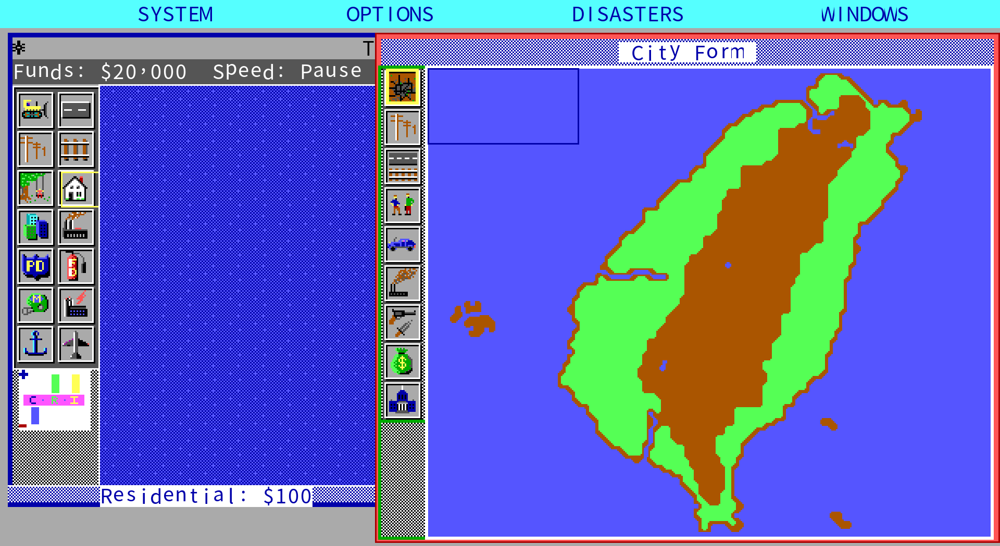

The island, the Central Mountain Range, Penghu to the west, Green Island and Orchid Island
to the south-east. The city name is read from the 128-byte header of the city file; the
`TAIWAN` in the title bar is the text that was already in the file.

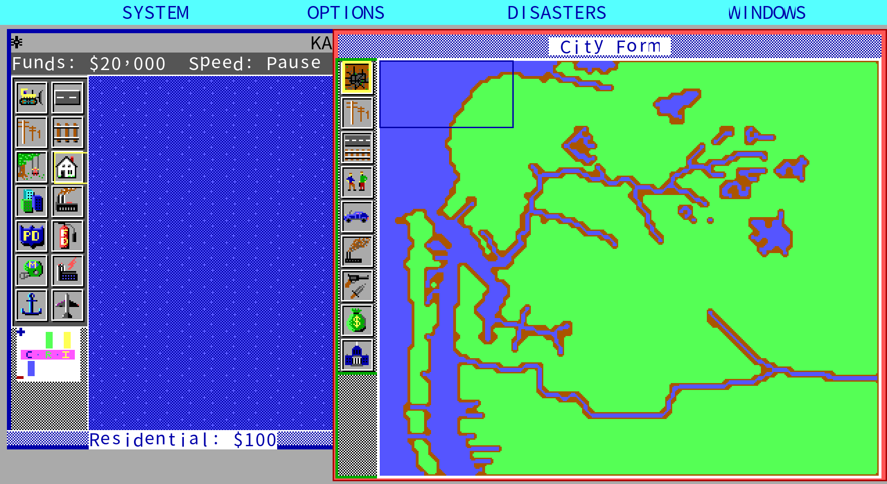

Kaohsiung is harbour terrain: the long lagoon on the west side and the inland water
system are both drawn in.

Both maps were made in Kaohsiung in 1990, by the same publisher as Collector's Edition 29
— four years before the citizens of Taipei and Kaohsiung could elect their own mayors.
File-by-file inventory and hashes:
[`docs/formats/00-e220-terrain-editor.md`](docs/formats/00-e220-terrain-editor.md).

Both city files are in [`cities/`](cities/). Their rights status is set out in note 5 of
[`LICENSE`](LICENSE) — "legal in Taiwan at the time" and "freely distributable today" are
two different things, and that reservation is written down there.

### Three more: Taipei, Taichung, Tainan

軟體世界 drew Taiwan and Kaohsiung; this project drew the rest. These three are the
project's own work and are freely distributable.

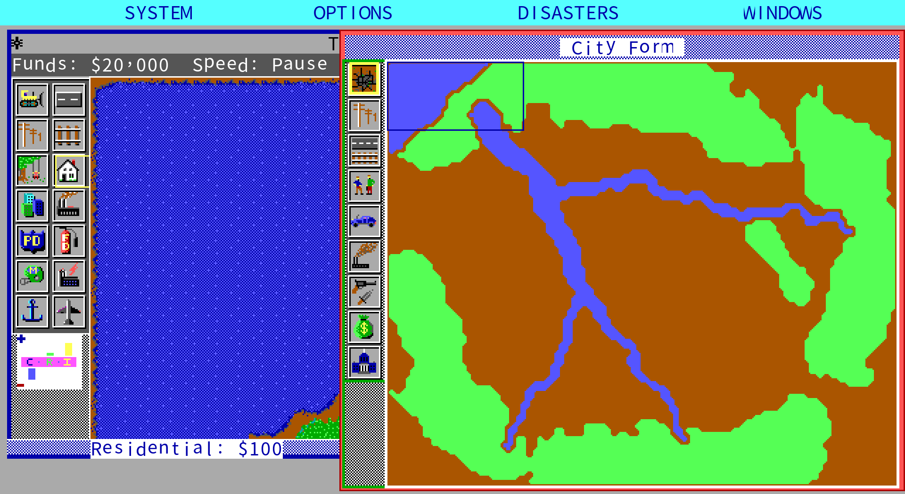
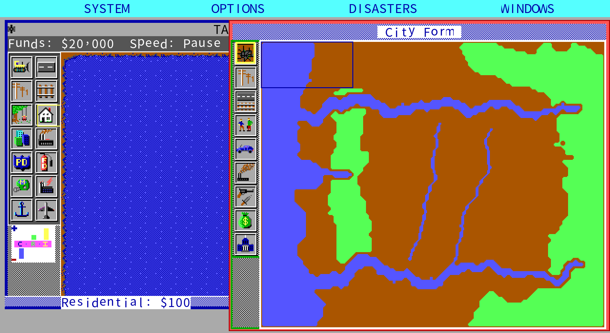
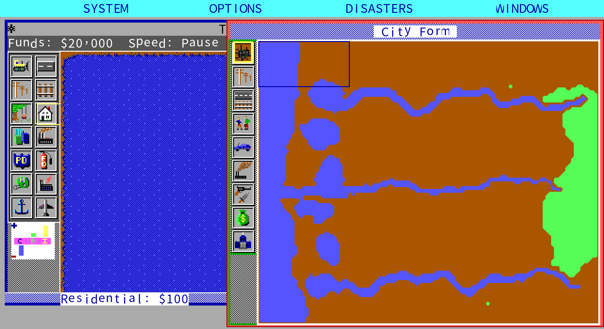

**These are stylised terrains, not survey data.** Fitting a city's water system and relief
into 120×100 cells means widening rivers until they are visible and turning hills into
continuous woodland. Shorelines and forest edges are left to the engine's own
`smoothRiver` / `smoothTrees` — the boundary rules from the original's `s_gen.c` — so they
look the way the original's terrain generator makes them look. The shapes come from value
noise with a fixed seed, so a rerun reproduces them exactly. Method and commands:
[`cities/README.md`](cities/README.md).

---

<a name="project"></a>
## What this project does

Rewrite the 1989 *SimCity* in Go / Ebiten and localise it into Traditional Chinese.
**Only the first game** — nothing from 2000 onward.

### Evidence priority

| # | Source | Scope |
|---|---|---|
| 1 | **Micropolis C source** (the SimCity Unix source EA released under GPL-3.0 in 2008) | everything in the simulation rules |
| 2 | **The DOS 1.10 data files themselves** | graphics sets, scenarios, messages, sounds, save format |
| 3 | **The DUX X11 release's Tcl scripts and XPMs** | interface semantics, strings, `.cty` samples |
| 4 | DOS executable disassembly / DOSBox runs | DOS-specific behaviour, visual confirmation |
| 5 | **The 軟體世界 Chinese manual** | renderings and period Taiwanese usage |
| 6 | Official English manual, community, magazine retrospectives | last resort, and cited |

Rules come from the source; presentation comes from the DOS version. See
[`CLAUDE.md`](CLAUDE.md) §1.

### Four gates

**Not one line of engine code is written** before the mechanism has been read out of the
source and written up. Mechanism confirmed (with `file:line`) → specification consolidated
(marked READY) → implementation → wiring registered. Every claim carries an inference
grade: confirmed / strong evidence / hypothesis / unresolved. See [`CLAUDE.md`](CLAUDE.md) §0.

**Community consensus is not evidence.** The player opinions quoted above are good
reading, but they never become constants in the code. Only the source and the data files
do. Where they conflict, the source wins and the conflict is recorded.

### Tick-for-tick parity

SimCity's state is a **120×100** grid plus a few dozen scalars — all serialisable. So the
same seed and the same sequence of operations can be fed to both Micropolis and the Go
version and **the whole map compared every tick**.

That harness exists: Micropolis builds and runs under Docker + Xvfb, and its embedded Tcl
interpreter exposes 128 state accessors (`sim Tile x y`, `sim Funds`, `sim Rand`, …)
drivable from a pty script. See
[`docs/re/01-oracle-harness.md`](docs/re/01-oracle-harness.md).

How far it got: **four runs of 8,000 frames each, all frame-for-frame identical** — a
small experiment on empty land (13,954 samples), the Dullsville scenario (122,314), and
Tokyo (**955,206**: a large city whose scenario disaster is the monster, with trains,
ships, planes, helicopters and explosions all present). Each frame compares the sample
count, the RNG state, `Scycle`, the three demand valves, the evaluation score and problem
table, **all eighteen fields of every sprite on the map**, and **a hash of the whole
12,000-cell map**.

The thing that made it work was not writing the rules more correctly; it was **making the
original single-steppable first**. Adding five read-only observation commands to the
oracle (observation only, on a copy) turned "find the divergence by searching" into
"look it up", and several long-masked differences surfaced the same day.

Tokyo forced out two **real game bugs**, not just parity artefacts. First, **the clearing
ritual on load was missing** — the original zeroes land value, pollution, crime, traffic
and sprites after reading a file; we did not, so a second city kept the first one's
numbers. Second, **the sprite list was being rebuilt**: the original walks a linked list,
so an explosion spawned when the monster destroys a building is inserted ahead of the
cursor and survives; we had ported it to a Go slice with the usual "walk and rebuild"
idiom, and that explosion was overwritten in the same frame — the monster destroyed
buildings without explosions. That one only became visible once a **per-frame map hash**
was added.

> In passing, this immediately refuted a second-hand number quoted earlier in this
> document: Tony Chen's 2002 specification table says the buildable area is 128×128, but
> the source says `SimWidth 120` / `SimHeight 100`, and the save size 120 × 100 × 2 =
> 24000 agrees. **First-hand beats second-hand**, even when the second-hand source is a
> magazine of the period.

---

<a name="integration"></a>
## What this remake brings together

At the time these were **four separately sold products**. Collecting them meant buying
three or more disks, running each one's `INSTALL.EXE` to copy files into the game
directory — and the terrain editor still had to be launched separately, outside the game.

| Product | Published | Contents |
|---|---|---|
| SimCity | 1989, Brøderbund / Maxis | one base look |
| **Graphics Set #1 (Ancient Cities)** | Brøderbund | Ancient Asia, Medieval, Wild West |
| **Graphics Set 2 — Future Cities** | Maxis | Future USA, Future Europe, Moon Colony |
| **SimCity Terrain Editor** | Maxis; repackaged in Taiwan by **軟體世界 Research Center (Kaohsiung)** in 1990 | a separate executable, `TERRAIN.EXE` |

⚠ The years for the two expansion disks (1990 / 1991) come only from the packager's
`file_id.diz`, which is **second-hand**; the file timestamps on the disks range from 1990
to 1993 and do not agree with it. What is certain is that **the publisher changed hands**:
Set #1 is credited to Brøderbund, Set 2 to Maxis.

Now they are one program. The system menu switches between seven looks (base plus the six
expansion sets), the fourth button on the title screen opens the terrain editor, and all
of it is in Traditional Chinese.

**Graphics Set #1 (Ancient Cities): Ancient Asia, Medieval, Wild West**

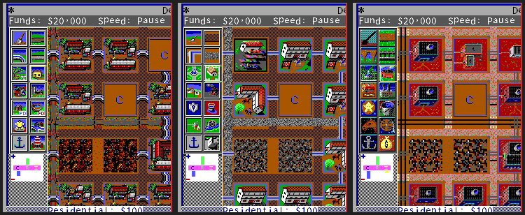

**Graphics Set 2 — Future Cities: Future USA, Future Europe, Moon Colony**

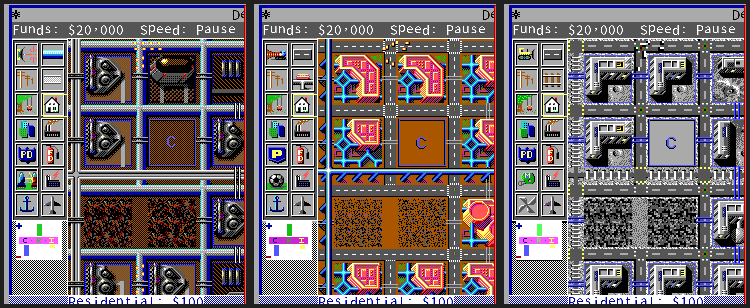

All six are **the same city at the same camera position** (Detroit 1972, cell 30,30) with
only the expansion set changed — so every difference is artwork. Even the tool palette
icons on the left change with it, and so do the tool **names**: the medieval railway is a
"coach road" and the power plant a "water wheel"; in Future USA the road is a "transport
tube" and the railway a "maglev track"; on the Moon the railway is just a "rail". That is
the original's design — each graphics set ships its own `*_MSG.PTF`.

**SimCity Terrain Editor: originally a separate program**

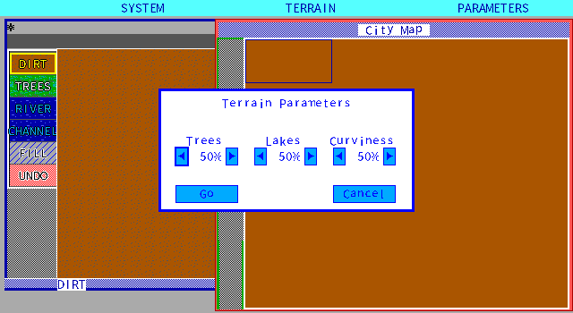

The "terrain parameters" dialog from the original `TERRAIN.EXE` — three percentages for
tree count, lake count and river curviness, then Start to generate. The layout was
measured **pixel by pixel** from the original running; all six spinner columns and four
rows agree. The three percentages are `s_gen.c`'s `TreeLevel` / `LakeLevel` / `CurveLevel`
themselves. The editor's main screen is [above](#shots).

### What the original already did, and what this project added

Drawing that line matters more than listing features. **What the original already did is
not a contribution:**

| Feature | Whose |
|---|---|
| Switching graphics sets in game | **the original** — entry 3 of message section 17 is "load graphics set" |
| Text changing with the set (tool names, messages, scenario briefings) | **the original** — each set ships its own `*_MSG.PTF` |
| **The terrain editor inside the game** | this remake. The original is a separate program you had to leave the game to run |
| **Switching display mode in game** | this remake. The original required `SETTINGS.EXE` to rewrite `SIMCITY.CFG` and a restart — which is what the expansion disks' own `README` tells you to do: "use the Settings program" |
| **Traditional Chinese** | this remake. The original never had a Chinese version (see [above](#no-chinese)) |
| Zoom, multiple languages, background music | this remake |

So "brings together" here means that **the six expansion sets' artwork and text, the
terrain editor and the six display modes are all reachable from one program** — and all of
it in Traditional Chinese. The terrain editor especially: it was an English-only separate
program, and this is the first time it has had a Chinese interface. The six sets come to
695 translated strings, and tool names change with the set (the medieval power plant is a
"water wheel") — that is the original's design, and the translation follows it.

### ⚠ What is brought together is the program, not the assets

The artwork and text of all six sets still come from the player's own disks. This project
distributes none of it.

And **no single original release contains all of the assets**:

- DOS 1.10 has the six expansion sets and mcga, but **no CGA and no Tandy**.
- DOS 1.03 has the base look in all six display modes, but **no mcga and no expansions**.
- The two expansion disks carry all six modes of their own artwork, but **no base look**.

Having all six display modes across all seven looks requires owning 1.03 *and* both
expansion disks. Where a piece is missing, the game reports it plainly for that
combination rather than silently falling back to another mode.

---

<a name="assets"></a>
## Source material and known risks

**No original asset enters version control or a release package. Players bring their own
legal copy.**

| Material | Contents | Risk |
|---|---|---|
| DOS 1.10 (69 files) | four display modes' graphics, 8 scenarios, 6 expansion message and sound sets | ⚠ **it is a cracked copy** |
| DOS 1.03 (27 files) | **all six display modes' graphics**, 8 scenarios | executable neither packed nor cracked |
| DOS 1.02 (19 files) | CEGA and MONO graphics, 8 scenarios | executable neither packed nor cracked |
| 軟體世界 terrain editor floppy (1990) | Maxis editor + six modes' artwork + 11 city files | Maxis assets stay local |
| DUX X11 release (1993) | executable + 30 Tcl + 154 XPM + 46 sounds + 23 `.cty` | ⚠ an unlicensed commercial release; **no C source** |
| 軟體世界 Collector's Edition 29 manual | 56 double-page scans | the completion project forbids profit; text only is transcribed |
| Micropolis source | GPL-3.0 | archived, read as a specification, never copied (see [below](#license)) |

### How the three DOS copies differ

| | 1.02 | 1.03 | 1.10 |
|---|---|---|---|
| Files | 19 | 27 | 69 |
| `SIMCITY.EXE` | 191,235 bytes | 192,795 | **126,542** |
| Readable strings | 896 | 859 | **266** |
| Packed / cracked | neither | neither | **both** |
| Display mode graphics | CEGA, MONO | **CEGA, MONO, sega, CGA, Tandy** | CEGA, MONO, sega, **mcga** |
| `.PPF` screens | CEGA only | **five modes, two each** | CEGA, sega, mcga |
| Expansion graphics sets | none | none | **six** |
| Scenarios | 8 | 8 | 8 |

**1.03 is the only copy in hand with all six display modes.** CGA and Tandy graphics are
missing from 1.10, while 1.10 adds mcga and the six expansion sets — **display modes were
not only ever added**; CGA and Tandy had disappeared by 1.10.

**The 1.02 and 1.03 executables are neither packed nor cracked.** The 1.10 one is packed
and its entry point is a cracker's stub, so any conclusion disassembled from it carries a
"source version in doubt" note.

**Version numbers are second-hand.** All three come from archive or folder names; there is
no version string in the executables. The names are used here only to refer to three
copies, not as a claim about the publisher's numbering.

### `SIMCITY.CFG` is a plain-text self-documenting file

The most useful find of the inventory. The configuration file carries its own decoder
table, giving the eight screen modes and the graphics set naming rule directly:

```
Screen Mode: E
Graphics Set: WESTCEGA

    Screen Mode:
        H - Hercules Graphics      M - Hires EGA Monochrome
        C - CGA Monochrome         e - Lores EGA Color
        T - Tandy Color            E - Hires EGA Color
        V - Monochrome VGA/MCGA    2 - 256 Color VGA/MCGA
```

So graphics file names are `<set><mode>`: `WESTCEGA.PGF` is the Wild West set in hi-res
EGA colour. The six set prefixes `ASIA` / `MEDI` / `WEST` / `FUSA` / `FEUR` / `MOON` match
the two expansion disks of the period.

---

<a name="status"></a>
## Status

The single source of truth for the work list is [`CONTEXT.md`](CONTEXT.md). Only
conclusions here.

### What is wired up

The normal player path runs end to end: new city or one of the eight scenarios → pick a
tool → build → read the four data windows → query a tile → save → quit → restart and load.
[`tools/playtest.sh`](tools/playtest.sh) drives that path under Xvfb with **real keys and a
real mouse**, screenshots every step and decides mechanically from the saved file — not
through a debug entry point.

| Layer | State |
|---|---|
| Simulation | 16-phase main loop, power, four per-cell scans, traffic, zone growth, census, demand valves, budget, evaluation, disasters, sprites, messages, player tools |
| Data formats | `.PGF` graphics, `.PTF` messages, `.PSN` scenarios, `.PSF` sounds, `.cty` city files, one shared LZSS |
| Presentation | tile drawing and animation, toolbar, four windows, two menus, full-page picture messages, six styles |
| Localisation | 226 base strings + six style overrides, 695 in total; renderings follow the 軟體世界 manual |
| Look | base + six expansion styles, **all six display modes decode** and can be switched in game — **the tool palette, demand indicator, graph buttons, layer icons and the whole colour scheme follow the mode**; the layout stays one 640×350 set |
| Terrain editor | the 1990 `TERRAIN.EXE` **rebuilt in full** |
| Saves | the original DOS format (128-byte header + 27,120 body); the reader also accepts Micropolis's bare 27,120 body |

### Verified against the original

| Slice | Method | Result |
|---|---|---|
| RNG | 24 consecutive outputs from the live original; four are enough to recover the internal state | the other 20 predicted correctly |
| Map and tile encoding | 130 constants regenerated from `sim.h` by a tool | byte-identical to the tool's output |
| **Terrain generation** | four seeds × 12,000 cells, cell by cell (including the 10% island branch) | **48,000 cells, full 16-bit words, all identical** |
| City file format | 32 files round-tripped byte for byte; the written file loaded back into the original | all identical; the original reads them, 12,000 tiles agree |
| Power | controlled experiment, 12,000 cells | all 266 `PWRBIT` differences in scenario 1 closed |
| **Frame-for-frame parity** | four runs of 8,000 frames (955,206 samples in the Tokyo one) | **4 × 8000/8000**; end-state map and funds also identical |
| Scenario win/lose | all eight loaded and left to run to their own deadline | all eight decide in time; both outcomes reachable |
| `.PGF` graphics | 42 files (6 modes × 7 sets) | all decoded; bank 0 always 960 tiles. Tandy's 16 colours are **packed**, not EGA planar (six styles × 960 tiles compared with sega, zero differences); CGA is **640×200 two-colour, 16×8 tiles** |
| **Six expansion styles' screens** | each style diffed byte-wise against the DOS original in the same scenario and camera | **six times 498/512 cells bit-identical**, with the 14 differing cells in identical positions |
| Terrain editor | the original run and measured pixel by pixel, then checked against the disassembly | all six spinner columns and four rows agree |

### Not done yet

- **Sound is wired up, but the sample rate is provisional.** Which of the eight effects
  belongs to which event is resolved (eleven `PlaySound(n)` call sites disassembled and
  matched against Micropolis). The rate is taken as 5,400 Hz, **measured rather than read
  out of the code**, and is marked provisional in the specification. Two methods sensitive
  to different errors both point there: length ratios give 5,300–5,450, spectral shape
  5,320–5,410. ±1.4% = ±0.24 semitones. **Comparing by ear against the original is not
  possible**: those eight effects only go to an external DAC, and no emulator in hand
  reproduces that card.
- The manual is **fully transcribed** (p.1–82, the whole operations manual plus two
  chapters of the reference manual), together with the reference card tucked inside it.
  The only thing not transcribed is the copy-protection code sheet.

### Self-assessment

Scoring is a way of making "what is still missing" concrete. **Every row states its
denominator and how it was measured.** This is self-assessment: apart from the DOS 1.10
original and Micropolis, no third party has run these numbers.

| Aspect | Score | Where the points are lost |
|---|:-:|---|
| Simulation rules | 9.5 | two deliberate deviations, both documented; no parity run longer than 8,000 frames |
| Data formats | 9.5 | `.PGF` banks 8 and 9 unresolved; which of the two `SOUNDDAT.PSF` is read is unknown |
| Presentation and controls | 9.5 | default window positions are one measurement of one boot; the fifth threshold of the numeric layers is provisional |
| Localisation and languages | 9.8 | Simplified Chinese is a character-level conversion, not a usage localisation; Japanese is this project's own translation, with no original to check it against and **no native review yet** |
| Sound | 8 | sample rate provisional; nobody has compared the timbre against the original |
| Playable completeness | 8 | Dullsville and San Francisco fail on all five seeds under the automatic player; **nobody has finished a city or a scenario by hand** |
| Cross-platform release | 8.5 | Windows and macOS have had no hands-on run |
| Asset preservation | 8.5 | what is preserved is a transcription, not the original; the rights status of the two 1990 maps is inferred |

**Overall 9 / 10.** The weighting is not even: the rules layer and the localisation are
the point of the project and both are close to full marks. The lost points concentrate on
two things — the sample rate is still provisional, and **nobody has actually played a city
or a scenario through by hand** (the automatic player proves the rules allow a win, which
is not the same thing).

**One row moved this time: localisation, 9.5 → 9.8.** One of its three deductions is gone.
Japanese used to stop at the interface labels — the status band, the picture messages and
the eight scenario briefings fell back to Traditional Chinese. All of that is translated
now, including the wording each of the six expansion sets uses of its own, with tests
pinning it down. The other two deductions still hold: Simplified Chinese is a literal
conversion, and the Japanese has had no native review. Hence 9.8 and not 10.

**The other seven rows did not move, even though plenty changed.** The score tracks what
is still unsolved, not how much work went in: this round the presentation layer had two
dozen strings routed through the text layer and three new tests added, but none of the
three open questions in that row (default window positions, how the original builds a
nuclear plant, the fifth threshold of the numeric layers) got any smaller.

---

<a name="run"></a>
## Running it

### Playing

Bring your own legal copy of **SimCity 1.10 (DOS)**, unpacked into a directory containing
`CEGA/`, `mcga/`, `MONO/`, `sega/`, `DATA/` and `SCENARIO/`. This project distributes none
of those files.

The public release packages (Linux tar.gz / AppImage, Windows, macOS universal) are
produced by [`tools/package_all.sh`](tools/package_all.sh) and contain only the
executable, the licence and a readme — fonts and translations are embedded in the binary.

```bash
./chengshi -data "/path/to/SIMCITY 1.10"                 # new city
./chengshi -data "…" -style medi                          # change city style
./chengshi -data "…" -mode tdy                            # change display mode
./chengshi -data "…" -scenario 6                          # scenario 6 (Detroit)
./chengshi -data "…" -load city.cty                       # load a city file
chmod +x chengshi-*-linux-amd64.AppImage
./chengshi-*-linux-amd64.AppImage -data "/path/to/SIMCITY 1.10"
```

Without `-seed`, `-scenario`, `-load`, `-window` or `-cam`, startup goes to the original
title screen, where new city / load / scenario can be chosen with the mouse.

To avoid typing the path, set `CHENGSHI_DATA`, or put the `SIMCITY 1.10` directory next to
the executable, in `~/.local/share/chengshi/` (Linux) or
`~/Library/Application Support/chengshi/` (macOS). Saves default to the user data
directory.

Style codes: `base` (default, the look with no expansion installed), `asia`, `medi`,
`west`, `fusa`, `feur`, `moon`.
Display mode codes: `cega` (hi-res EGA colour, default), `sega`, `tdy`, `mcga`, `mono`,
`cga`.

macOS's `城市.app` is cross-compiled on Linux and is **neither signed nor notarised** —
right-click → Open the first time.

### Building and verifying from source

Everything — builds, tests, screenshots — runs in Docker. Nothing is installed on the host.

```bash
docker build -f docker/go.Dockerfile -t simcity-go:1.25 docker/

tools/go.sh test ./...              # all tests, including wiring and font coverage
tools/playtest.sh                   # the normal player path on a real window
tools/screenshot.sh 12 out.png      # one screenshot
tools/release.sh                    # build release packages
tools/package_all.sh v.1.5.0-20260904
tools/verify_package_all.sh v.1.5.0-20260904
```

Tick-for-tick parity additionally needs your own archive of
[Micropolis](https://github.com/SimHacker/micropolis) in `workplace/ref/micropolis/`;
without it those tests skip rather than fail.

---

<a name="docs"></a>
## Documentation map

| File | Contents |
|---|---|
| [`CONTEXT.md`](CONTEXT.md) | status, terminology, work list — read this first |
| [`CLAUDE.md`](CLAUDE.md) | method: four gates, evidence priority, localisation policy, licensing position |
| [`docs/re/`](docs/re/) | mechanism notes from source and disassembly, with `file:line` |
| [`docs/spec/`](docs/spec/) | specifications marked `READY`; implementation follows these |
| [`docs/formats/`](docs/formats/) | DOS data formats: LZSS, `.PGF`, `.PTF`, `.cty` |
| [`docs/manual-cht/`](docs/manual-cht/) | page-by-page transcription of **four** period Chinese manuals, plus [`naming-crosswalk.md`](docs/manual-cht/naming-crosswalk.md): their lineage, the term-by-term comparison and every decision |
| [`translations/glossary.md`](translations/glossary.md) | glossary, each entry marked as manual-derived or new |
| [`LICENSE`](LICENSE) | full licence text plus trademark and reference disclosures |
| [`WORKLOG.md`](WORKLOG.md) | work log, verification commands, packaging records |

---

<a name="license"></a>
## Licence and disclaimers

This project is licensed under **RRSAL-1.0** (Retro Remake Source-Available License 1.0,
SPDX `LicenseRef-RRSAL-1.0`). **Source-available, not open source**:

- **Free for non-commercial use** without asking first: use, run, copy, distribute,
  **modify and distribute modified versions**, make language packs.
- **Streaming, video, review, reporting, papers and exhibitions are explicitly
  permitted**, and **platform revenue sharing and viewer donations do not count as
  commercial use**. The condition is attribution: title, author, repository URL.
- Conditions: keep the full licence text; state what was changed, by whom, and where it
  came from; do not charge for this work; do not distribute original assets.
- **Commercial use requires prior discussion**: <wicanr2@gmail.com>.
- Submitting a pull request grants the copyright holder the right to use that
  contribution under any terms including commercial ones (clause 7); contributors keep
  their own copyright.

The full text is in [`LICENSE`](LICENSE); the Traditional Chinese text governs, with an
English translation attached.

**The licence does not cover original assets.** It covers only what the copyright holder
created in this repository. The original executables, data files, artwork, music, bitmap
fonts and manual scans belong to their respective rights holders; this project does not
distribute them and users must supply their own legal copy.

### Relationship to Micropolis

This project **is not a fork of Micropolis and does not distribute its code**. Micropolis
is the SimCity Unix source EA released under GPL-3.0 in 2008; this project reads it as a
**specification**, writes the result into `docs/spec/`, and reimplements it in Go without
copying a line. The copyright holder therefore takes the position that this work is not a
derivative of Micropolis and is not bound by GPL-3.0.

**That is the copyright holder's position, not a court's.** Whether "read GPL source, then
rewrite" produces a derivative work is genuinely disputed in practice. The position and
the risk are both stated here rather than glossed over.

### Trademarks

SimCity and Maxis are trademarks or registered trademarks of Electronic Arts Inc.
MICROPOLIS is a registered trademark owned by Micropolis GmbH and licensed to the
Micropolis urban simulation project. This project is not affiliated with or endorsed by
Electronic Arts, Maxis, Will Wright, DUX Software, Micropolis GmbH, 軟體世界 or oldgame.tw;
those names are used only to refer to the original works, as nominative use.

---

<a name="thanks"></a>
## Acknowledgements

- **Will Wright and Maxis**, for making a game in 1989 that can be neither won nor lost —
  and selling it.
- **Electronic Arts and Don Hopkins**, for releasing the source as Micropolis under
  GPL-3.0 in 2008. Without that release this project would have had only disassembly.
- **軟體世界**, for bringing the game to Taiwan in the 1990s and writing a Chinese manual
  for it.
- **oldgame.tw and the "Software World manual completion project"**, for scanning and
  preserving that manual. Their own reason: "as time passes these early floppies and
  manuals are being thrown away, and without an organised effort many precious manuals and
  materials will be lost forever." This project is doing the same thing.
- **Tony Chen** (*PC Gamer Taiwan*, 2002) and **Johnny L. Wilson** (*Computer Gaming
  World* #59, 1989): thirteen years and an ocean apart, two articles reached the same
  conclusion about this game.
