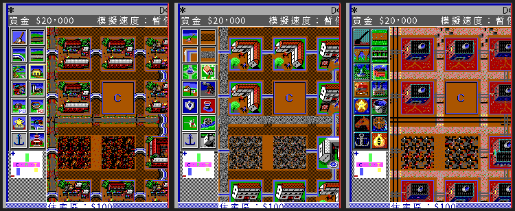
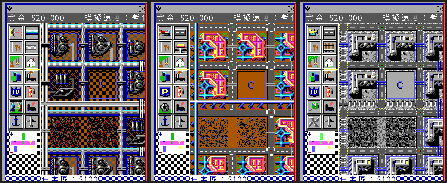
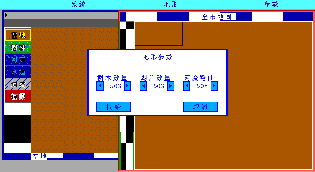

# シムシティ — 繁体字中国語リメイク

[繁體中文](README.md) · [English](README_en.md) · **日本語**

**まず市長になる。市長を選ぶのはそのあと。**

台北市と高雄市の市民が自分たちの市長をはじめて選挙で選んだのは 1994 年 12 月 3 日。
それ以前、この二つの直轄市の首長は中央政府が任命していた。その数年前、台湾の
出版社「軟體世界」はすでに『シムシティ』を店頭に並べていた。NT$180、フロッピー
2 枚、中国語マニュアル 1 冊。画面のなかの都市が税率をいくつにするか、道路をどこに
通すか、発電所を建てるか、予算を警察に回すか消防に回すか——すべてキーボードの前に
座っている人間が決める。

このゲームが与えるのは実績ではない。悪い手札と期限である。ダルズビルは 100 年
停滞したまま市民は退屈し、市庫には 5,000 ドル、猶予は 30 年。サンフランシスコ
1906 年は地震から始まり、道路も送電網も寸断されて 5 年。デトロイト 1972 年は
10 年で犯罪を下げろという。ボストン 2010 年は原発のメルトダウンで幕を開け、
汚染は消えないのでその土地は捨て、都市は別の方向へ伸ばすことになる。八つの
シナリオ。時間が来れば数字で判定される。言い訳は見てもらえない。

このプロジェクトは 1989 年のシミュレーションエンジンを Go で書き直し、オリジナルの
グラフィックとデータファイルを読み込ませ、繁体字中国語をあて、当時のマニュアルも
あわせて保存する。合法なオリジナルのフロッピーを自分で用意すれば、その席はあなたのものだ。

> Maxis／Will Wright、1989 年。Go / Ebiten による書き直し ＋ 繁体字中国語化 ＋
> 軟體世界「珍藏版 29」中国語マニュアルの保存。

**現状：遊べる。** 新規都市と八つのシナリオ、六つの都市スタイル、六つの表示モード、
建設、四つの情報ウィンドウ、セーブとロードまでつながっている。実際のキー入力と
マウスで動かして検証している（[検証](#run)）。tick 単位の一致はまだ完全には
収束していない。残る差は [`docs/re/12-tick-parity.md`](docs/re/12-tick-parity.md) にある。
進捗率はこのファイルには書かない。現状の唯一の情報源は [`CONTEXT.md`](CONTEXT.md)。

---

## 目次

- [画面](#shots)
- [当時起きなかったこと](#no-chinese)
- [あのマニュアルが残したもの](#manual)
- [1989 年に何が議論されていたか](#reception)
- [中国語圏での発売と記憶](#gap)
- [このプロジェクトがやっていること](#project)
- [このリメイクが一つにまとめたもの](#integration)
- [素材の棚卸しと既知のリスク](#assets)
- [現状](#status)
- [動かし方](#run)
- [ドキュメント案内](#docs)
- [ライセンスと表明](#license)
- [謝辞](#thanks)

---

<a name="shots"></a>
## 画面


起動するとまず SIM CITY の看板に入る。四つの選択肢は現在の言語で描かれる（前の三つは
オリジナルのもの、四つめ「地形エディタ」はリメイクの追加）。ロゴ、オリジナルの三つの
ボタン枠とそのクリック矩形はオリジナルのレイアウトのまま。差し替えているのは画像に
焼き込まれた英語のテキストだけで、リメイク側の四言語テキスト層が描き直している。
四つめのボタンは、**オリジナルのアートが一切ない**と実測で確認した看板の緑地に
置いてあるので、何も覆い隠していない。


デトロイト 1972 年、ベースの外観（拡張ディスクを入れていない状態）。レイアウトは
DOS 版そのまま：メニューバー、編集ウィンドウ（タイトルバーの都市名と年月、資金／
メッセージ帯、アイコンツールパレット、RCI 需要インジケータ、ツール帯）、City Form
ウィンドウと左端のレイヤーアイコン列。文字セルもオリジナルどおり（英数 1 セル、
漢字 2 セル）なので、`$20,000` のような欄はオリジナルとまったく同じ幅になる。


1990 年にフロッピーで配られた『SimCity Terrain Editor』。オリジナルは独立した
プログラムだが、リメイクはこれを丸ごと実装した：三つのメニュー（システム／地形／
パラメータ）、左の六マスのパレット（更地・森・川・水路の四つのブラシ、それに
塗りつぶしとアンドゥ）、編集ウィンドウ、右の全市地図。**ゲーム本体と同じ
ウィンドウシステムを使っている**——座標は完全に同一で、これはオリジナルを実際に
走らせて 1 ピクセルずつ測って確かめた。各ブラシが地図に書き込む値は、ゲームと
エディタが共有するツール記述テーブルから来ている。アンドゥは 5,000 マスのリングと
全図スナップショット 4 枚。出口もオリジナルどおり——エディタはセーブするだけで、
ゲーム側でそのファイルを読む。

**これらの画面はオリジナルとマス単位で突き合わせてある。「それっぽい」ではない。**
リメイクの画面を 640×350 に戻し、DOSBox で動くオリジナルとバイト単位で比較する：

| 比較対象 | 結果 |
|---|---|
| City Form を閉じた状態の編集領域 512 マス | **498 マスがビット単位で一致**。異なる 14 マスはすべて両者が各自描くカーソル枠。**六つの拡張スタイルすべてで同じ数字になり、異なるマスの位置も完全に同じ**（[レポート](docs/playtest/style-parity-2026-09-03.md)）|
| City Form ウィンドウ全体 | **130,581／131,600 ピクセル一致**（99.226%）、地図本体は **107,834／108,300**（99.570%）|
| タイトル画面とシナリオメニュー | **224,000 ピクセル中、違いはマウスカーソルの 16×15 のブロックだけ** |

再現手順は `tools/screen_parity.sh`（自分で DOSBox を走らせて基準を作る。オリジナルの
素材もオリジナルの画面もバージョン管理には入らない）。この判定は、パレットが 1 段
暗かったこと、ツールパレットの位置が 2 ピクセルずれていたこと、地図タイルが黒を透明
として扱っていたこと、セーブデータの地図が 8 行ずれていたこと、`.PPF` のビット
プレーンが逆順だったこと（レイアウトは寸分違わず、文字も読めて、色だけ総入れ替え）
を実際に検出している。どれもビルドは通り、テストも通り、遊べてしまう類の誤りだった。

| | |
|---|---|
|  |  |
| 同じ都市を中世の拡張に切り替えたところ。**ツール名も一緒に変わる**——発電所は「水車」、鉄道は「馬車道」、スタジアムは「馬上槍試合場」。これは六つの拡張に対するオリジナルの設計であって、翻訳側の裁量ではない。 | 地図ウィンドウ、犯罪率レイヤー。11 のレイヤーすべてが実装済みで、1–9、0、`-` で切り替える。 |


シナリオの説明文も拡張ごとに書き換えられている。デトロイト 1972 年の犯罪問題は、
中世セットでは「虎城、1563 年」になる。


評価ウィンドウ。世論、四つの深刻な問題、そして統計 7 項目（総人口、転出入者数、
市有資産総額、都市の分類、ゲームレベル、総合評点、年間評点）——すべてシミュレーション層
そのものが出した数字である。


**縮小表示・多言語・BGM はリメイクの追加で、オリジナルにはない。** オリジナルの
編集ウィンドウは常に 1 マス 16 ピクセル——1989 年の EGA 画面はその大きさで、都市全体を
見るには右の 3×3 のミニマップしかなかった。ここでは `-`（またはホイール）で 1/2、1/4 に
縮小でき、**縮小したままでも建設できる**。編集ウィンドウを最大幅にすれば、1/4 で
120×100 の地図がちょうど一度に収まる。

### 六つの表示モード

1989 年の PC には多種多様な画面があった。`SIMCITY.CFG` は自前のデコード表を持っていて
八つのコードを並べており、ゲームには六種類のアートが同梱されている：EGA 高解像度カラー
（640×350）、EGA 低解像度カラー、Tandy カラー、VGA 256 色、モノクロ VGA、CGA モノクロ
（640×200 の 2 色）。六つとも解読でき、ゲーム内で切り替えられる——`-mode`、または
**SYSTEM → 表示モード**。


同じ都市（台北、古代アジア拡張）を六つのモードで表示したところ。上段：EGA 高解像度
カラー、EGA 低解像度カラー、Tandy カラー。下段：VGA 256 色、モノクロ VGA、CGA モノクロ。
タイルはプレイヤー自身が用意したオリジナルのもので、本プロジェクトはそれらのファイルを
配布しない。

**変わるのはアートと配色すべてであって、レイアウトではない。**


ツールパレット、需要インジケータ、グラフボタン、レイヤーアイコンは、そのモード自身の
アートを使う（左から：EGA 高解像度、Tandy、モノクロ、CGA）。これらのバンクは**互いの
拡大縮小版ではない**——それぞれ自分の画面のために描かれている。ツールパレットは
EGA 高解像度で 57×182、Tandy で 56×123、CGA で 55×120。マスの大きさも行間も違い、
レイヤーアイコンにいたっては並べ方まで違う（EGA とモノクロは縦 1 列 9 個、Tandy は
2 列 5 行、**CGA は横 1 行 9 個**）。だからモードごとに実測したグリッドを持たせている。
そうしないとボタンが隣のマスに当たる。

プログラムが自分で描いている側——メニューバー、ウィンドウ枠、タイトルバー、資金帯、
ダイアログ、選択枠——もモードに追随する。判定基準はオリジナルの実測だ。六つのモードを
DOSBox でそれぞれ起動して色数を数えたところ、**モノクロ VGA と CGA モノクロは画面全体で
`#000000` と `#ffffff` の 2 色しかない**。したがってその二つのモードではインターフェイスも
白黒に収束させ、選択枠は網点の輪郭で描く——オリジナルがそうしているからである。

⚠ レイアウトは一種類しかない。本プロジェクトの座標はすべて EGA 高解像度（640×350）の
アートから測ったものだ。つまりこれは「Tandy や CGA のアートを EGA 高解像度のレイアウトで
遊ぶ」状態であり、**オリジナルが出したどの画面でもない**——本プロジェクトが作った
組み合わせである。理由と測り方は
[`docs/spec/ui-layout.md`](docs/spec/ui-layout.md) の「顯示模式」の節にある。

言語は **SYSTEM → 設定** から繁体字中国語・簡体字中国語・日本語・English を選べる。
選択はユーザー設定ディレクトリの `chengshi/settings.json` に書かれ、次回起動時に適用
される。`-lang` は設定を書き換えずにその起動だけ上書きする。


**オリジナルに音楽はない。** これは調べがついている。互いに裏づけあう根拠が五つ
（[`docs/re/19-no-music.md`](docs/re/19-no-music.md)）：公式マニュアルのクレジットには
`Sounds:` はあっても `Music:` がない。`SIMCITY.CFG` はサウンドデバイスしか選べない。
実行ファイルの文字列表に音楽関連の語がひとつもない。69 個のデータファイルに入っている
音声は、合計 3 秒の効果音 8 本だけ。そして **実機録音 148 秒のうち無音でないのは 1 秒
だけ**——その 1 秒はダイアログの通知音で、ちょうど陽性対照になる。タイトル画面は
12 秒間そこに留まる。オープニング曲があるなら最も鳴るべき場所だ。

そこでリメイクが再生するのは**プレイヤー自身が用意したファイル**（`music/` 以下の
`.ogg`／`.wav`）である。`M` で切り替え、`[`／`]` で曲送り、`-mute` は効果音と音楽の
両方を止める。本プロジェクトは公開配布物にオリジナルの音楽を一切含めない。

> 画像内の地図タイル・建物・スプライトは**プレイヤー自身が持つオリジナル**から来ている。
> プログラムはそれを読み込んで描画しているだけだ。本プロジェクトはオリジナル素材を
> 配布しないし、配布パッケージにも入っていない。スクリーンショットは説明のためだけに
> 置いてある。

---

<a name="no-chinese"></a>
## 当時起きなかったこと

**台湾で発売されたシムシティ 1 作目に中国語版は存在しない。**

軟體世界「珍藏版 29」、NT$180、フロッピー 2 枚、表紙に「16 BIT」、右下にサンフランシスコの
スカイラインを背にした緑のトカゲ。箱には中国語マニュアルが入っている——が、ゲーム本体は
英語である。

これは推測ではない。oldgame.tw に保存されている「シムシティシリーズ名作回顧」
（Tony Chen、『電腦玩家』2002 年 11 月号）にはシリーズの仕様対照表が付いており、1 作目の
欄には代理店「軟體世界」、価格 180、記憶媒体「フロッピー」、表示「EGA 16 色」、ハード
「XT」、そして**中国語版「無」**と明記されている。中国語版は 2 作目からだ。

したがって本プロジェクトは「どこかの中国語版を復元したもの」ではなく、**台湾の
マニュアルを拠りどころにした 1989 年版の繁体字中国語リメイク**である。地域別・
プラットフォーム別の発売史を検証し終えるまで、中国語圏で初の版だとは主張しない。

---

<a name="manual"></a>
## あのマニュアルが残したもの

軟體世界「珍藏版 29」の中国語マニュアルは、oldgame.tw の「軟體世界マニュアル補完計画」に
よってスキャン保存されている。見開き 56 枚。そこに残っているのは操作手順だけではなく、
1990 年代初頭の台湾の訳語一式である：

| 原文 | 軟體世界の訳語 |
|---|---|
| SCENARIOS | **悲情城市**（悲しみの都市）|
| DULLSVILLE | 達斯維利 |
| SAN FRANCISCO ／ TOKYO ／ DETROIT | 舊金山／東京／底特律 |
| BOSTON ／ RIO DE JANEIRO | 波士頓／里約熱內盧 |
| HAMBURG ／ BERN | 漢堡／伯恩 |
| （シナリオのクリア目標）| **明日之都**（明日の都）|
| （クリア報酬）| **市鑰**（市の鍵）|

**これらの語選びは「読みやすく」直したりしない。** `docs/manual-cht/` はページごとに
完全に翻刻し、当時の言い回し・訳語・文体をそのまま残す。原文の誤植はそのまま翻刻して
注を付け、判読できない字は〔判読不能〕と記して推測しない。`translations/glossary.md` は
マニュアルの既存訳語を優先し、マニュアルにない語だけを新たに訳して、その旨を表に明記する。

スキャン画像そのものはバージョン管理にも配布物にも入れない——補完計画の説明書きが
「スキャンに記号を加えたり営利に用いたりしないこと」を求めており、本プロジェクトは
それに従う。

---

<a name="reception"></a>
## 1989 年に何が議論されていたか

リメイクする前に、なぜリメイクに値するのかを知っておく必要がある。以下はすべて出典つき。
**一次証拠とプレイヤーの言い分は分けて示す。**

### 勝つことも負けることもできないゲーム

Brøderbund は当初、発売を断っている。理由は「売り方がない——勝つことも負けることも
できない」。八つのシナリオは、もう少し従来型のゲームの形に引き戻すために、パブリッシャー
の要求で追加されたものだ（[Wikipedia](https://en.wikipedia.org/wiki/SimCity_(1989_video_game))）。

面白いのは、**時代も言語も違う二人の評者が、どちらもシナリオは本質ではないと結論して
いる**ことだ：

> 「シナリオがどれほど良くできていても、自分で都市を設計することの魅力には遠く及ばない。
> ……特注のフェラーリを作れるというのに、なぜ他人が乗り古したシボレーで遊ぶのか。」
> —— Johnny L. Wilson、『Computer Gaming World』第 59 号、1989 年 5 月

> 「シムシティには結末もなければ決まった攻略ルートもない。あるのはプレイヤーの無限の
> 創造性と挑戦だけだ。」
> —— Tony Chen「シムシティシリーズ名作回顧」、『電腦玩家』2002 年 11 月

### 1989 年の編集部は何に文句を言っていたか

CGW の記事で面白いのは結論ではなく細部である。当時の編集部は全員が自分の都市を持ち、
地図を印刷して見せ合っていた。その不満は、そのまま受け入れ検査項目になるくらい具体的だ：

- **空港を建てると墜落する。** 評者の空港は 4 か月で飛行機に突っ込まれ、編集長の都市では
  **半年で 5 回**墜落した。
- **船が同じ橋脚にぶつかり続ける**、あるいは同じ整地済みの海岸で座礁する。
- **住宅区がいきなり「マンション化」する**：「Oh, no! My prime residential area just went
  condo!」彼らの対処法は、区内の 1 マスを整地して公園にし、その区の成長を止めることだった。
- **エントロピー**：成長しないものは衰退する。「SimCity takes the laws of entropy
  seriously.」

### 1989 年時点ですでにあった三つの抜け道

| 抜け道 | やり方 | 出典 |
|---|---|---|
| バンザイ税率 | 12 月に税率を上限 20% まで上げ、徴収したら 1 月に 0% へ戻す。市民は気づかない | CGW #59, 1989 |
| Shift + `FUND` | Mac／Amiga 版は 1 回ごとに +$10,000、C-64/128 は F1 で $4,000 | CGW #59, 1989 |
| 公園凍結法 | 住宅区が十分育ったら 1 マス整地して公園にする。「もう伸びるな」という信号になり、同時に犯罪を下げ地価を上げる | CGW #59, 1989 |

CGW は当時すでに、Maxis がバンザイ税率を後継版で塞ぐことを検討していると書いている。

### ゴジラは生態学者である

CGW の記事には **"Godzilla Is An Ecologist"** という小見出しがある。怪獣は**公園を避け、
重工業地区へ一直線に向かう**。都市が大きいほど長く居座る。記事はこれを「環境保護庁——
トカゲ課」と呼んでいる。

ただし**ゲーム内のあの怪獣に名前はない**。IBM 版マニュアルの東京シナリオは "a large
reptilian creature rose from Tokyo Bay" としか書かず、CGW も「都市を襲う怪獣に名前は
与えられていない」と注記している。中国語圏ではそのままゴジラと呼ばれており、Tony Chen の
記事の図説には「右上で都市を破壊している緑の物体が、かの有名なゴジラ怪獣である」とある。

### 長く誤って語られてきた二つの数字

- **「税率 7%」は迷信ではなく、ゲームの初期値そのものである。** IBM 版マニュアルは
  「The optimum tax rate for fast growth is between 5 and 7%」——つまり**範囲**を書いており、
  ソースは初期税率を 7 に設定している（`sim.c:182 CityTax = 7`）。プレイヤーが覚えている
  あの数字は、初期値であり、同時にマニュアルの範囲の上端でもある。
- **ダルズビルの公式難易度は Easy である。** マニュアルの難易度表記は下記のとおり。
  ネット上で流布する「ダルズビルが最難関」はプレイヤーの言い分で、マニュアルとは逆だ。

| シナリオ | テーマ | 英語版マニュアル | 制限 | クリア条件 |
|---|---|---|---|---|
| DULLSVILLE, USA 1900 | 発展の停滞 | Easy | 30 年 | 大都市 |
| SAN FRANCISCO, CA 1906 | M8.0 の地震＋大火 | **Very Difficult** | 5 年 | 大都市 |
| HAMBURG, GERMANY 1944 | 空襲による火災旋風 | **Very Difficult** | 5 年 | 大都市 |
| BERN, SWITZERLAND 1965 | 交通渋滞 | Easy | 10 年 | 交通密度が低いこと |
| TOKYO, JAPAN 1957 | 怪獣襲来 | Moderately Difficult | 5 年 | 総合評点 500 超 |
| DETROIT, MI 1972 | 犯罪 | Moderately Difficult | 10 年 | 低犯罪率 |
| BOSTON, MA 2010 | 原発のメルトダウン | **Very Difficult** | 5 年 | 総合評点 500 超 |
| RIO de JANEIRO, BRAZIL 2047 | 温暖化による海面上昇 | Moderately Difficult | 10 年 | 総合評点 500 超 |

中国語マニュアルは英語の 3 段階に対して**四つの言い回し**を使っており、東京では両者が
食い違う。それは訳者の文章であって、別の等級体系ではない。

マニュアルにはシナリオの災害を回避する裏技も書かれている——セーブしてロードし直すこと。

⚠ **1 作目に水道管はない。** IBM 版マニュアル全体で "water" は地形の水域しか指さない。
上水道は 2000 以降の要素だ。ここに書いてあるのは、これが最も誤って「記憶」されやすい
細部だからである。

### 実際に授業で使われた

- 南カリフォルニア大学とアリゾナ大学が都市計画と政治学の授業で使用した（Wikipedia）。
- 1989 年の CGW 記事は、その年 8 月の都市計画学会で、シムシティを都市計画の動的モデルと
  して論じた発表があったことに触れている。
- 1990 年、『Providence Journal』紙はプロビデンス市長選の候補者 5 人に同市を模した
  シムシティを遊ばせた。候補の Victoria Lederberg は民主党予備選での僅差の敗北を、
  自分のプレイぶりについての新聞記事のせいだとした。最もうまく遊んだ元市長
  Buddy Cianci はその年の選挙に勝っている。

### このモデルには立場があり、開発チームもそれを認めている

- CGW 1989：「The design team **admits a bias toward rail-based mass transit**.」
- Maxis 社長 Jeff Braun：「We're pushing political agendas.」（Wikipedia 経由）
- Will Wright は Jay W. Forrester のシステムダイナミクスと『Urban Dynamics』(1969) の
  影響を認めている。「1960 年代アメリカの都市理論をゲームに焼き込んでいる」という後年の
  批判の出発点はここにある。

リメイクにとってこれは立場の問題ではなく**技術的な問題**である。そうした偏りは
シミュレーションの係数そのものに書き込まれている。こちらの責務は**そのまま再現して
出典を明記すること**であって、2026 年の都市計画観に「修正」することではない。

---

<a name="gap"></a>
## 中国語圏での発売と記憶

直接検証できる資料は台湾のものが最もそろっており、そこには明確な変化が見てとれる。
1990 年代初頭の 1 作目は**英語のゲーム＋軟體世界の繁体字中国語マニュアル**であり、
台湾の中国語版は『シムシティ 2000』が最初だった。1999 年、iThome は EA 台湾支社の話として
2000 の台湾での販売本数を 4〜5 万本と見積もっている。その好調は、1997 年の台湾製
『模擬首都』の直接の市場的背景でもある。『シムシティ 3000』、そして 2003 年の
『SimCity: Formosa』に至ると、ローカライズは文字の翻訳から台湾のランドマークや地図にまで
広がっていた。

1 作目のあのマニュアルの意義は、したがって「箱に中国語が入っていた」だけではない。
「悲情城市」「明日之都」といった用語を定着させ、17 ページを割いて都市の発展と計画を
説明している。一方で、香港・マカオ・中国大陸における 1 作目の取り扱いについては直接の
証拠がまだなく、台湾の歴史を中国語圏全体に一般化することはできない。年表・証拠等級・
出典は
[`docs/research/simcity-chinese-world-history.md`](docs/research/simcity-chinese-world-history.md)。

### 動画


57 秒で今どこまでできているかを一通り：オリジナルの看板、繁体字中国語のインターフェイス、
軟體世界が 1990 年に描いた台湾と高雄、本プロジェクトが足した台北・台中・台南、
**1990 年のあの地形エディタ**、更地から築いた都市、六種類の災害、予算／統計／評価の三つの
情報ウィンドウ、八つの悲情城市、そして最後に同じ看板を CGA／Tandy／EGA／VGA／モノクロで
並べたところ。

画面のタイルも音もプレイヤー自身のオリジナルから来ており、動画そのものはこのリメイクが
動いているところである。`promo.mp4` の音は**オリジナルの効果音 8 本**だ——このゲームには
BGM がないので、旋律を被せることも、代わりに合成することもしない。

### 軟體世界が描いた台湾と高雄

代理店がやったのはマニュアルの翻訳だけではない。Maxis の『SimCity Terrain Editor』は
1990 年に**軟體世界研究中心（高雄）**によって再パッケージ発売されており、フロッピーには
Maxis 自身のデモ都市のほかに、台湾で作られた都市ファイルが 2 つ入っている——
`TAIWAN.CTY` と `KAOHSIUN.CTY`。ディスク上の `README` は枠が一つあるだけで、住所と
BBS の電話番号 (07) 384-8901 が書かれている。


台湾本島、中央山脈、西の澎湖、南東には緑島と蘭嶼。都市名は都市ファイルの 128 バイトの
ヘッダから読んでいる。タイトルバーの `TAIWAN` はファイルにもとから書かれていた文字だ。


高雄は港湾の地形。西側の細長い潟湖と内陸の水系がどちらも描かれている。

どちらも 1990 年に高雄で作られたもので、「珍藏版 29」と同じ代理店の手による。台北と高雄の
市民が自分の市長を選挙で選べるようになる 4 年前のことだ。ファイル単位の棚卸しとハッシュは
[`docs/formats/00-e220-terrain-editor.md`](docs/formats/00-e220-terrain-editor.md)。

この 2 つの都市ファイルは [`cities/`](cities/) に収めてある。権利関係の説明は
[`LICENSE`](LICENSE) の付記第 5 項にある——「当時の台湾で合法だった」ことと「今日
自由に配布してよい」ことは別の話で、その留保はそこに書いてある。

### あと三枚：台北・台中・台南

軟體世界が台湾と高雄を描いた。残りは本プロジェクトが描いた。この三枚は本プロジェクト
自身の制作物で、自由に配布できる。


**これは様式化した地形であって測量データではない。** 120×100 マスに都市の水系と起伏を
収めるには、川は見える幅まで広げ、丘陵は連続した森に置き換えるしかない。海岸線と森の縁は
エンジン自身の `smoothRiver`／`smoothTrees` に任せてある。これはオリジナルの `s_gen.c` の
境界規則なので、見た目はオリジナルの地形生成器と同じ流儀になる。形は固定シードの値
ノイズから起こしているので、走らせ直せば同じ結果になる。作り方と再生成コマンドは
[`cities/README.md`](cities/README.md)。

---

<a name="project"></a>
## このプロジェクトがやっていること

1989 年の『シムシティ』を Go / Ebiten で書き直し、繁体字中国語化する。**1 作目だけ**を
対象とし、2000 以降はやらない。

### 証拠の優先順位

| 順 | 出典 | 適用範囲 |
|---|---|---|
| 1 | **Micropolis の C ソース**（EA が 2008 年に GPL-3.0 で公開した SimCity Unix 版ソース）| シミュレーション規則のすべて |
| 2 | **DOS 1.10 のデータファイルそのもの** | グラフィックセット、シナリオ、メッセージ、音、セーブ形式 |
| 3 | **DUX X11 版の Tcl スクリプトと XPM** | インターフェイスの語彙、文字列、`.cty` の実例 |
| 4 | DOS 実行ファイルの逆アセンブル／DOSBox 実行 | DOS 固有の挙動、目視確認 |
| 5 | **軟體世界の中国語マニュアル** | 訳語と当時の台湾の言い回し |
| 6 | 公式英語マニュアル、コミュニティ、雑誌回顧 | 最後の手段。使うときは出典を明記 |

規則層はソースを読み、表示層は DOS 版に合わせる。詳細は [`CLAUDE.md`](CLAUDE.md) §1。

### 四つのゲート

ある仕組みがソースから読み出されて記録されるまで、**エンジンのコードは 1 行も書かない**。
仕組みの確認（`ファイル名:行番号` つき）→ 仕様への集約（READY を付ける）→ 実装 →
配線の登録、という順に一つずつ通す。どの主張にも推論等級を付ける：確認済／強い証拠／
仮説／未解決。詳細は [`CLAUDE.md`](CLAUDE.md) §0。

**コミュニティの通説は証拠ではない。** 前節で引いたプレイヤーの言い分は読み物としては
面白いが、コードの定数にはならない。定数になるのはソースとデータファイルだけだ。両者が
食い違えばソースが勝ち、食い違い自体を記録に残す。

### tick 単位の突き合わせ

シムシティの状態は **120×100** のマス配列といくつかのスカラーだけで、すべて直列化できる。
つまり同じ乱数種と同じ操作列を Micropolis と Go 版の両方に流し込み、**tick ごとに地図全体を
比較できる**。

その仕掛けはすでにできている。Micropolis は Docker + Xvfb でビルドでき、動く。しかも
内蔵の Tcl インタプリタが 128 個の状態アクセサ（`sim Tile x y`、`sim Funds`、`sim Rand`…）を
公開しており、pty スクリプトから駆動できる。詳細は
[`docs/re/01-oracle-harness.md`](docs/re/01-oracle-harness.md)。

どこまで一致したか：**8,000 フレームの突き合わせを 4 本、すべてフレーム単位で完全一致**——
更地での小実験（サンプル 13,954 回）、ダルズビルのシナリオ（122,314 回）、そして東京
（**955,206 回**：大都市で、シナリオ災害は怪獣。列車・船・飛行機・ヘリコプター・爆発が
勢ぞろいする）。各フレームで比較するのは、サンプル回数、乱数状態、`Scycle`、三つの需要
バルブ、都市評価の点数と問題表、**画面上のスプライト全 18 フィールド**、そして
**12,000 マスの地図全体のハッシュ**である。

ここまで来られた鍵は、規則をより正しく書くことではなく、**まずオリジナルをステップ実行
できるようにしたこと**だった。オラクル側に読み取り専用の観測コマンドを 5 つ足した時点で
（観測だけを足し、規則には触れず、複製に対して行う）、分岐点の特定が「探す」から
「引く」に変わり、長く隠れていた差がその日のうちに何件も表に出た。

東京の分は、突き合わせの都合ではない**本物のゲームのバグ**を 2 つあぶり出した。1 つは
**ロード時の一括クリア処理が抜けていたこと**——オリジナルは読み込み後に地価・汚染・犯罪・
交通・スプライトをすべてゼロにするが、こちらはやっていなかったので、2 つめの都市に前の
都市の数字が残った。もう 1 つは**スプライトのリストを作り直していたこと**——オリジナルは
連結リストを辿るので、怪獣がビルを壊したときに生まれる爆発はカーソルの前に挿入されて
残る。こちらは「一周しながら作り直す」という定石で Go のスライスに移植していたため、その
爆発が同じフレームのうちに上書きされていた——怪獣がビルを壊しても爆発しなかったのだ。
これは**フレームごとの地図ハッシュ**を足してはじめて見えるようになった。

> ついでに言うと、これは本文で先に引いた二次情報を即座に覆した。Tony Chen の 2002 年の
> 仕様表は「建設範囲 128×128」と書いているが、ソースは `SimWidth 120` / `SimHeight 100` で、
> セーブサイズ 120 × 100 × 2 = 24000 とも一致する。**一次が二次に勝つ**。二次が当時の
> 雑誌であっても同じだ。

---

<a name="integration"></a>
## このリメイクが一つにまとめたもの

当時これは**別売りの 4 製品**だった。全部そろえるにはフロッピーを 3 枚以上買い、
それぞれの `INSTALL.EXE` を走らせてゲームのディレクトリにファイルを流し込む必要が
あった。地形エディタにいたっては、ゲームを抜けて別に起動しなければならない。

| 製品 | 発売 | 内容 |
|---|---|---|
| SimCity | 1989 年、Brøderbund／Maxis | ベースの外観 1 種 |
| **Graphics Set #1（古城風情 / Ancient Cities）** | Brøderbund | 古代アジア、中世、西部開拓 |
| **Graphics Set 2 — Future Cities（回到未來）** | Maxis | 未来アメリカ、未来ヨーロッパ、月面居住地 |
| **SimCity Terrain Editor** | Maxis。台湾では**軟體世界研究中心（高雄）**が 1990 年に再パッケージ | 独立した実行ファイル `TERRAIN.EXE` |

⚠ 拡張ディスク 2 枚の年（1990／1991）は、パッケージ作成者の `file_id.diz` にしか
根拠がなく**二次情報**である。ディスク内のファイルのタイムスタンプは 1990 年から
1993 年まで散らばっており、それとも食い違う。確実なのは**発売元が替わっている**
ことだ——Set #1 は Brøderbund、Set 2 は Maxis の名義になっている。

いまはこれが 1 本のプログラムになっている。システムメニューで 7 種類の外観
（ベース ＋ 拡張 6 種）を切り替えられ、タイトル画面の 4 つめのボタンから地形
エディタに入れて、すべて繁体字中国語である。

**Graphics Set #1（古城風情 / Ancient Cities）：古代アジア、中世、西部開拓**



**Graphics Set 2 — Future Cities（回到未來）：未来アメリカ、未来ヨーロッパ、月面居住地**



6 枚とも**同じ都市・同じカメラ位置**（デトロイト 1972 年、マス 30,30）で、拡張
セットだけを差し替えている——つまり違いはすべてアートである。左のツールパレットの
アイコンも一緒に変わり、ツールの**名前**まで変わる。中世では鉄道が「馬車道」、
発電所が「水車」。未来アメリカでは道路が「輸送管」、鉄道が「磁気浮上軌道」。
月面居住地では鉄道はただの「軌道」。これはオリジナルの設計で、各グラフィック
セットが自前の `*_MSG.PTF` を持っているからだ。

**SimCity Terrain Editor：もとは別のプログラム**



オリジナル `TERRAIN.EXE` の「地形パラメータ」ダイアログ——樹木の量、湖の量、川の
曲がり具合の 3 つのパーセンテージを設定し、「開始」で地形を生成する。レイアウトは
オリジナルを実際に走らせて**1 ピクセルずつ測った**もので、6 つの増減ボタンの列位置と
4 つの行位置がすべて一致する。3 つのパーセンテージは `s_gen.c` の `TreeLevel`／
`LakeLevel`／`CurveLevel` そのものである。エディタの主画面は[上](#shots)にある。

### オリジナルにもとからあったもの、このプロジェクトが足したもの

この線引きは、機能の数を並べるより重要だ。**オリジナルがもとからできたことは
貢献ではない。**

| 機能 | どちらのもの |
|---|---|
| ゲーム内でグラフィックセットを切り替える | **オリジナル**——メッセージ第 17 節の 3 番目が「グラフィックセットを読む」 |
| セットに合わせて文字も変わる（ツール名、メッセージ、シナリオ説明）| **オリジナル**——各セットが自前の `*_MSG.PTF` を持つ |
| **地形エディタがゲームの中にあること** | リメイク。オリジナルはゲームを抜けて起動する別プログラム |
| **ゲーム内での表示モード切り替え** | リメイク。オリジナルは `SETTINGS.EXE` で `SIMCITY.CFG` を書き換えて再起動する必要があった（拡張ディスク自身の `README` にも "use the Settings program" とある）|
| **繁体字中国語** | リメイク。オリジナルに中国語版は存在しない（[前述](#no-chinese)）|
| 縮小表示、多言語、BGM | リメイク |

つまりここでいう「まとめた」とは、**拡張 6 セットのアートと文字、地形エディタ、
6 つの表示モードが、どれも 1 本のプログラムから到達できる**ということであり、
しかもそのすべてが繁体字中国語になっている、ということだ。とりわけ地形エディタ——
もとは英語だけの独立プログラムで、中国語のインターフェイスを持つのはこれが初めて
である。6 セット分の訳文は合計 695 条。ツール名もセットに追随する（中世の発電所は
「水車」）。それはオリジナルの設計であり、翻訳はそれに従っている。

### ⚠ まとめたのはプログラムであって、素材ではない

6 セットのアートと文字は、いまもプレイヤー自身のディスクから来ている。本プロジェクトは
そのいずれも配布しない。

そして**素材のすべてを含む単一のオリジナル版は存在しない**：

- DOS 1.10 は拡張 6 セットと mcga を持つが、**CGA と Tandy がない**。
- DOS 1.03 は 6 つの表示モードのベース外観を持つが、**mcga も拡張もない**。
- 拡張ディスク 2 枚は自分のアートを 6 モード分そろえているが、**ベース外観がない**。

6 つの表示モード × 7 種類の外観をすべてそろえるには、1.03 と拡張 2 枚の両方が要る。
足りない組み合わせでは、黙って別のモードに落ちるのではなく、はっきりエラーを出す。

---

<a name="assets"></a>
## 素材の棚卸しと既知のリスク

**オリジナル素材は一切バージョン管理にも配布パッケージにも入れない。プレイヤーが合法な
オリジナルを自分で用意する。**

| 素材 | 内容 | リスク |
|---|---|---|
| DOS 版 1.10（69 ファイル）| 4 モード分のグラフィック、シナリオ 8、拡張 6 組のメッセージと音 | ⚠ **クラック版である** |
| DOS 版 1.03（27 ファイル）| **6 モード分のグラフィックが全部そろっている**、シナリオ 8 | 実行ファイルは未パック・未クラック |
| DOS 版 1.02（19 ファイル）| CEGA と MONO のグラフィック、シナリオ 8 | 実行ファイルは未パック・未クラック |
| 軟體世界の地形エディタ盤（1990）| Maxis のエディタ ＋ 6 モード分のアート ＋ 都市ファイル 11 個 | Maxis 素材はローカルのみ |
| DUX X11 版（1993）| 実行ファイル ＋ Tcl 30 ＋ XPM 154 ＋ 音 46 ＋ `.cty` 23 | ⚠ 無許諾の商用配布物。**C ソースは入っていない** |
| 軟體世界「珍藏版 29」マニュアル | 見開き 56 枚のスキャン | 補完計画が営利利用を禁じているため、文字だけを翻刻 |
| Micropolis ソース | GPL-3.0 | 保管済み。仕様書として読み、書き写さない（[後述](#license)）|

### 手元の DOS 3 版の違い

| | 1.02 | 1.03 | 1.10 |
|---|---|---|---|
| ファイル数 | 19 | 27 | 69 |
| `SIMCITY.EXE` | 191,235 バイト | 192,795 | **126,542** |
| 可読文字列 | 896 | 859 | **266** |
| パック／クラック | どちらもなし | どちらもなし | **両方あり** |
| 表示モードのグラフィック | CEGA、MONO | **CEGA、MONO、sega、CGA、Tandy** | CEGA、MONO、sega、**mcga** |
| `.PPF` 画面 | CEGA のみ | **5 モード各 2 枚** | CEGA、sega、mcga |
| 拡張グラフィックセット | なし | なし | **6 組** |

**1.03 は手元で唯一、6 つの表示モードがすべてそろっている版である。** CGA と Tandy の
グラフィックは 1.10 では欠けており、代わりに 1.10 は mcga と拡張 6 組を持つ——
**表示モードは増える一方ではなく**、CGA と Tandy は 1.10 の時点で消えている。

**バージョン番号は二次情報である。** 3 つとも書庫名やフォルダ名から来ており、実行ファイル
内にバージョン文字列はない。ここでの呼称は 3 つの複製を指し示すためのもので、メーカーの
版番号だと主張するものではない。

### `SIMCITY.CFG` は平文の自己説明ファイル

棚卸しで最も有用だった発見。設定ファイルが自前のデコード表を持っており、8 つの画面モードと
グラフィックセットの命名規則をそのまま示している：

```
Screen Mode: E
Graphics Set: WESTCEGA

    Screen Mode:
        H - Hercules Graphics      M - Hires EGA Monochrome
        C - CGA Monochrome         e - Lores EGA Color
        T - Tandy Color            E - Hires EGA Color
        V - Monochrome VGA/MCGA    2 - 256 Color VGA/MCGA
```

つまりグラフィックファイル名の規則は `<セット><モード>` で、`WESTCEGA.PGF` は Wild West
セットの EGA 高解像度カラー版である。6 つのセット接頭辞 `ASIA`／`MEDI`／`WEST`／`FUSA`／
`FEUR`／`MOON` は当時の 2 種類の拡張ディスクに対応する。

---

<a name="status"></a>
## 現状

作業リストと項目別の状態の唯一の情報源は [`CONTEXT.md`](CONTEXT.md)。ここには結論だけ置く。

### つながっているもの

通常のプレイ経路は最後まで通る：新規都市または 8 つのシナリオ → ツール選択 → 建設 →
4 つの情報ウィンドウを見る → 区画を調べる → セーブ → 終了 → 再起動してロード。
[`tools/playtest.sh`](tools/playtest.sh) がこの経路を Xvfb 上で**実際のキー入力と
実際のマウス**で走らせ、各段階でスクリーンショットを撮り、最後にセーブデータの中身で
機械的に判定する。デバッグ用の入口で迂回してはいない。

| 層 | 状態 |
|---|---|
| シミュレーション規則 | 16 フェーズのメインループ、電力、4 つの走査、交通、区画の成長、国勢調査、需要バルブ、予算、評価、災害、スプライト、メッセージ、プレイヤーのツール |
| データ形式 | `.PGF` グラフィック、`.PTF` メッセージ、`.PSN` シナリオ、`.PSF` 音、`.cty` 都市ファイル、共通の LZSS |
| 表示 | タイル描画とアニメーション、ツールバー、4 つのウィンドウ、2 つのメニュー、全画面の画像メッセージ、6 スタイル |
| 中国語化 | 基本 226 条 ＋ 6 スタイル分の上書き、計 695 条。訳語は軟體世界のマニュアル基準 |
| 外観 | ベース ＋ 拡張 6 スタイル、**6 つの表示モードすべてを解読**しゲーム内で切替可能。**ツールパレット・需要インジケータ・グラフボタン・レイヤーアイコン・配色一式もモードに追随する**。レイアウトは 640×350 の一種類のまま |
| 地形エディタ | 1990 年の `TERRAIN.EXE` を**丸ごと再実装** |
| セーブ／ロード | オリジナルの DOS 形式（128 バイトのヘッダ ＋ 27,120 バイトの本体）。読み込み側は Micropolis の 27,120 バイト本体も受け付ける |

### オリジナルと突き合わせて検証したもの

| 対象 | 方法 | 結果 |
|---|---|---|
| 乱数生成器 | 動いているオリジナルから連続出力 24 個を取得。4 個あれば内部状態を復元できる | 残り 20 個を全部予測できた |
| 地図とタイル符号化 | 130 個の定数を `sim.h` からツールで再生成 | ツールの出力とバイト単位で一致 |
| **地形生成** | 4 つの種でそれぞれ 12,000 マスをマス単位比較（島生成の 10% 分岐を含む）| **48,000 マスの 16 ビット語が完全一致** |
| 都市ファイル形式 | 32 ファイルをバイト単位で往復。書き出したファイルをオリジナルで読み込み | 往復はすべて一致。オリジナルも読め、12,000 タイルが一致 |
| **フレーム単位の突き合わせ** | 4 本 × 8,000 フレーム（東京はサンプル 955,206 回）| **4 本とも 8000/8000**。終了時の地図と資金も一致 |
| `.PGF` グラフィック | 42 ファイル（6 モード × 7 セット）| すべて解読。Tandy の 16 色は EGA のプレーン式ではなく**パック式**、CGA は **640×200 の 2 色、タイル 16×8** |
| **拡張 6 スタイルの画面** | 各スタイルを同一シナリオ・同一カメラで DOS 版とバイト単位比較 | **6 つとも 498／512 マスがビット一致**、異なる 14 マスの位置も同一 |

### まだできていないこと

- **音は鳴るが、サンプリングレートは暫定値。** 8 本の効果音がどのイベントに対応するかは
  解明済み（`PlaySound(n)` の呼び出し 11 箇所を逆アセンブルし、Micropolis の対応関数と
  突き合わせた）。レートは 5,400 Hz を採っているが、これは**コードから直接読んだ値では
  なく実測値**で、仕様書では暫定と明記している。誤差に対する感度が異なる 2 つの方法が
  どちらもこの付近を指す：長さ比が 5,300–5,450、スペクトル形状が 5,320–5,410。
  ±1.4% ＝ ±0.24 半音。**耳で聴き比べることはできない**——あの 8 本は外付け DAC にしか
  出力されず、そのカードを再現できるエミュレータが手元にない。
- マニュアルは**全ページ翻刻済み**（p.1–82、操作マニュアル全体＋リファレンス 2 章）。
  唯一翻刻していないのはコピープロテクトのコード表である。

### 自己評価

点をつけるのは「あと何が足りないか」を具体的に言うためだ。**どの行にも分母と測り方を
書く。** これは自己評価であって、DOS 1.10 のオリジナルと Micropolis という 2 つのオラクル
以外に、第三者がこれらの数字を回したことはない。

| 面 | 自己評価 | 減点箇所 |
|---|:-:|---|
| シミュレーション規則層 | 9.5 | 意図的な逸脱が 2 箇所（いずれも記録済み）。8,000 フレームを超える長時間の突き合わせはまだ |
| データ形式 | 9.5 | `.PGF` の第 8・9 バンクの用途が未解決。2 つある `SOUNDDAT.PSF` のどちらが読まれるか不明 |
| 表示層と操作 | 9.5 | ウィンドウの既定位置は「ある 1 回の起動」の実測値。数値レイヤーの第 5 段階の閾値は暫定 |
| 中国語化と多言語 | 9.5 | 簡体字は繁体字の**字面**変換であって用語のローカライズではない。日本語は本プロジェクトの新訳で、ラベル部分のみ |
| 音 | 8 | サンプリングレートが暫定。音色をオリジナルと比べた人がいない |
| 遊べる完成度 | 8 | 自動プレイヤーではダルズビルとサンフランシスコが 5 種すべて失敗。**人の手で都市やシナリオを最後まで遊んだ者がまだいない** |
| クロスプラットフォーム配布 | 8.5 | Windows と macOS は実機での試遊なし |
| 素材保存 | 8.5 | 保存できたのは翻刻であって原本ではない。1990 年の 2 枚の地図の権利関係は推定 |

**総合 9 / 10。** 重みは均等ではない。規則層と中国語化がこのプロジェクトの目的であり、
どちらも満点に近い。減点は 2 点に集中している——**サンプリングレートがまだ暫定値**である
ことと、**誰も実際に手で都市やシナリオを遊び通していない**こと（自動プレイヤーが証明した
のは「規則上は勝てる」であって、それとは別の話だ）。

---

<a name="run"></a>
## 動かし方

### 遊ぶ

まず合法な **SimCity 1.10（DOS）** を自分で用意し、どこかに展開しておく。その中に
`CEGA/`、`mcga/`、`MONO/`、`sega/`、`DATA/`、`SCENARIO/` が見えていること。本プロジェクトは
これらのファイルを配布しない。

公開配布パッケージ（Linux tar.gz／AppImage、Windows、macOS universal）は
[`tools/package_all.sh`](tools/package_all.sh) で作る。中身は実行ファイル、ライセンス、
readme だけで、フォントと訳文は実行ファイルに埋め込まれている。

```bash
./chengshi -data "/path/to/SIMCITY 1.10"                 # 新規都市
./chengshi -data "…" -style medi                          # 都市スタイルの変更
./chengshi -data "…" -mode tdy                            # 表示モードの変更
./chengshi -data "…" -scenario 6                          # シナリオ 6（デトロイト）
./chengshi -data "…" -load city.cty                       # 都市ファイルの読み込み
chmod +x chengshi-*-linux-amd64.AppImage
./chengshi-*-linux-amd64.AppImage -data "/path/to/SIMCITY 1.10"
```

`-seed`／`-scenario`／`-load`／`-window`／`-cam` のいずれも指定しなければ、起動後まず
オリジナルの看板メニューに入り、マウスで新規都市・都市の読み込み・シナリオを選べる。

毎回パスを打ちたくなければ環境変数 `CHENGSHI_DATA` を設定するか、`SIMCITY 1.10` の
ディレクトリを実行ファイルの隣、`~/.local/share/chengshi/`（Linux）、
`~/Library/Application Support/chengshi/`（macOS）のいずれかに置く。セーブは既定で
ユーザーデータディレクトリに落ちる。

スタイルコード：`base`（既定。拡張なしの外観）、`asia` 古代アジア、`medi` 中世、
`west` 西部開拓、`fusa` 未来アメリカ、`feur` 未来ヨーロッパ、`moon` 月面居住地。
表示モードコード：`cega`（EGA 高解像度カラー、既定）、`sega`、`tdy`、`mcga`、`mono`、`cga`。

macOS の `城市.app` は Linux 上でクロスコンパイルしており、**署名も公証もされていない**——
初回は右クリック → 開く。

### ソースからのビルドと検証

ビルド・テスト・スクリーンショットはすべて Docker 内で行う。ホストには何もインストール
しない。

```bash
docker build -f docker/go.Dockerfile -t simcity-go:1.25 docker/

tools/go.sh test ./...              # 全テスト（配線チェックとフォント網羅を含む）
tools/playtest.sh                   # 実ウィンドウ・実キー・実マウスでの通常プレイ経路
tools/screenshot.sh 12 out.png      # スクリーンショット 1 枚
tools/release.sh                    # 配布パッケージのビルド
tools/package_all.sh v.1.3.0-20260904
tools/verify_package_all.sh v.1.3.0-20260904
```

tick 単位の突き合わせには、別途 [Micropolis](https://github.com/SimHacker/micropolis) の
保管物を `workplace/ref/micropolis/` に置く必要がある。なければ該当テストは失敗ではなく
スキップされる。

---

<a name="docs"></a>
## ドキュメント案内

| ファイル | 内容 |
|---|---|
| [`CONTEXT.md`](CONTEXT.md) | 現状、用語、作業リスト。引き継ぐときはまずこれ |
| [`CLAUDE.md`](CLAUDE.md) | 方法論：四つのゲート、証拠の優先順位、中国語化方針、ライセンスの立場 |
| [`docs/re/`](docs/re/) | ソース読解と逆アセンブルの記録。1 つの仕組みにつき 1 本、`ファイル名:行番号` つき |
| [`docs/spec/`](docs/spec/) | `READY` を付けた仕様。実装はこれに従う |
| [`docs/formats/`](docs/formats/) | DOS のデータ形式：LZSS、`.PGF`、`.PTF`、`.cty` |
| [`docs/manual-cht/`](docs/manual-cht/) | 中国語マニュアルのページ単位の翻刻 |
| [`translations/glossary.md`](translations/glossary.md) | 訳語表。各項目にマニュアル由来か新訳かを明記 |
| [`LICENSE`](LICENSE) | ライセンス全文 ＋ 商標と参照に関する表明 |
| [`WORKLOG.md`](WORKLOG.md) | 作業履歴、検証コマンド、パッケージ記録 |

---

<a name="license"></a>
## ライセンスと表明

本プロジェクトは **RRSAL-1.0**（Retro Remake Source-Available License 1.0、SPDX
`LicenseRef-RRSAL-1.0`）を採用する。**source-available であって open source ではない**：

- **非商用利用は無償**、事前の同意は不要：使用、実行、複製、配布、**改変および改変版の
  配布**、他言語の言語パック作成。
- **実況、動画、レビュー、報道、論文、展示は明示的に許可**する。さらに**プラットフォームの
  収益分配や視聴者からの投げ銭は商用利用に当たらない**。条件はクレジット表示：作品名、
  作者、リポジトリ URL。
- 条件：ライセンス全文を保持すること。改変版には何を誰が変えたか、出所はどこかを明記する
  こと。本作品自体に課金しないこと。オリジナル素材を配布しないこと。
- **商用利用は事前の相談が必要**：<wicanr2@gmail.com>。
- プルリクエストの送付は、その貢献を商用を含む条件で利用する権利を著作権者に許諾したことに
  なる（第 7 条）。貢献者は自身の著作権を保持する。

全文は [`LICENSE`](LICENSE)。繁体字中国語版が正文で、英訳を添付している。

**ライセンスはオリジナル素材を対象としない。** 対象はこのリポジトリ内で著作権者が制作した
ものだけである。オリジナルの実行ファイル、データファイル、アート、音楽、ビットマップ
フォント、マニュアルのスキャンはそれぞれの権利者に帰属する。本プロジェクトはそれらを
配布せず、利用者は合法なオリジナルを自分で用意する必要がある。

### Micropolis との関係

本プロジェクトは **Micropolis のフォークではなく、そのコードを配布もしない**。Micropolis は
EA が 2008 年に GPL-3.0 で公開した SimCity Unix 版のソースであり、本プロジェクトはこれを
**読める仕様書**として扱い、読んだ内容を `docs/spec/` に書き、Go で書き直している。1 行も
書き写していない。著作権者はこれをもって、本作品は Micropolis の二次的著作物ではなく
GPL-3.0 に拘束されないという立場を取る。

**これは著作権者の立場であって、裁判所の判断ではない。**「GPL のソースを読んでから書き
直す」ことが二次的著作物にあたるかは実務上争いがある。ここでは立場とリスクの両方を、
糊塗せずに書いておく。

### 商標

SimCity と Maxis は Electronic Arts Inc. の商標または登録商標である。MICROPOLIS は
Micropolis GmbH が保有する登録商標で、Micropolis 都市シミュレーションゲームプロジェクトに
ライセンスされている。本プロジェクトは Electronic Arts、Maxis、Will Wright、DUX Software、
Micropolis GmbH、軟體世界、oldgame.tw のいずれとも提携関係になく、推奨も受けていない。
これらの名称はオリジナル作品を指し示すためだけに用いている（指示的使用）。

---

<a name="thanks"></a>
## 謝辞

- **Will Wright と Maxis**：1989 年に、勝つことも負けることもできないゲームを作り、しかも
  売ってみせたこと。
- **Electronic Arts と Don Hopkins**：2008 年にソースを GPL-3.0 で Micropolis として公開
  したこと。あの公開がなければ、このプロジェクトは逆アセンブルに頼るしかなかった。
- **軟體世界**：1990 年代にこのゲームを台湾に持ち込み、中国語マニュアルを作ったこと。
- **oldgame.tw と「軟體世界マニュアル補完計画」**：そのマニュアルをスキャンして残したこと。
  彼ら自身の言葉では「時が経つにつれ、こうした初期のフロッピーやマニュアルも次第に
  捨てられていく。組織立った行動を起こさなければ、多くの貴重なマニュアルや資料は
  永久に失われてしまう」——本プロジェクトも同じことをしている。
- **Tony Chen**（『電腦玩家』2002）と **Johnny L. Wilson**（『Computer Gaming World』
  #59, 1989）：13 年と太平洋を隔てて、2 本の記事がこのゲームについて同じ結論に達した。
